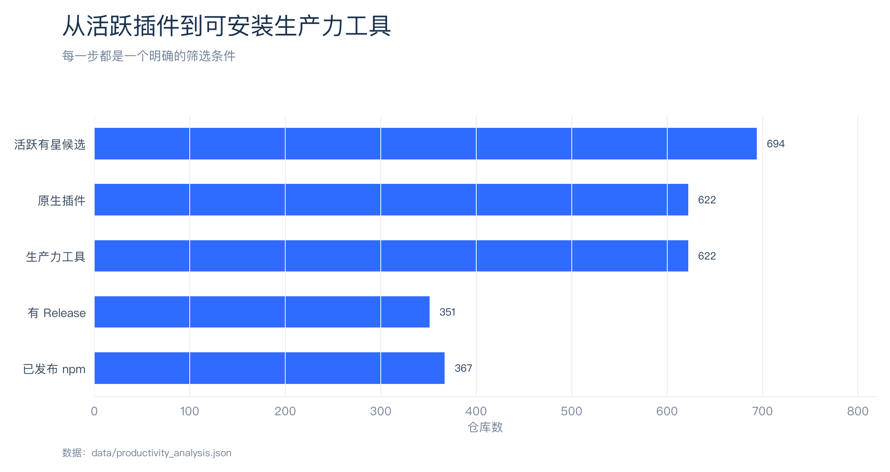
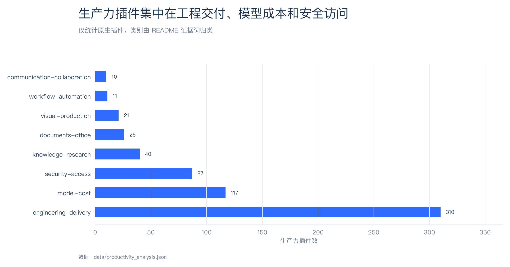
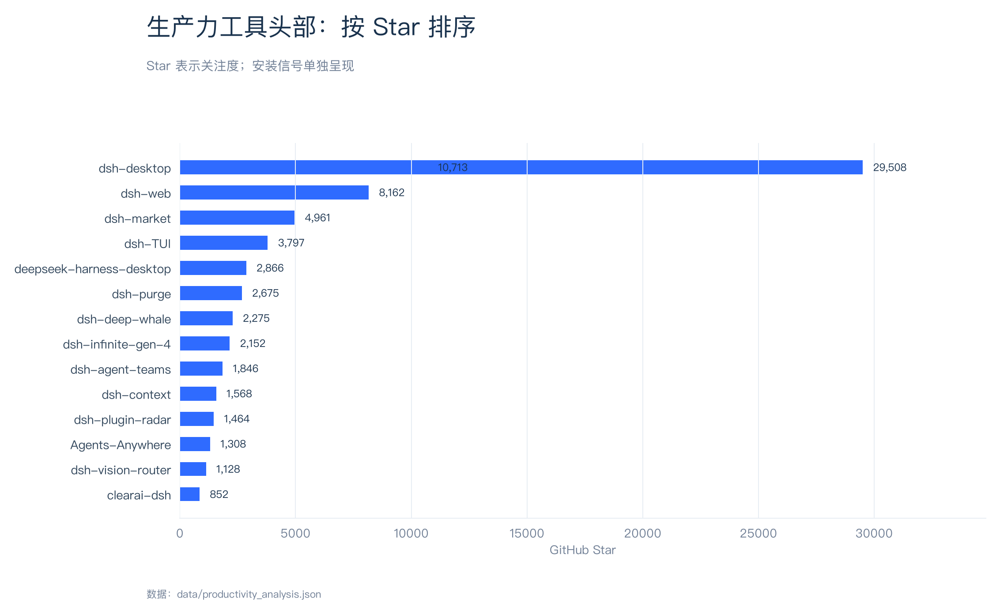
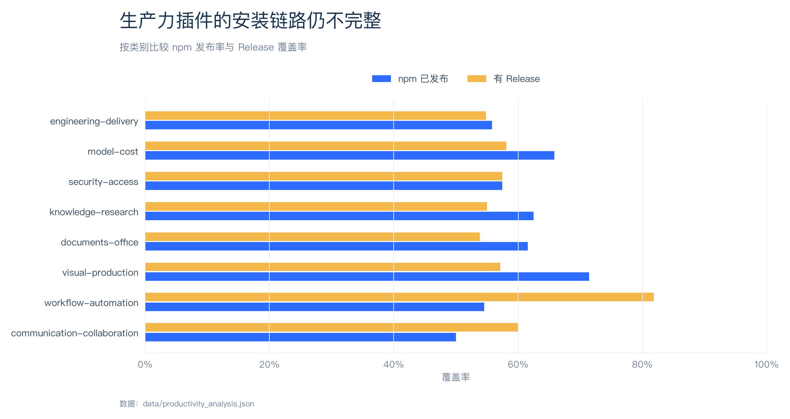
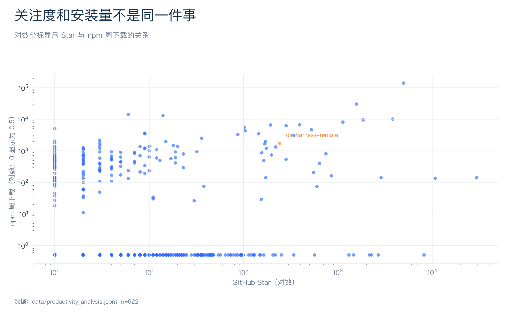
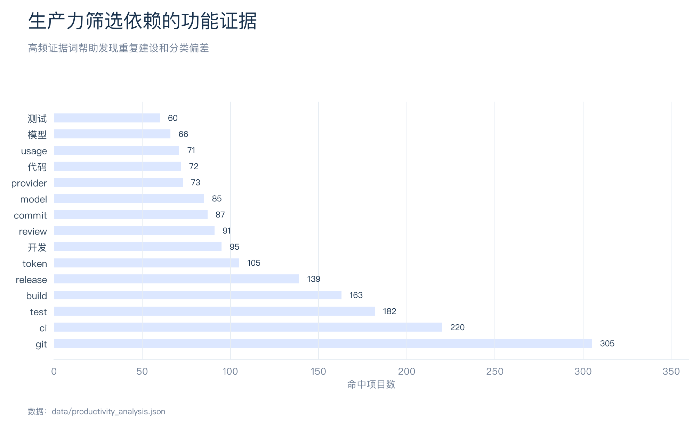
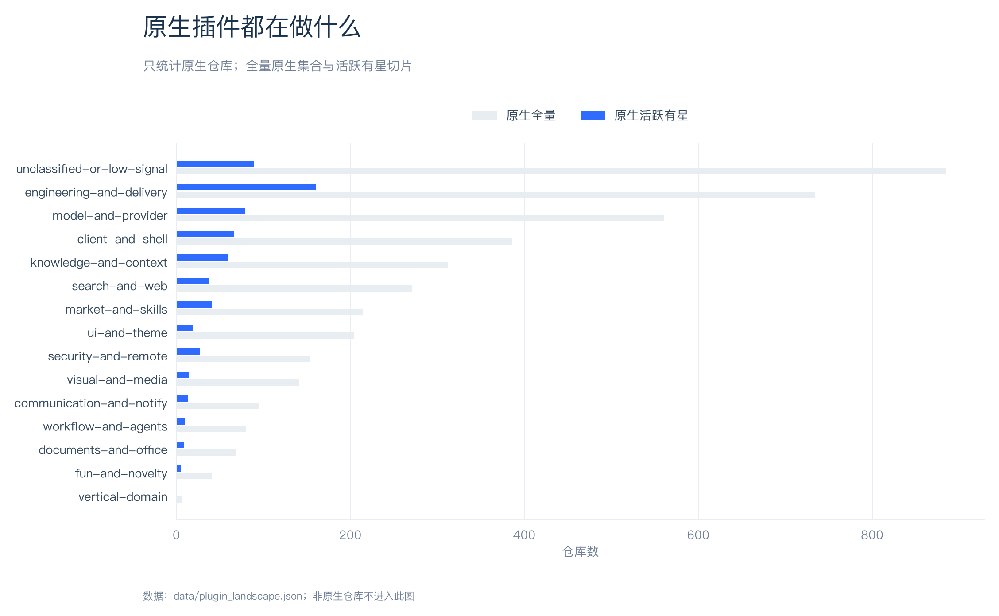
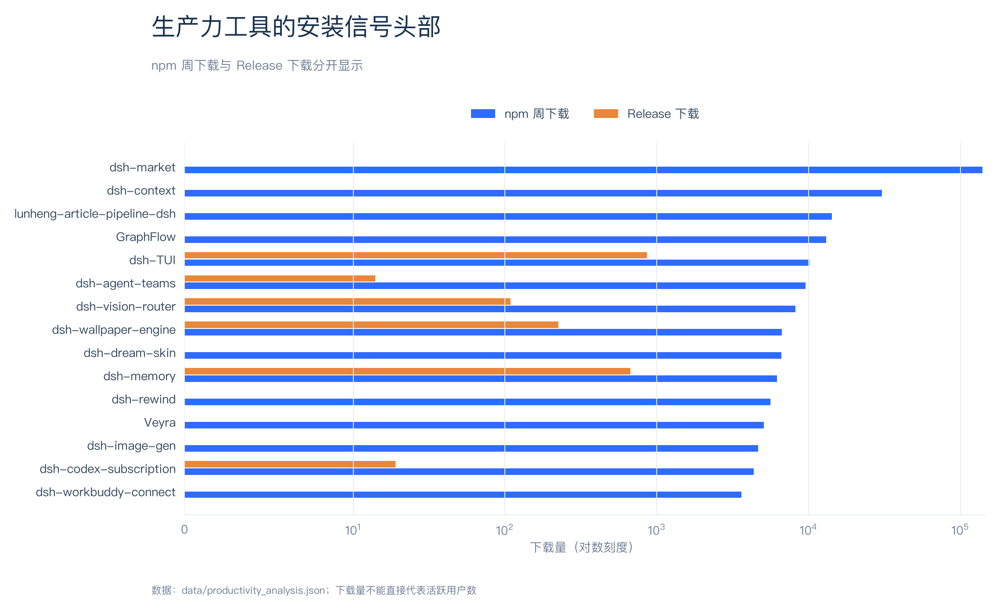

# dsh-plugin-bench

DeepSeek Harness（DSH）插件生态的独立基准评估：基于 GitHub API 一手数据枚举 topic，分析活跃度、高星停滞、原生/适配/无关三桶、品类结构与 Release/npm 分发完成度。

本轮快照日期为 **2026-09-30**：实际枚举 16,685 个仓库；复查时 GitHub topic 官方计数为 16,688，覆盖 99.98%。完整结论见 [DSH 插件生态评估报告](report/DSH插件生态评估报告-2026-09-30.md)。

## 最新核心指标

| 指标 | 数值 |
|---|---:|
| 去重仓库 | 16,685 |
| 一次性仓库 | 6,125（36.7%） |
| v0.2.0-rc.2 后有 push | 646（15.6%，原生集合） |
| 活跃 × 有星 | 630（原生） |
| 原生 × 活跃 × 有星 | 630 |
| star ≥ 10 | 1,078（170 活跃 / 908 停滞） |
| README 覆盖 | 2,407 |
| 分发缓存覆盖 | 630 / 630 个原生活跃有星仓库 |
| npm 已发布 | 371 / 630 个原生活跃有星仓库 |
| 写好包名但未发布 npm | 79 |
| 远程访问 | 11（3 个 ≥10★） |
| 移动端本机客户端 | 1 |

固定锚点后的新建仓库也会计入“有 push”，因此 15.6% 不是纯粹的存量留存率。正式报告只使用原生判定集合，共 4,153 个仓库。

## 主要发现

本轮为自动化统计及初步分类。README 每份最多缓存前 8,000 字符，2,177 份是非空缓存及预分类数量，不是人工完整深读数量；分类规则中的人工标签含历史沿用。分发脚本没有区分请求失败与查无结果，以下“未发布”等负向判断和下载归属仍需复核。锚点后 push 不等于兼容性验证。

- 原生集合中的 0–4★ 仓库占 53.3%，原生活跃项目的维护信号比全 topic 更适合用于选型。
- 正式报告已移除适配、蹭标签和其他非原生仓库；原生判定集合共 4,153 个。
- 原生活跃仓库贡献 371,569 次 npm 周下载；分发数据覆盖全部 630 个原生活跃有星仓库。
- 核心远程访问按“从另一台设备经网络访问并操作正在运行的 DSH”严格统计：11 个原生活跃仓库、615★；远端工作区开发、实例运维、插件救援及移动端本机客户端均另计。
- 207 个原生活跃有星仓库写有 package name 却未发布 npm，安装链路仍是明确的生态工程债。
- 新增生产力筛选层：694 个活跃有星候选中筛出 622 个原生生产力工具，按知识检索、文档办公、工程交付、工作流自动化、协作通知、安全访问、模型成本和视觉生产分类。

## 数据文件

| 文件 | 内容 |
|---|---|
| `data/repos.jsonl` | 16,685 条仓库元数据 |
| `data/analysis.json` / `data/digest.txt` | 2,407 份 README 的预分类与摘要 |
| `data/active_set.jsonl` | 694 个活跃有星仓库 |
| `data/active_inventory.json` / `.md` | 活跃品类清单，含分类来源与远程访问分类 |
| `data/classification.jsonl` | 4,515 个重点仓库的原生 / 适配 / 无关明细 |
| `data/native_plugins.jsonl` | 4,153 个原生仓库 |
| `data/dist_check.jsonl` | 694 个活跃仓库的 Release/npm 数据 |
| `data/audit_summary.json` | 报告使用的结构化汇总 |
| `data/productivity_analysis.json` / `.md` | 生产力工具筛选、类别、证据词和分发信号 |
| `data/plugin_landscape.json` / `.md` | 原始社区内容地图，供分析过程追溯 |
| `data/native_audit_summary.json` | 只含原生插件的报告汇总 |

活跃品类使用历史人工标签、本轮人工复核、增量规则和仅元数据判断；`classification_source` 字段保留来源差异。本轮分发数据覆盖全部活跃有星仓库，README 覆盖 Top 2,000 高星仓库及全部活跃有星仓库的并集。

## 图表

| 图 | 内容 |
|---|---|
|  | 从活跃候选到可安装生产力工具 |
|  | 生产力工具的工作场景分布 |
|  | 按 Star 排序的原生生产力工具 |
|  | 各类别 npm 与 Release 覆盖率 |
|  | GitHub Star 与 npm 周下载的关系 |
|  | 生产力筛选使用的功能证据词 |
|  | 原生插件内容家族与活跃有星切片 |
|  | npm 与 Release 下载量头部 |

图表可通过 `python3 scripts/make_charts.py` 重新生成。

## 复现

```bash
python3 skills/github-topic-audit/scripts/fetch.py dsh-plugin \
  --out audit-dsh-plugin-20260930 --readme-top 2000

python3 skills/github-topic-audit/scripts/stats.py audit-dsh-plugin-20260930 \
  --anchor-release deepseek-ai/deepseek-harness@dsh-v0.2.0-rc.2

python3 skills/github-topic-audit/scripts/classify_native.py audit-dsh-plugin-20260930 \
  --start 2026-02-01 \
  --kw dsh --kw deepseek-harness --kw 'deepseek harness' --kw deepseek_harness \
  --anchor 2026-09-29T09:42:36Z \
  --product-first data/product_first.txt \
  --exclude deepseek-ai/deepseek-harness \
  --previous data/classification.jsonl \
  --supplement-active-high

python3 scripts/build_active_inventory.py audit-dsh-plugin-20260930 \
  --previous data/active_inventory.json \
  --anchor 2026-09-29T09:42:36Z

python3 skills/github-topic-audit/scripts/check_dist.py audit-dsh-plugin-20260930 \
  --repos audit-dsh-plugin-20260930/active_set.jsonl \
  --native-file audit-dsh-plugin-20260930/native_plugins.jsonl

python3 scripts/build_audit_summary.py audit-dsh-plugin-20260930 \
  --official-count 16688 \
  --official-source 'GitHub Search API 2026-09-30 复查' \
  --anchor 2026-09-29T09:42:36Z \
  --anchor-label v0.2.0-rc.2

python3 scripts/write_audit_report.py \
  audit-dsh-plugin-20260930/native_audit_summary.json --date 2026-09-30
```

Top 2,000 之外的活跃有星仓库 README 补齐步骤见 `skills/github-topic-audit/SKILL.md` 第 4 步；补齐后需重新运行 `stats.py`。

完整流程与分类边界见 `skills/github-topic-audit/SKILL.md`。

生产力工具专项结果见 [生产力工具插件分析](report/DSH生产力工具插件分析-2026-09-30.md)。

当前正式报告只使用 `native_audit_summary.json`，适配、蹭标签和其他非原生项目不进入报告统计。

## License

- 本仓库报告与脚本：MIT
- `data/repos.jsonl` 等 GitHub API 元数据及第三方 README 版权归各自作者所有
