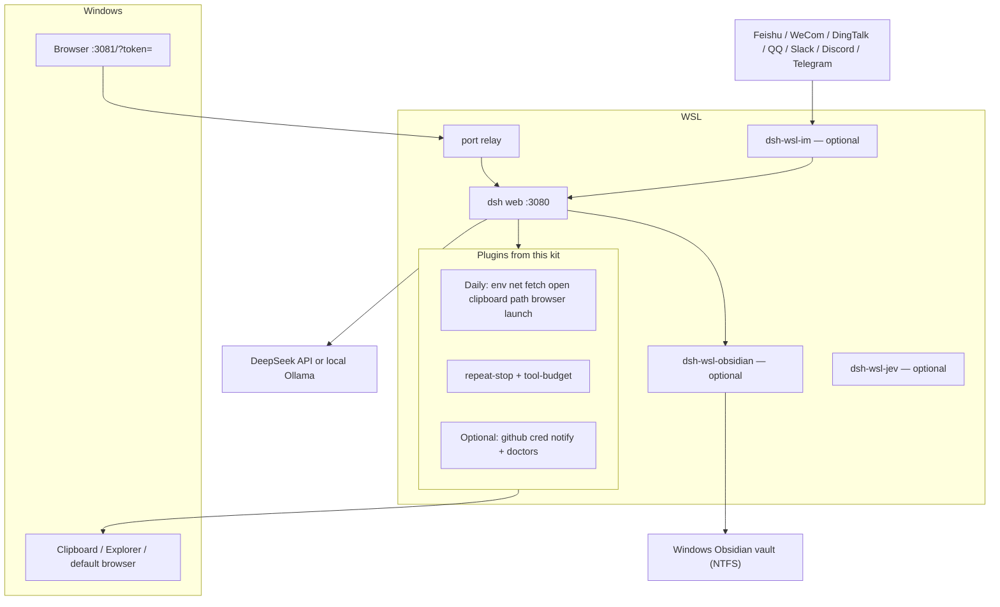

# dsh-wsl-kit

**One line:** DeepSeek Harness agent in WSL, chat in a Windows browser — install this kit when paths, proxy, clipboard, and “open that file” must cross the OS boundary.

This is a **meta-repo** (docs + install script + [`cordis.patch.yml`](./cordis.patch.yml)). It does not ship plugin runtimes. Each plugin repo ships a homepage `README.md` (often Chinese-first for newer plugins) plus `README.en.md` / `README.zh.md` as needed.

[中文说明 → README.zh.md](./README.zh.md)

---

## How the pieces fit

The kit is not a runtime. `install.sh` clones plugins into the dsh `web` profile. Chat stays on Windows; the agent and tools stay in WSL. Optional [dsh-wsl-im](https://github.com/173787247/dsh-wsl-im), [dsh-wsl-obsidian](https://github.com/173787247/dsh-wsl-obsidian), and [dsh-wsl-jev](https://github.com/173787247/dsh-wsl-jev) are **not** in `install.sh`.

| Boundary | Who owns it |
|----------|-------------|
| Windows UI | Browser on `:3081` with a one-shot `?token=` (bare `:3081` is 401; `:3080` is WSL-only) |
| Agent | `dsh web` inside WSL, tools via plugin `ctx` |
| Cross-OS | Daily plugins (`path`, `open`, `clipboard`, `browser`, `launch`, `net`, `fetch`) |
| IM | `dsh-wsl-im` outbound WS/Stream/Gateway → `ctx.agents`. One workspace per IM, one session per chat |
| Obsidian | `dsh-wsl-obsidian`: WSL agent ↔ Windows NTFS vault + `obsidian://`. Not in `install.sh` |
| Jev | `dsh-wsl-jev`: System One decisions (`jev_ask` / `check` / `rank`) via OpenRouter or TypeSafe. Not in `install.sh` |

## Plugin versions

Sibling checkout versions on **2026-09-18**. Floors enforced by [`scripts/check-plugin-versions.sh`](./scripts/check-plugin-versions.sh) are the minimum, not this snapshot.

Local dsh line the same day: **`0.1.6-alpha.1`** (`alpha` tag). npm `latest` noted earlier in this file was still **`0.1.5-rc.1`**. Scripts still assume dsh **≥0.1.2**.

### Daily

| Plugin | Version | Set |
|--------|---------|-----|
| [dsh-wsl-env](https://github.com/173787247/dsh-wsl-env) | 0.3.0 | daily |
| [dsh-wsl-net](https://github.com/173787247/dsh-wsl-net) | 0.5.2 | daily |
| [dsh-wsl-fetch](https://github.com/173787247/dsh-wsl-fetch) | 0.1.2 | daily |
| [dsh-wsl-open](https://github.com/173787247/dsh-wsl-open) | 0.2.0 | daily |
| [dsh-repeat-stop](https://github.com/173787247/dsh-repeat-stop) | 0.1.2 | daily |
| [dsh-tool-budget](https://github.com/173787247/dsh-tool-budget) | 0.1.2 | daily |
| [dsh-wsl-clipboard](https://github.com/173787247/dsh-wsl-clipboard) | 0.1.0 | daily |
| [dsh-wsl-path](https://github.com/173787247/dsh-wsl-path) | 0.2.0 | daily |
| [dsh-wsl-browser](https://github.com/173787247/dsh-wsl-browser) | 0.1.0 | daily |
| [dsh-wsl-launch](https://github.com/173787247/dsh-wsl-launch) | 0.1.0 | daily |

### GitHub add-on and optional

| Plugin | Version | Set |
|--------|---------|-----|
| [dsh-wsl-github](https://github.com/173787247/dsh-wsl-github) | 0.2.0 | github |
| [dsh-wsl-cred](https://github.com/173787247/dsh-wsl-cred) | 0.2.0 | github |
| [dsh-wsl-notify](https://github.com/173787247/dsh-wsl-notify) | 0.1.0 | github |
| [dsh-wsl-im](https://github.com/173787247/dsh-wsl-im) | 0.3.2 | not in `install.sh` |
| [dsh-wsl-obscura](https://github.com/173787247/dsh-wsl-obscura) | 0.1.0 | not in Daily |
| [dsh-wsl-obsidian](https://github.com/173787247/dsh-wsl-obsidian) | 0.1.0 | not in `install.sh` (optional) |
| [dsh-wsl-jev](https://github.com/173787247/dsh-wsl-jev) | 0.1.0 | not in `install.sh` (optional) |
| [dsh-wsl-ollama](https://github.com/173787247/dsh-wsl-ollama) | 0.1.0 | not in `install.sh` (optional) |
| [dsh-wsl-media](https://github.com/173787247/dsh-wsl-media) | 0.2.0 | not in `install.sh` (optional) |
| [dsh-wsl-search](https://github.com/173787247/dsh-wsl-search) | 0.2.0 | not in `install.sh` (optional) |
| [dsh-wsl-vecmem](https://github.com/173787247/dsh-wsl-vecmem) | 0.1.0 | not in `install.sh` (optional) |
| [dsh-wsl-k8s](https://github.com/173787247/dsh-wsl-k8s) | 0.1.0 | not in `install.sh` (optional) |
| [dsh-wsl-secret](https://github.com/173787247/dsh-wsl-secret) | 0.2.0 | not in `install.sh` (optional) |
| [dsh-wsl-llamacpp](https://github.com/173787247/dsh-wsl-llamacpp) | 0.1.0 | not in `install.sh` (optional) |
| [dsh-wsl-vllm](https://github.com/173787247/dsh-wsl-vllm) | 0.1.0 | not in `install.sh` (optional) |
| [dsh-wsl-struct](https://github.com/173787247/dsh-wsl-struct) | 0.1.0 | not in `install.sh` (optional) |
| [dsh-wsl-git](https://github.com/173787247/dsh-wsl-git) | 0.1.0 | not in `install.sh` (optional) |
| [dsh-wsl-tmux](https://github.com/173787247/dsh-wsl-tmux) | 0.1.0 | not in `install.sh` (optional) |
| [dsh-wsl-compose](https://github.com/173787247/dsh-wsl-compose) | 0.1.0 | not in `install.sh` (optional) |
| [dsh-wsl-systemd](https://github.com/173787247/dsh-wsl-systemd) | 0.1.0 | not in `install.sh` (optional) |
| [dsh-wsl-helm](https://github.com/173787247/dsh-wsl-helm) | 0.1.0 | not in `install.sh` (optional) |
| [dsh-wsl-terraform](https://github.com/173787247/dsh-wsl-terraform) | 0.1.0 | not in `install.sh` (optional) |
| [dsh-wsl-rclone](https://github.com/173787247/dsh-wsl-rclone) | 0.1.0 | not in `install.sh` (optional) |
| [dsh-wsl-db](https://github.com/173787247/dsh-wsl-db) | 0.1.0 | not in `install.sh` (optional) |
| [dsh-wsl-glab](https://github.com/173787247/dsh-wsl-glab) | 0.1.0 | not in `install.sh` (optional) |
| [dsh-wsl-playwright](https://github.com/173787247/dsh-wsl-playwright) | 0.1.0 | not in `install.sh` (optional) |
| [dsh-wsl-mail](https://github.com/173787247/dsh-wsl-mail) | 0.1.0 | not in `install.sh` (optional) |
| [dsh-wsl-cal](https://github.com/173787247/dsh-wsl-cal) | 0.1.0 | not in `install.sh` (optional) |
| [dsh-wsl-pkg](https://github.com/173787247/dsh-wsl-pkg) | 0.1.0 | not in `install.sh` (optional) |

### Full-set extras

| Plugin | Version | Plugin | Version |
|--------|---------|--------|---------|
| [gpu](https://github.com/173787247/dsh-wsl-gpu) | 0.2.2 | [port](https://github.com/173787247/dsh-wsl-port) | 0.2.2 |
| [distro](https://github.com/173787247/dsh-wsl-distro) | 0.2.0 | [workspace](https://github.com/173787247/dsh-wsl-workspace) | 0.2.0 |
| [picker](https://github.com/173787247/dsh-wsl-picker) | 0.1.0 | [tray](https://github.com/173787247/dsh-wsl-tray) | 0.2.4 |
| [expose](https://github.com/173787247/dsh-wsl-expose) | 0.2.2 | [hostsvc](https://github.com/173787247/dsh-wsl-hostsvc) | 0.4.3 |
| [clock](https://github.com/173787247/dsh-wsl-clock) | 0.2.0 | [dns](https://github.com/173787247/dsh-wsl-dns) | 0.2.0 |
| [mnt](https://github.com/173787247/dsh-wsl-mnt) | 0.2.0 | [editor](https://github.com/173787247/dsh-wsl-editor) | 0.1.0 |
| [shot](https://github.com/173787247/dsh-wsl-shot) | 0.1.0 | [docker](https://github.com/173787247/dsh-wsl-docker) | 0.2.2 |
| [ssh-agent](https://github.com/173787247/dsh-wsl-ssh-agent) | 0.2.0 | [encoding](https://github.com/173787247/dsh-wsl-encoding) | 0.2.0 |
| [wslconfig](https://github.com/173787247/dsh-wsl-wslconfig) | 0.2.0 | [download](https://github.com/173787247/dsh-wsl-download) | 0.2.0 |

Shared helper [dsh-wsl-common](https://github.com/173787247/dsh-wsl-common) `