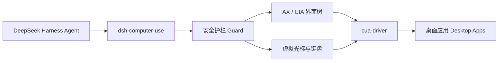

# dsh-computer-use

> **让 DeepSeek Harness 像人一样操作桌面。** 观察屏幕、定位界面元素、移动独立虚拟光标、点击、输入、滚动和拖拽。
>
> **Give DeepSeek Harness a safe, observable Computer Use layer.** Observe desktop applications, locate UI elements, and act through an isolated virtual cursor.

[](https://github.com/988hj7tczd-oss/dsh-computer-use/actions/workflows/ci.yml)
[](https://www.npmjs.com/package/dsh-computer-use)
[](https://www.npmjs.com/package/dsh-computer-use)
[](https://github.com/988hj7tczd-oss/dsh-computer-use)
[](LICENSE)
[](https://nodejs.org/)
[](#platform-support--平台支持)


> **真实演示 · Real demo:** a local, non-sensitive page was observed, filled, clicked, and verified through the Computer Use action loop.

**中文文档 · English documentation**

- [中文文档](#中文文档)
- [English Documentation](#english-documentation)

## 生态入口 · Ecosystem

| 入口 | 作用 | Link |
|---|---|---|
| **harness-desktop** | 开箱即用的 DeepSeek Harness 桌面客户端 · Ready-to-use desktop client | [下载 / Download](https://github.com/988hj7tczd-oss/harness-desktop/releases) |
| **AI House** | 发现 AI 工具、模型和 Agent · Discover AI tools and agents | [工具中心 / Tools](https://www.aibunkhouse.com/tools) |
| **npm** | 安装和查看包信息 · Install and inspect the package | [dsh-computer-use](https://www.npmjs.com/package/dsh-computer-use) |
| **awesome-dsh-plugin** | 发现更多 DeepSeek Harness 插件 · Discover more plugins | [Plugin list](https://github.com/988hj7tczd-oss/awesome-dsh-plugin) |
| **Gitee 镜像** | 国内访问入口 · China mirror | [Gitee](https://gitee.com/jerryweizhihao/dsh-computer-use) |

---

# 中文文档

## 这是什么？

`dsh-computer-use` 是 DeepSeek Harness 的跨平台 Computer Use 插件，为 AI Agent 增加一套可观察、可约束、可验证的桌面操作能力。

它不是传统的鼠标宏：Agent 必须先观察目标窗口，再基于新鲜快照执行动作。点击、双击和右键操作通过 cua-driver 的独立虚拟光标完成，用户可以看到操作过程，而不是让程序悄悄发送一串不可见事件。

适合用于：

- 让 DeepSeek Harness 操作原生 macOS、Windows 和 Linux 桌面应用；
- 操作 Electron、Canvas 或游戏等 Accessibility/AX 信息不完整的界面；
- 构建“打开应用 → 观察 → 点击 → 输入 → 再观察验证”的 Agent 闭环；
- 为桌面自动化、内部工具和个人工作流增加可审计的 Computer Use 执行层；
- 研究 Computer Use、视觉定位和安全护栏。

> 本项目是开源社区插件，不是 DeepSeek 官方产品，也不代表 DeepSeek 的官方立场。

## 为什么需要它？

普通文本 Agent 可以生成答案，但无法直接完成很多桌面任务。`dsh-computer-use` 把桌面交互拆成三个阶段：

```text
观察 Observation → 决策 Decision → 受约束执行 Guarded Action
```



核心原则：

1. **先观察，再操作**：没有新鲜观察快照时，动作会被拒绝；
2. **模型所见即所点**：元素编号和坐标来自同一窗口截图空间；
3. **语义优先**：优先使用 `element` 编号，坐标模式保留视觉操作自由度；
4. **失败关闭**：目标不明确、快照过期、应用不在白名单时不继续执行。

## 能力一览

| 能力 | 说明 |
|---|---|
| 屏幕观察 | 读取目标窗口元数据、Accessibility/AX/UIA 元素和坐标 |
| 三种观察模式 | `ax` 零视觉 Token、`native` 主模型直读图片、`vision` 视觉观察者 |
| 独立虚拟光标 | 点击、双击、右键会显示虚拟光标移动和操作过程，不抢用户真实鼠标 |
| 文本与快捷键 | 输入文本、发送 `return`、`cmd+c`、`ctrl+shift+p` 等按键 |
| 滚动与拖拽 | 支持上下左右滚动和窗口本地截图坐标拖拽 |
| 应用管理 | 列出运行中的应用，后台启动应用，按需前置窗口 |
| 安全护栏 | 快照 TTL、应用白名单、危险操作审批、密码框保护 |
| 跨平台 | macOS 已验证；Windows/Linux 需按真实环境完成平台验收 |

## 12 个模型工具

| 工具 | 作用 | 主要参数 |
|---|---|---|
| `screen_observe` | 获取窗口、AX/UIA 元素、坐标或截图 | `window`, `mode`, `query`, `maxElements` |
| `screen_zoom` | 截取并放大窗口局部区域 | `window_id`, `pid`, `x1`, `y1`, `x2`, `y2` |
| `computer_click` | 点击元素或截图坐标 | `element` 或 `x,y`，可选 `count` |
| `computer_double_click` | 双击元素或坐标 | `element` 或 `x,y` |
| `computer_right_click` | 右键点击元素或坐标 | `element` 或 `x,y` |
| `computer_type` | 向焦点或指定元素输入文本 | `text`, 可选 `element` |
| `computer_key` | 发送按键或快捷键 | `key`，例如 `return`、`cmd+c` |
| `computer_scroll` | 在目标窗口滚动 | `direction`, `amount`, 可选 `element` |
| `computer_drag` | 拖拽窗口中的区域 | `from_x`, `from_y`, `to_x`, `to_y` |
| `computer_wait` | 等待界面加载或动画完成 | `ms`，最大 60000 |
| `app_list` | 列出正在运行的应用 | 无 |
| `app_launch` | 启动应用 | `name` 或 `bundle_id`，可选 `bring_to_front` |

## 快速开始

### 方式一：使用 harness-desktop

普通桌面用户建议先下载 [harness-desktop](https://github.com/988hj7tczd-oss/harness-desktop/releases)。它是一个开箱即用的 DeepSeek Harness 桌面客户端，支持 macOS、Windows 和 Linux。

```text
1. 下载并启动 harness-desktop
2. 完成首启配置
3. 安装本插件
4. 重启 harness-desktop
5. 在对话中让 Agent 操作桌面
```

### 方式二：从 GitHub 源码安装

```bash
git clone https://github.com/988hj7tczd-oss/dsh-computer-use.git
cd dsh-computer-use

# 先预演，不写入配置
./install.sh --dry-run

# 安装到用户级 patch 层
./install.sh

# 安装后重启 harness-desktop
```

安装脚本只做两件事：

1. 将插件链接到 `$DSH_HOME/profiles/web/node_modules/dsh-computer-use`；
2. 在 `$DSH_HOME/cordis.patch.yml` 注册插件。

脚本使用用户级 patch 层，不修改项目代码，也不修改其他 profile 的配置。

### Windows / Linux

`install.sh` 默认使用 macOS 的 `DSH_HOME` 路径。Windows 或 Linux 用户请先指定自己的 DSH home：

```bash
export DSH_HOME="/path/to/your/dsh-home"
./install.sh --dry-run
./install.sh
```

如果系统不支持符号链接，请使用宿主 DSH 的插件管理方式，或按照 `docs/store-evidence.md` 中的手动安装说明操作。

### 方式三：npm 包

```bash
npm install -g dsh-computer-use
```

安装后仍需要让 DSH profile 加载该 bundle，并确认 `cua-driver` 已经安装且在 `PATH` 中，或设置：

```bash
export CUA_DRIVER_BIN=/path/to/cua-driver
```

在 Windows 官方安装器布局中，插件还会自动探测
`%USERPROFILE%\\.cua-driver\\packages\\current\\cua-driver.exe`；GUI 宿主的 PATH 不完整时无需手工把目录加入 PATH。

安装完成后重启宿主，再通过 `app_list` 或 `screen_observe` 验证工具是否出现。

## 第一个完整任务

安装并授权后，可以让 Agent 执行下面的任务：

```text
请完成以下桌面任务：

1. 使用 app_list 列出正在运行的应用；
2. 使用 app_launch 打开一个普通桌面应用；
3. 使用 screen_observe 观察目标窗口；
4. 找到目标按钮，优先使用 element 编号点击；
5. 使用 computer_type 输入一段非敏感测试文本；
6. 再次使用 screen_observe 验证文本已经出现；
7. 如果界面发生变化，请重新观察，不要使用旧元素编号继续操作；
8. 如果动作被安全护栏拒绝，请报告拒绝原因，不要绕过护栏。
```

### 推荐的操作循环

```text
app_list / app_launch
        ↓
screen_observe
        ↓
computer_click / computer_type / computer_key
        ↓
computer_wait（如需等待）
        ↓
screen_observe 验证结果
```

每一次界面明显变化后，都应重新调用 `screen_observe`。元素编号属于某一次观察快照，不应跨页面、弹窗或长时间等待复用。

## 观察模式

`screen_observe` 的 `mode` 有三种选择：

| 模式 | 原理 | 成本 | 适用场景 |
|---|---|---|---|
| `ax`（默认） | 读取 AX/UIA 界面树并返回编号和坐标 | 不消耗视觉 Token | 原生应用、元素树完整的界面 |
| `native` | 将截图作为图片块交给当前对话模型 | 图片 Token；不额外调用视觉观察者 | Canvas、游戏、Electron 或 AX 树为空的界面 |
| `vision` | 通过 Harness 的 `ctx.llm` 调用视觉模型，返回结构化元素列表 | 额外一次视觉模型调用 | 当前主模型不支持图片输入时 |

### `native` 模式

当前对话模型必须声明支持 `image` 输入，例如视觉模型。插件通过 Harness attachments 传递图片，不额外发起独立视觉 API 请求。

```text
screen_observe(mode="native")
```

### `vision` 模式

默认观察模型为：

```text
provider: deepseek-official
model: deepseek-v4-flash-vision-exp
```

老版本 Harness 需要在模型配置中声明：

```yaml
models:
  - id: deepseek-v4-flash-vision-exp
    input: [text, image]
```

当 DeepSeek 视觉观察者不可用时，插件可以尝试 GLM 视觉兜底。GLM 兜底需要 `ZHIPU_API_KEY`，并可能受到免费模型访问量限制。

### 自动降级

当 AX/UIA 树为空时，插件会尝试：

```text
native（当前路由支持图片时）
  → vision（宿主存在可用视觉模型时）
  → ax（返回可用的界面树信息或明确错误）
```

## 坐标语义

从 v0.2.0 起，所有坐标均为：

> **窗口本地截图像素（window-local screenshot pixels）**

这意味着：

- 坐标原点在目标窗口左上角；
- `screen_observe` 输出的 `@(x,y)` 与 `computer_click(x=,y=)` 使用同一坐标系；
- 不需要乘以 2；
- 不需要加屏幕坐标或窗口偏移；
- 使用 `screen_zoom` 时，返回图片是局部区域，但点击仍应使用整窗截图坐标。

优先使用：

```text
computer_click(element=5)
```

只有在元素无法通过 AX/UIA 识别，或视觉模式给出坐标时，才使用：

```text
computer_click(x=640, y=420)
```

## 安全模型

### 已内置的安全机制

1. **无快照拒绝**：没有先调用 `screen_observe`，动作不会执行；
2. **观察快照 TTL**：快照过期后动作被拒绝，必须重新观察；
3. **应用白名单**：配置 `allowedApps` 后，只允许指定应用接受操作；
4. **危险操作审批**：元素标签命中删除、支付、购买、转账、退出登录等词时请求用户确认；
5. **密码框保护**：检测到 `AXSecureTextField` / `AXPasswordField` 时拒绝自动输入；
6. **固定 argv 调用**：通过宿主以非 shell 方式启动 `cua-driver`；
7. **权限边界声明**：核心桌面路径不读取业务文件或额外凭据；仅当用户配置视觉 GLM fallback 时，才读取指定 key 来源并向 GLM API 发起请求；没有 npm lifecycle 安装脚本。

### 重要限制

语义安全检测依赖观察到的元素标签，主要对 `element` 编号模式有效：

- `x/y` 坐标模式无法提前知道目标语义，主要依赖快照 TTL 和可见操作；
- `computer_type` 和 `computer_key` 作用于当前焦点时，无法预判最终目标内容；
- `computer_key