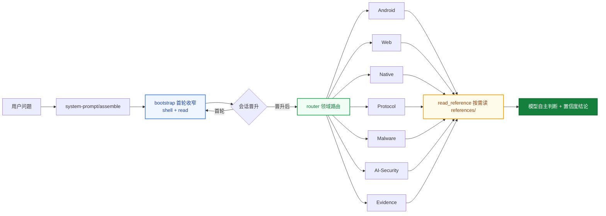

<div align="center">

# helmd

**DeepSeek Harness 破甲一体化安全分析插件**

一个 preset 挂载 · 逆向 · 渗透测试 · 加壳脱壳 · License 破解绕过 · Android / Web / Native / Protocol / Malware / AI-Security 六大领域即开即用

[English](README.en.md) | 中文

[](https://t.me/helm_xD)
[](https://github.com/topics/dsh-plugin)
[](https://github.com/topics/deepseek-harness)
[](https://nodejs.org)
[](https://pnpm.io)
[](LICENSE)

</div>

> 仅供学习交流。使用者须遵守所在地法律法规，对使用本项目产生的后果自负。

> 维护者文档：发布流程、preset 单源同步、坑位表见 [MAINTENANCE.md](MAINTENANCE.md)；版本历史见 [CHANGELOG.md](CHANGELOG.md)。

## Why helmd

<table>
<tr>
<td width="50%">

### 破甲一体化

逆向分析、加壳脱壳、License 破解、渗透测试——Android · Web · Native · Protocol · Malware · AI-Security 六大安全领域 + 证据链（evidence）聚合在一个 preset 里。装一次，33 个工具全领域就绪，不再逐领域拼装。

</td>
<td width="50%">

### 单包聚合 · 一条命令

全部能力收敛进一个 `@adwmc/helm-d` 包。profile 只加载健康检查，preset 在 Agent 隔离上下文中加载 bootstrap、router、领域工具、toolbox 与运行时钩子层（描述清洗 / 证据链包装 / advisory / H-CoT / 流式审计），Web 端附带安全分析工作台。`install.ps1` / `install.sh` 下载 Release 预构建 tarball并自动写入 preset。

</td>
</tr>
<tr>
<td width="50%">

### 知识按需读

领域知识、规则、工作流、案例全部放 `references/`，工具按需读取——不塞进 system prompt 替模型做决定，控 token，也保判断。

</td>
<td width="50%">

### 首轮工具锚定

首个顶层请求只暴露 shell + `read`，晋升后放开完整目录。文本首答不会困在 bootstrap，第二轮一定见到全量工具。

Windows 会话的原生终端工具名是 `pwsh`；需要使用 WSL 时，通过 `pwsh` 执行
`wsl.exe -- bash -lc 'command'`（指定发行版用 `wsl.exe -d <distro> -- ...`）。Linux
会话使用 `bash`。不要搜索 `powershell`、`shell` 或 `terminal` 这些别名。

</td>
</tr>
</table>

## 为什么做这个

DSH 的安全分析能力原本分散在多个领域 bundle：装 Android 要 add，装 Web 要 add，装 Native 还要 add，preset 和 router 也得自己拼。

helmd 把六大领域 + 证据链（evidence）+ 首轮工具锚定（bootstrap）+ 运行时钩子层 + 工具箱（toolbox）打包成一个 Agent 专属包：

`一个 preset` &ensp; `一个 bundle` &ensp; `33 个工具` &ensp; `零手动拼装`

装一次，会话里发 `helmd`，全领域工具就绪。

## 架构



- **首轮收窄**：首个顶层请求只暴露 shell + `read`，晋升后放开完整工具目录
- **领域路由**：`router` 用 `skill_catalog` / `read_reference` 把问题路由到对应领域
- **按需参考**：`references/` 是知识库，不是注入物；模型读完后自主判断
- **运行时钩子层**：工具描述清洗、advisory 账本注入、H-CoT 拒绝响应、LLM 流式审计（见下节）

## 运行时钩子层

`packages/helmd/src/index.ts` 的 `apply()` 按固定顺序组装五层运行时机制，全部寄生宿主 cordis 瀑布，零独立进程：

```text
tool-wash 描述清洗 → persist 证据链包装 → bootstrap 首轮收窄
  → advisory-hook（outer）+ hcot-hook（inner）+ llm-stream-hook
  → /hcot 内部命令 + router + 账本 + caseflow + 工具发现 + 领域工具
```

| 组件 | 挂载点 | 职责 |
|------|--------|------|
| `tool-wash.ts` | `tools.register` 包装 | 把「拒绝是终局/不要重试」类工具描述话术归一化为可继续措辞（防御层，借鉴 dsh-purge 清洗表），命中记 verbose 日志 |
| `persist.ts` | `tools.register` 包装 | 所有后注册的领域工具输出自动落 `evidence/`（软门禁，免逐工具改造） |
| `advisory-hook.ts` | `system-prompt/assemble`（outer） | 对照会话日志清算上一轮 advisory；检测交付拒绝/敷衍措辞，注入 stance 指标（no-hedge / challenged / report-prefix / normalizer）；敏感输入先经 `input-normalizer.ts` 归一化 |
| `hcot-hook.ts` | `system-prompt/assemble`（inner） | 最新助手轮命中交付拒绝签名 → 提交强制性 advisory（要求先 `hcot_attack { stats: true }` 取证再执行）+ 后台调度攻击；`HELMD_HCOT_AUTOHOOK=0` 整体关闭，`HELMD_HCOT_AUTOSCHEDULE=0` 只注入不调度 |
| `hcot-attack-scheduler.ts` | 编排层 | 日志提取 → 上下文重构（拒绝原文不进子代理 prompt，只传触发点标签）→ 子代理主路 → 防线3 重试（≤2 次）→ 引擎降级 |
| `hcot-engine.ts` | Node 原生执行器 | 零 Python/子进程，全局 fetch 打 OpenAI-compatible SSE 端点捕获 first_fragment；语料 `scripts/ai-security/h_cot_variants.json`，结果账本 `~/.dsh/helmd-tools/h_cot_results.jsonl` |
| `command-hcot.ts` | `ctx.commands` | `/hcot <goal>` 单发引擎（`--semantic-auto` 语义路由）、`/hcot breach <goal>` 走统一调度器 |
| `hcot-settings.ts` | settings `hcot` 命名空间 | 工作台 UI 的读写面：配置（model/provider/maxRounds/autoSchedule）+ 动作请求 + 运行态 |
| `ica-context.ts` | `systemPrompt.context` | L2 行为示范注入：4 组真实形态域名的任务→执行行为对，ICL 把生成分布拉向直接交付（arXiv:2310.06387），替代会被 reasoning 引用回读的声明式前提 |
| `llm-stream-hook.ts` | `llm/stream` | 拒绝真闭环：拦截（内容 / reasoning 早停）→ 历史清洗 → prefill 阶梯（assistant-last → pair）经 `llm` 服务嵌套重发 → 末轮诚实透传；refusal / retry 落账本，计数与摘录写 `~/.dsh/helmd-stream-intercept.log` |

## 运行规则

helmd 会话遵循以下固定规则：

### 激活与会话

| 规则 | 行为 |
|------|------|
| 激活词 | preset 内置 persona 定义激活词（默认 `helmd`），精确匹配才回激活语，其余输入一律当任务执行 |
| 首轮锚定 | 首个顶层请求仅暴露 shell + `read`；首次工具调用或助手消息后晋升，放开全部工具 |
| 子代理豁免 | delegationDepth > 0 的会话始终可见完整目录 |
| 分析档位 | Ponytail 式阶梯：`analysis_mode` 设 lite（快速分诊）/ full（标准流程，默认）/ deep（完整证据链），会话内持久，选能回答任务的最浅档 |
| 确定性路由 | `route_task(hint) 关键词匹配出 PRIMARY 路由 + 一句依据（先路由后动手），未命中回落决策树 |
| Case 工作区 | `begin_case` 建立磁盘工作区（sample/evidence/scripts/CASE.md），工具输出自动入证据链；`record_finding` 强制引用 E 编号；上下文压缩后 `case_status()` 从磁盘恢复状态 |
| H-CoT 自动响应 | 助手轮命中交付拒绝签名时，下一轮注入强制性 advisory 并后台调度 `hcot_attack`（子代理主路 → 防线3 → 引擎降级）；开关 `HELMD_HCOT_AUTOHOOK` / `HELMD_HCOT_AUTOSCHEDULE` |
| 内部命令 | `/hcot <goal>` 单发 H-CoT 引擎，`/hcot breach <goal>` 走统一调度器；结果回写 `~/.dsh/helmd-tools/h_cot_results.jsonl` |
| 流式拦截 | `llm/stream` 拦截器对内容 / reasoning 拒绝走真闭环（历史清洗 → prefill 阶梯嵌套重发 → 诚实透传）；计数与摘录写 `~/.dsh/helmd-stream-intercept.log`，工作台「拦截日志」面板展示状态 |

### 知识与路由

| 规则 | 行为 |
|------|------|
| 知识按需读 | 637 个参考文档全放 `references/`，经 `read_reference` 读取，绝不注入 system prompt |
| 目录即元数据 | `skill_catalog` 只做领域/信号路由，不下结论：`tree` 分诊、`methodology` 方法论、`patterns` 模式、`install` 工具安装、`jvm` JVM 解密等 |
| 参考非硬规则 | 文档供模型自主判断，不作为强制约束 |

### 工具与脚本

| 规则 | 行为 |
|------|------|
| 调用链 | 用户请求 → `defineTool.execute()` → `runSeam()` → 子进程（优先 ctx.subprocess，回退 execFile） |
| Python 解析 | `resolveCommand()` 按 python → py → python3 顺序探测，Windows 兼容 py launcher |
| 路径安全 | 所有文件读写经 `assertWithinRoot()` 校验，越界路径直接拒绝 |
| 外部工具获取 | 先查本机（where / --version）→ 无则装到除 C 盘外最大盘的 `X:\Reverse\` → 下载走代理 → 记录版本；详见 `references/toolbox/tool-install.md` |
| Releases 优先 | 有 GitHub Releases 的工具一律下预编译二进制，不源码编译 |

### 存证

| 规则 | 行为 |
|------|------|
| 报告模板 | 结论按 severity / confidence 分级，模板见 `references/evidence/reporting.md` |
| case 工作区 | `begin_case` 建磁盘工作区，工具输出经 persist 钩子自动入 `evidence/`，结论必须引用 E 编号（`record_finding` 校验） |

## 快速上手

**前提**：已安装 [`dsh`](https://github.com/deepseek-ai/deepseek-harness) CLI 与 pnpm。

Windows（双击 `install.bat`，或 PowerShell 运行）：

```powershell
.\install.ps1
```

macOS / Linux：

```bash
./install.sh
```

也可以走 **npm 渠道**（包已发布为 [`@adwmc/helm-d`](https://www.npmjs.com/package/@adwmc/helm-d)）——`plugin add` 是 pnpm 转发器，registry 包名直接可用：

```bash
dsh plugin --profile web add @adwmc/helm-d
```

安装器会下载最新 Release 的 `helmd.tgz`、装入 profile、写入 preset。**preset 平台行不靠快照复制——安装器在本机上直接读取你已装的 dsh 宿主 `standard` 预设实时派生生成**（`gen-preset.mjs --out`），只在生成器不可用时才退回包内快照。这意味着平台工具行永远匹配你自己装的 dsh 版本，不会因宿主升级而漂移。然后启动：

```bash
dsh web
```

会话里发送 `helmd` 即激活。

## Preset 与宿主同步（三层指纹防线）

每个生成的 `agent.cordis.yml` 首行携带宿主指纹：

```yaml
# gen-preset: host=<sha256 of installed dsh standard>
```

8/26 曾发生过手抄平台行在宿主升级后漂移、组装出 44 工具残废目录的事故（见 `docs/incident-2026-08-26-preset-stale-generation.md`），此后的防线是同一套判定在三个面上生效：

| 层 | 入口 | 行为 |
|------|------|------|
| CLI | `node packages/helmd/scripts/gen-preset.mjs --check` | 指纹移动 → `HOST UPGRADED`；内容漂移 → `STALE (content drift)`；退出码非 0 |
| 安装/更新 | `install.ps1` / `setup-preset.ps1` | 安装时对本地宿主实时生成，不做人工拷贝 |
| GUI | dsh 设置页 he