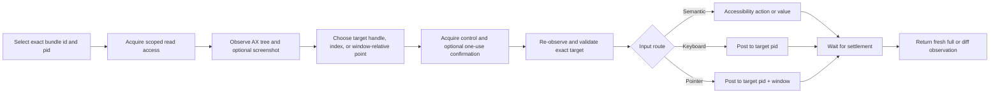

# DSH Computer Use

[](https://x.com/anion_ex)
[](LICENSE)


**Native macOS control for DeepSeek Harness that keeps your real cursor and foreground application alone by default; the Bundle may bring the target app forward before keyboard input for reliable typing.**

DSH Computer Use gives an Agent fresh Accessibility observations, exact process/window targeting, stale-state rejection, scoped application access, and verified post-action state. Semantic Accessibility comes first; mouse, drag, wheel, and keyboard fallback are routed to the selected process instead of the global desktop.

English | [中文](README.zh.md)

## Why it is different

Accessibility permission lets a process inspect and operate macOS UI elements, but the permission itself does not prevent focus stealing or cursor movement. Those behaviors depend on the input route.

The default DSH Computer Use route is deliberately non-interfering:

- **No system-cursor movement:** the helper contains no cursor-warp path.
- **No global pointer injection:** click, scroll, and drag fallback use a pid/window-targeted SkyLight route, not the global HID event stream.
- **No pointer-triggered activation:** semantic Accessibility, process-targeted pointer input, and `keyboardPolicy: preserve` run without activation; `keyboardPolicy: activate` (Bundle default) brings the target app forward before keyboard fallback, matching Codex Computer Use.
- **A separate Agent cursor:** click, scroll, and drag actions animate a click-through, nonactivating software cursor while the macOS system cursor remains untouched. It appears only while the exact target application is frontmost and follows a speed/acceleration-shaped curved path. Click and scroll wait for arrival before input; drag reaches and presses at the start point, then tracks the destination while the native drag runs.
- **No blind replay:** every action is tied to an exact, unexpired observation and returns fresh state.

The result is a native action layer that can operate many background applications while the user continues working in the current foreground application.

## What it adds

- **Observe before acting.** Return a bounded Accessibility tree, indexed elements, exact app/process/window metadata, permission state, and an optional screenshot Artifact.
- **Bind actions to state.** Every element exposes an observation-local index and opaque `targetHandle`; exact lookup remains compatible, while explicitly allowed rebinding accepts only a unique native or semantic identity inside the same process and window.
- **Prefer semantic input.** Use `AXPress`, editable values, selected-text assignment, and advertised Accessibility actions before pointer fallback.
- **Route fallback to the target.** Keyboard input goes to the selected pid; pointer input goes to the selected pid and `CGWindowID` with window-local coordinates, resolving the app window under the point so arbitrary screen coordinates work.
- **Return fresh evidence.** Every successful action settles for a bounded interval and returns a new full or diff observation.
- **Scope application access.** Read and control leases are separated by Agent, Session, turn, and exact bundle id; high-impact actions require one-use confirmation.
- **Keep the model surface focused.** Execution Tools appear only after the current Agent loads the Computer Use Skill.

## Proof: a never-active background fixture

The repository includes a deterministic AppKit fixture and a universal native helper. Release tests start the fixture with `open -g` in background mode, then use the same protocol exposed to the Agent.

```text
observe exact bundle id + pid
-> element: "Targeted pointer probe", no AXPress action
-> computer_click with observationId + element index + allowCoordinateFallback
-> fresh observation
-> activation "not-requested"; pointerRouting "target-process"
-> status "Status: pointer click"
```

<p align="center">
  
</p>

The fixture records every `applicationDidBecomeActive` callback. An independent native monitor also samples the system cursor and frontmost pid every millisecond throughout click, scroll, and drag. The default release path must not increase `activationCount`; it also requires unchanged cursor coordinates, an unchanged frontmost pid, exact click/scroll counts, and one complete down/up drag gesture.

See [Foreground-safe input policy](docs/interaction-policy.md) for the requirements, architecture, decisions, evidence, and compatibility limits.

## Scope

`dsh-computer-use` is the native **action layer**. It does not replace narrower interfaces:

- browser tasks should use browser automation and DOM/CDP state;
- APIs, CLIs, and purpose-built application plugins remain preferable when available;
- OCR, visual grounding, and pixel interpretation should use the separately installed `dsh-vision-toolkit`: load the `vision-tools` Skill and pass the exact screenshot Artifact path to `vision_glance`, `vision_ground`, `vision_detect`, `vision_crop`, or `vision_long_screenshot_ocr`; do not replace those tools with shell-driven `tesseract`, `screencapture`, or ad hoc Swift/Python OCR;
- domain bundles such as `dsh-design` can compose Computer Use when a workflow crosses into a native application.

## Quick start

### Prerequisites

- macOS 14 or newer.
- DeepSeek Harness with a Web or Headless Profile and the Skill Tool mounted.
- macOS Accessibility permission for observation and native actions.
- macOS Screen Recording permission only when a screenshot is requested.
- Node.js `^22.19.0` or `>=24.0.0` when building this repository.

Install the Web and Headless bundles directly from npm:

> [!IMPORTANT]
> The published package name is `@anionex/dsh-computer-use`. The former
> `@dsh-external/dsh-computer-use` name was never published to npm and is not
> installable; update any old profile or manifest references before installing.

```sh
dsh plugin --profile web add @anionex/dsh-computer-use
dsh plugin --profile headless add @anionex/dsh-computer-use

dsh --profile web --dump-config | grep computer-use
dsh --profile headless --dump-config | grep computer-use
```

For local development, replace the package name with an absolute checkout path.

Restart a running `dsh web` host after changing the installed plugin, then start a new Session so the host reloads the Bundle and Skill catalog.

Load the Skill in that Session:

```text
/computer-use
```

Then try:

> Use Computer Use to inspect the running DSH Computer Use Fixture, enable its deterministic option, and report the fresh status. Prefer Accessibility elements and do not reuse an old observation.

## How it works



Every observed element has an observation-local compatibility index and an opaque `targetHandle`. Index-only acti