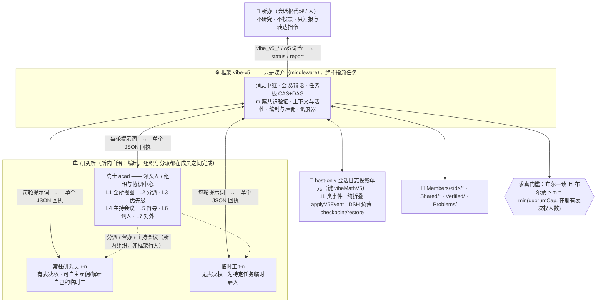

# Vibe Mathematics — 多代理数学问题求解与验证框架（四架构）

[English](README.en.md) | 中文

> 运行在 **DeepSeek Harness** 内的一组 **agent preset**（`vibe-math-v2` / `vibe-math-v3` / `vibe-math-v4` / `vibe-math-v5`），
> 用多代理协作自动求解数学问题并对结论做多代理交叉验证。四个预设共享「**断点续跑**、
> **中途人工干预**、**进度汇报**、**自然语言驱动**」底座能力，但采用四代不同的求解架构：
> **💡 `vibe-math-v2` 与 `vibe-math-v3` 同级主推**——两者都是成熟可用、正在维护的主推架构，根据你的实际需求自行选择（详见下方「怎么选」）；`vibe-math-v4` 是「常驻自组织合作研究」架构，`vibe-math-v5` 是最新的「研究所体系」（两者均为实验性）。
>
> - **`vibe-math-v2`（概率驱动 · JSON 数据层）✅ 主推**：`qs.json` 问题清单 + `Propos/` 命题库 + 概率驱动调度 + 代码启发式调度；
> - **`vibe-math-v3`（第三代 · 论文式 md + 规划代理 + 方法库）✅ 主推**：全部知识以 **Markdown 论文/研究报告式** 存储与续写（`Problems/` 问题清单+依赖+来源动机、`Progress/` 研究日志、`Propos/` 命题库、`Methods/` 通用理论发明库、`Verified/` 绝对可信）；调度前由**规划代理**自主制定接下来 N 步计划；解决过程中发明的理论/框架/工具/方法/思想由 **Method Keeper** 沉淀为可复用方法体系（如发明群论、泛函分析那样）。
> - **`vibe-math-v4`（第四代 · 常驻自组织合作研究）🧪 实验性**：一组**持久化常驻子代理**互相**留言 + 开会**，自主决定一切任务安排（无中央调度）；各自沉淀进度/命题/方法/子问题库并互相查阅；验证**仅当全体常驻一致（真 或 假）**才写入 `Verified/`，否则留库附概率；上下文达阈值自动 `/compact`；仅当全体一致认为原问题已解决才停止。
> - **`vibe-math-v5`（第五代 · 研究所体系）🧪 实验性 · 最新**：把常驻升级为一座**研究所**——**院士**（领头人 / 组织与协调中心，负责拆解与**分派**、定优先级、主持会议、督导进度）+ **常驻研究员**（有表决权，可自主雇佣/解雇自己的临时工）+ **临时工**（无表决权）；有**公共规章**、**群聊与会议**、**compare-and-set 任务板**、**真实解雇**；**≥ m 票布尔一致**才写入 `Verified/`（反向票阻塞、弃权不计票、未达门槛留库附平均概率）；状态存于**会话日志的 host-only 投影单元**，零 token 成本。

安装本插件包（或手动复制预设）后，DSH 的预设选择器里会出现**四个** agent preset。

---

## 🧩 架构图（v2 + v3 + v4 + v5）

> 静态架构图；完整流程说明见 [docs/架构图.md](docs/架构图.md)（v1 历史架构图；v2 起目录布局已变更）与
> [vibe-math-v5/架构图.md](vibe-math-v5/架构图.md)（v5 全套细节图）；
> 可编辑生成脚本：中文 v2/v3 海报由 matplotlib 脚本生成 [v2](docs/generate_framework_diagram_v2.py) / [v3](docs/generate_framework_diagram_v3.py)（matplotlib → PNG）；
> 英文版 v2/v3 由零依赖 Node 脚本生成 [v2-en](docs/generate_framework_diagram_v2_en.mjs) / [v3-en](docs/generate_framework_diagram_v3_en.mjs)（→ **SVG**）；
> [v4](docs/generate_framework_diagram_v4.mjs) / [v5](docs/generate_framework_diagram_v5.mjs)
> （零依赖 Node → **SVG**，`node docs/generate_framework_diagram_v4.mjs`，加 `--lang=en` 生成英文版 `示例图/框架图-v4-en.svg`）。
> v4 起改用 SVG：纯文本、diff 友好、任意缩放不糊；需要 PNG 时用无头浏览器截图（命令见生成脚本头部）。

### Vibe Math V2（概率驱动 · JSON 数据层）✅ 主推

**一句话流水线**：`qs.json` 按优先级取问题 → Explorer 拆方向（全死路则重派生）→ 每方向一个 Solver 多轮迭代（引理进 `Propos/`、解法回 `qs.json`，概率均 <1）→ 调度器选 r（命题 / 命题+证明·证伪 / 问题+解法）派 ≥3 验证器独立审查→辩论→裁决 → 概率=1 自动收口（问题 solved、命题 1/0，优先级置 `never`）；全程状态落盘，`resume` 断点续跑，`reportMode` 可 file/push/both 汇报。

### Vibe Math V3（论文式 md + 规划代理 + 方法库）✅ 主推

**一句话流水线**：全部知识以 **Markdown 论文/研究报告式**存储与续写（`Problems/` 问题清单含依赖/后生问题来源动机、`Progress/` 研究日志按方向按轮续写、`Propos/` 命题库、`Methods/` 通用理论发明库、`Verified/` 绝对可信）→ 调度前调度器构造状态简报并调用**规划代理**，规划代理一次性安排接下来 N 步（spawn solver/verifier/explorer/method-keeper、interrupt、promote、wait），代码校验后执行（超出并发的动作排队跨 tick 消费；规划失败自动回退 v2 式启发式）→ 验证器独立审查→辩论→**近共识裁决**（同侧且均值 ≥0.85/≤0.15 取均值，修复 v2 flat 误判）→ 概率=1 收口并生成 `Verified/` 卡 → 求解器的 `methods_used`/`new_inventions` 上报由 **Method Keeper** 沉淀/完善方法库（可组成体系层级、跨项目复用）。

### Vibe Math V4（常驻自组织合作研究）🧪 实验性

> 上面这张 SVG 由零依赖脚本生成：`node docs/generate_framework_diagram_v4.mjs`（纯 Node、无 Python/matplotlib 依赖；
> 生成时会估算文字宽度，任何一行溢出容器都会告警并以退出码 1 结束）。

**一句话流水线**：起始产生 N 个**常驻子代理**（continuable，持久上下文）先各自头脑风暴、产出初始见解/方向 → 此后**所有任务安排由它们互相留言 + 集体开会自主决定**（框架只做消息总线/会议/任务板/产物沉淀，**绝不分配任务**）；每个常驻把有价值的产物按**价值程度 / 动机用途计划 / 自身概率估计**沉淀到**自己**的 `Progress/<id>/`、`Propos/<id>/`、`Methods/<id>/`、`Subproblems/<id>/` 库，并**可互相阅读**；验证由它们**自行商议**发起，**仅当全体常驻一致（真或假）**才写入 `Verified/`，否则留库附概率；常驻上下文量达阈值（默认 66%）自动 `/compact`；**仅当全体一致认为原问题已解决**才停止；可随时人工干预/增开/关闭常驻，支持断点续跑。

> 说明：V4 去掉 v3 的中央规划器与确定性角色（explorer/solver/verifier/planner/method-keeper），把"研究者"本身作为主体。详见 `vibe-math-v4/实现方案.md`。
> 保活机制（分级保活 A+B + 死锁看门狗）：团伙空闲超 `activityTimeoutMs` 会收到**自驱动** CHECKPOINT（建议继续解决/发消息/提议任务，而非"是否要停止"），且**并行填充**——A 分支一次尽量填满 `maxParallel` 并发预算（同一时刻唤醒多个空闲常驻，而非"只唤醒 r1、结束后再 r2"的串行），邮箱投递也并行送达多个空闲收件人；唤醒失败会自动重新武装心跳；若团队空闲且**无新产物**超过 `stallAutoMeetingMs`（默认 6 分钟），框架会自动召集一次同步会议让常驻们自行决定下一步；若某次**会议/验证卡死**（超过 2×`activityTimeoutMs` 仍无新的发言/投票），框架会自动**放弃该会议/验证**并回到正常自组织，避免一个坏掉的会议永久卡住整个团队；**会议不抢占验证**——验证进行时会议请求会暂存，验证做完再补开（保持一致共识的"求真"环节不被协调讨论打断）——框架始终只促成、从不指派任务。

---

### Vibe Math V5（研究所体系）🧪 实验性 · 最新

**一句话定位**：把 v4 的"一群互相留言的常驻"升级为一座**研究所**——有**院士**（领头人）、**常驻研究员**、
**临时工**三类职员，有所内**公共规章**，有**群聊与会议**，有**自主雇佣/解雇**，并且
**任何结论都必须由至少 m 名有表决权者一致给出布尔概率 1 或 0 才能写入 `Verified/`**。

> 图源与全部细节图（成员生命周期、一轮时序、共识状态机、会议流程、调度优先级、状态折叠、
> 提示词构成、任务板、职权矩阵）：[`vibe-math-v5/架构图.md`](vibe-math-v5/架构图.md)。
> 上面这张 SVG 由零依赖脚本生成：`node docs/generate_framework_diagram_v5.mjs`。

#### 职位与职权

| 职位 | 代号 | 表决权 | 职权 |
|---|---|---|---|
| **院士**（领头人） | `acad` | ✅ 一票，**与他人等重** | **组织与协调中心**：建立全所视图（`overview`）、把原问题拆解成任务并**分派**（`assign`）、设定优先级（`prioritize`）、召集并主持会议（`convene`）、督导进度（`nudge`）、调配临时工、对外汇报。**不能单方面定论**，也不能自我扩张编制。 |
| **常驻研究员** | `r-<n>` | ✅ 一票 | 在自己的方向上深入钻研；**可自主雇佣/解雇自己的临时工**；向院士汇报进展、接受其组织与分派（**有据理反对权**）。 |
| **临时工** | `t-<n>` | ❌ | 为特定任务临时雇入：可读/可想/可发言/可写自己的成果库/可认领或被分派任务；由**雇主或院士**解雇。代号永不复用。 |
| **所办**（主助手） | —— | ❌ | **不参与研究、不投票**。只汇报、把人的话翻译成工具调用，并代持平台要求的创建权（建所/增聘常驻研究员）。 |

**分工一句话**：**组织由院士负责，但判断属于每个人自己** —— 院士分派的是**工作**，不是**结论**。

#### 求真规则（V5 的核心）

一个对象进入 `Verified/` 必须**同时**满足：

1. 至少有 **m = min(`quorumCap`, 在册有表决权人数)** 名有表决权者投出**布尔概率值**；
2. 这些票**全部**是 `1`（绝对为真）或**全部**是 `0`（绝对为假）。

票是 `[0,1]` 的数值：**严格介于 0 与 1 之间 = 弃权/存疑**（不计入 m，但计入全组平均概率）。
**任何一张反向布尔票都会阻塞定论** —— 少数派无法靠别人弃权把结论推过去。
未达门槛的对象**留在原库**，并附上全组平均概率与完整辩论录，**不强行裁决**。

表决两段式：先【独立初评】（彼此不可见），未定论再进入【公开辩论】后重投，轮次上限 `verdictMaxRounds`。
`quorumMode: "all-unanimous"` 可切回 v4 的"全体一致"口径。

#### 运行机制

- **通信**：群聊（扇出给每位其他成员）、私信、只投给有表决权者；消息**逐收件人持久化**，
  先落盘再投递，群聊按 `chatDigestMs` / `chatDigestMax` 合批摘要（私信/会议/表决不合批）。
  一切所内通信都经框架中继（DSH 的邻接限制不允许成员之间直接发消息），但**署名始终是真实发送者**。
- **会议与验证互斥**（双向）：验证进行中会议请求会**暂存**；会议进行中提出的验证会**排队**——
  两个共识过程永不同时进行，避免互相饿死看门狗时钟。会议按**随机发言序**逐个收集意见，
  收口时汇总表决并检查是否全体认为已解决。
- **任务板**：compare-and-set（改前必须读到最新 `expected_revision`）+ 依赖 DAG（认领前必须全部依赖已完成，
  环检测拒绝坏依赖）+ 写范围重叠告警；owner 被解雇时任务自动收回。
- **雇佣 / 解雇**：院士与常驻研究员都可雇**自己的**临时工，配额按人（`maxTempPerMember`）与全所
  （`maxTempTotal`）双限；解雇是**真实的**——取消在途回合、释放常驻子会话、收回任务、丢弃未投递邮件。
- **活性**：主驱动是**一次性活动等待**（`vibe_v5_wait`，不轮询）；调度器按优先级推进
  （进行中的会议/验证 → 队列中的验证 → 暂存会议 → 在办任务 → 加急邮件 → 群聊摘要 → 停滞自动开会 → 兜底心跳），
  并发受 `maxParallel` 闸门限制；任务板的"推一把"按 `activityTimeoutMs` **节流**。
- **看门狗**：会议/验证超过 2×`activityTimeoutMs` 没有新发言/新票 → 放弃它并回到自组织；
  心跳**每次唤醒后都重新武装**，所以调度器不会永久冻结。
- **上下文**：达 `compactThreshold`（%）或累计 `compactAfterRounds` 轮时要求成员把工作状态浓缩进
  `Progress/`；**规章在 persona 里**，压缩后依然有效，不需要每轮重申。
- **停止**：**仅当全体有表决权者都认为原问题已解决**才结题（写 `Problems/conclusion.md`）。

#### 状态与持久化

研究所状态存在**会话日志的 host-only 投影单元**里（键 `vibeMathV5`）：框架的副作用只是往会话日志
追加 11 类事件，由 `applyV5Event`