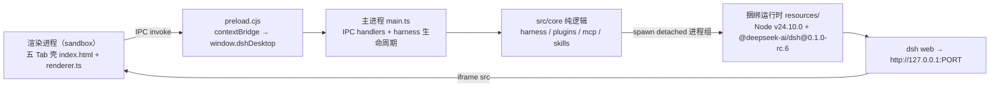

<div align="center">


# DSH Desktop Hub

**无需 Node.js，不碰 YAML，一站式使用和管理 DeepSeek Harness。**

DeepSeek Harness 官方 Web UI 桌面客户端 —— 内置插件市场、MCP 市场、Skills 市场与三套本地管理台。

> 注：本项目是社区维护的开源项目，非 DeepSeek 官方产品。

[](https://github.com/FlashingChen/dsh-desktop-hub/releases/latest)
[](https://github.com/FlashingChen/dsh-desktop-hub/releases/latest)
[](https://github.com/FlashingChen/dsh-desktop-hub/releases)
[](LICENSE)
[](https://github.com/FlashingChen/dsh-desktop-hub/actions/workflows/ci.yml)
[](https://github.com/FlashingChen/dsh-desktop-hub/actions/workflows/release.yml)

</div>


---

## 社区交流

欢迎加入 QQ 交流群，获取使用帮助、交流插件与功能想法。

| QQ 交流群 |
| :---: |
|  |
| **群名：dsh-desktop-hub · 群号：1106611027** |

## 为什么不是普通 Desktop

不是套壳。官方 Web UI 原样保留在 Harness Tab 里，同时把三个命令行场景搬进同一个窗口：

- **开箱即用**：内置 Node.js + DeepSeek Harness 运行时（约 586MB），下载即用，本机不需要安装任何环境。
- **一体化**：在 Harness 对话、插件市场、MCP 市场、Skills 市场之间切换，不用再开终端敲 `dsh plugin` / 手写 YAML。
- **安全**：所有写操作原子落盘、自动备份 `.bak-<ts>`、官方 HMR 热生效，改错了随时可恢复。
- **及时更新**：Windows 与 macOS 发布版启动后自动检查 GitHub Releases，侧边栏提示新版本；用户确认后下载并重启安装，不必再手动打开 GitHub。

## 核心能力

### 三类扩展市场

插件、MCP 与 Skills 共用一个目录体验：搜索、查看来源、来源等级与权限，确认后分别安装到当前 profile 或用户级 skills。插件默认来自 [DSH Plugin Market](https://github.com/dsh-market/dsh-market) 发布的 [Awesome DSH Plugin](https://github.com/awesome-dsh-plugin/awesome-dsh-plugin) 清单，MCP 合并官方 Registry 与 [DSH MCP Market](https://github.com/LKMeng2001/dsh-mcp-market)，Skills 合并 [ClawHub](https://clawhub.ai) 与 [SkillsMP](https://skillsmp.com)。npm 只在插件安装预检时读取 manifest，不作为主市场搜索源；网络不可用时回退到本地缓存和随包精选目录。

> **市场数据来源声明**：各来源的运行时地址、用途、缓存策略、许可证边界和安全限制见 [`MARKET_SOURCES.md`](MARKET_SOURCES.md)。上游目录的收录不等于 DSH 安全背书。

### MCP 市场与配置转换 —— 粘贴即用

Claude Code / Cursor 导出的 MCP JSON，粘贴进去 → 自动转换成 DSH 插件行 YAML（`${VAR}` 自动转 `!!js process.env.VAR`，sse / 非法 serverName 会警告）→ 确认后写入 profile patch，官方 HMR 热生效。市场条目若声明环境变量，会在安装卡片中先填写密钥，DSH 将值写入当前 MCP 配置，用户不需要再手动设置系统环境变量。


### Skills 市场与管理

扫描用户级 / 随包全部 skills（rank 规则，同名低 rank 生效、高 rank 标「被遮蔽」）；支持导入 `.skill` / `.zip` / GitHub 仓库链接，或直接新建用户级 skill，模型可见 / 用户可见一键切换。


### Plugin 市场与管理

按组合包 / 依赖分类展示 web profile 的插件清单；安装、移除、更新真实执行 `dsh plugin`；聚合仓库（缺 `dsh.bundle`）拒绝误装，避免把仓库根目录装成插件。


## 快速开始

1. **下载安装**：macOS 下载 DMG（v0.3.5 起已签名并公证，可直接打开）；Windows 下载 EXE（当前未签名，首次运行需放行一次：SmartScreen → 更多信息 → 仍要运行）。
2. **配置模型**：在 Harness Tab 的官方 Web UI 里填入 API Key。首次启动会有分步引导带你认识各功能区，之后可随时从侧栏「使用引导」重看。
3. **开始使用**：直接对话；需要外部工具时，到 MCP / Skills / Plugin Tab 管理。

> 当前为预览版（macOS arm64，已签名并公证；Windows x64 未签名）。

## Roadmap

| 状态 | 项目 |
|---|---|
| ✅ | 基础版：五 Tab 壳（含反馈入口）+ MCP / Skills / Plugin 管理 + 内置运行时 |
| ✅ | 扩展中心 MVP：Plugin 市场、MCP 市场、Skills 市场（随包精选目录） |
| 🚧 | Profile 切换（当前固定 `web`） |
| Planned | Model Manager（API Key / 模型管理面板） |
| Planned | Doctor（环境自检与一键修复） |
| ✅ | Windows 安装包（NSIS，x64，与 macOS 并行发布） |
| ✅ | 后台托盘：关闭窗口后继续运行 Harness，可从托盘显示或退出 |
| Planned | Linux 安装包 |
| ✅ | 应用更新（GitHub Releases 检查、下载与重启安装） |
| ✅ | 首次访问引导：Spotlight 分步教程，侧栏「使用引导」可重看 |
| ✅ | macOS 签名与公证（Developer ID，v0.3.5 起；应用内更新同步启用） |

## 社区与反馈

应用内置第五个“反馈”Tab。匿名/署名反馈会提交到可访问的反馈服务，再由 bot 整理为 GitHub Issue，普通用户不需要访问 GitHub。诊断环境信息默认不附加，用户可以单独复制诊断信息或完整反馈；网络不可用时可复制内容发送到 QQ 群。

- [Issues](https://github.com/FlashingChen/dsh-desktop-hub/issues)：维护者与能访问 GitHub 的开发者直接查看问题
- [Discussions](https://github.com/FlashingChen/dsh-desktop-hub/discussions)：使用讨论与想法交流
- QQ 交流群：群号 `1106611027`，二维码见应用内反馈 Tab

本项目是活项目：CI 每个 tag 自动出包，Roadmap 上的能力持续在长。Star 一下跟踪进展。

---

# 开发者 / Architecture

> 想参与开发？请先阅读 [贡献指南](CONTRIBUTING.md)。

## 架构

```
渲染进程（sandbox）             preload                   主进程                    核心逻辑                   捆绑运行时
┌──────────────────┐   ┌──────────────────┐   ┌────────────────────┐   ┌──────────────────┐   ┌─────────────────────────┐
│ 五 Tab 壳         │   │ window.dshDesktop│   │ IPC handlers       │   │ src/core/         │   │ resources/              │
│ index.html       │──▶│ contextBridge    │──▶│ harness:url         │──▶│ harness.ts        │──▶│ node/（Node v24.10.0）   │
│ renderer.ts      │   │ preload.cjs      │   │ plugins:list/       │   │ plugins.ts        │   │ dsh-runtime/            │
│ (harness iframe) │◀──│ (CJS, sandbox)   │◀──│   install/remove/    │   │ mcp.ts            │   │  @deepseek-ai/dsh       │
│                  │   │                  │   │   update             │   │ skills.ts         │   │  (0.1.0-rc.6)           │
│                  │   │                  │   │ mcp:list/convert/    │   └──────────────────┘   │        │                │
│                  │   │                  │   │   apply/update/     │            │ spawn(detached) ▼                │
│                  │   │                  │   │   delete             │            └──── dsh web --port 0 ─────┘                │
│                  │   │                  │   │ skills:list/create/  │                          │                                │
│                  │   │                  │   │   toggle             │                          │                                │
│                  │◀──│ harness:frame-   │   │ harness:frame-loaded │                    http://127.0.0.1:PORT                  │
└──────────────────┘   └──────────────────┘   └────────────────────┘                          └─────────────────────────────────┘
```



生命周期：

```
启动 → registerIpc() → resolveDshExec()（打包内 runtime 优先，回退 PATH）
  → spawn dsh web --port 0（独立进程组）→ 解析 127.0.0.1:PORT → 轮询 HTTP 200（就绪超时 120s）
  → BrowserWindow（1280×800，sandbox + contextIsolation + preload.cjs）
  → 加载五 Tab 壳（file://dist/renderer/index.html）
  → renderer 经 IPC 取 harness URL → iframe 挂载官方 Web UI
  → 创建系统托盘；普通关闭按钮隐藏窗口，托盘菜单可重新显示或退出
退出 → 托盘「退出」/应用菜单 → will-quit → harness.stop()：SIGTERM 进程组 → 2s 兜底 SIGKILL → app.quit
```

- 默认（无 flag）＝产品行为：启动 harness + 五 Tab 壳；关闭窗口后继续驻留托盘，托盘菜单提供「显示窗口 / 退出」。
- 冒烟模式：`--smoke`（不启 harness，DOM + 真实数据断言）；`--harness-smoke`（真实 harness + iframe 加载断言）。

## 目录结构

```
dsh-desktop-hub/
├── src/
│   ├── main/main.ts            # Electron 主进程：窗口 + 托盘 + IPC + harness 进程生命周期
│   ├── preload/preload.ts      # contextBridge 白名单 API（sandbox，编译为 preload.cjs）
│   ├── renderer/               # 五 Tab 壳：index.html + renderer.ts（纯脚本，无模块）
│   └── core/                   # 纯逻辑（可单测）：harness.ts / plugins.ts / plugin-ops.ts / pnpm.ts / mcp.ts / skills.ts / feedback.ts / diagnostics.ts
├── tests/                      # node --test 单测（从 dist/ 导入，需先 build）
├── scripts/
│   ├── build-preload.mjs       # preload 以 CJS 编译并重