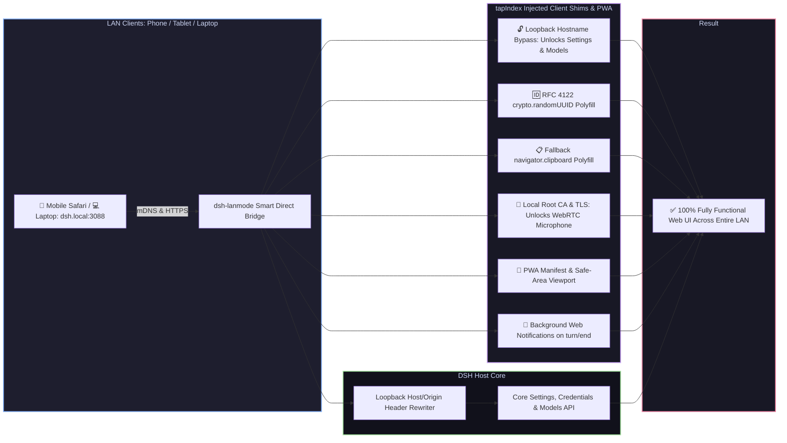

# 📦 @goodandready/dsh-lanmode

**Alpha.5 compatibility hotfix:** async browser plugin initialization now
retains its awaited lifecycle. See [compatibility and tests](docs/testing/alpha5-compatibility.md)
and [0.6.11 patch notes](docs/releases/0.6.11.md).

<h3>Local Area Network (LAN) Access Enabler, mDNS (dsh.local), PWA, Root CA, QR Code, Background Notifications & Auto-TLS for DeepSeek Harness</h3>

  
  
  
  

  

  <a href="README.md"><b>🇬🇧 English</b></a> •
  <a href="README.ru.md"><b>🇷🇺 Русский</b></a> •
  <a href="README.zh.md"><b>🇨🇳 中文说明</b></a>

<table align="center">
  <tr>
    <td align="center">
      ⭐ <strong>If you like this plugin, please star it on GitHub</strong> — it shows me that the plugin is useful to you and motivates me to keep developing it.
        
      🐛 <strong>If you find a bug or would like to request a feature</strong>, open a GitHub issue in any language — I will review your proposal and implement useful suggestions in a future plugin version.
    </td>
  </tr>
</table>

---

## ⚡ Why DSH Fails Over Local Network (LAN)

By default, modern web browsers and the **DeepSeek Harness** frontend deliberately restrict access when opened from non-localhost IP addresses (e.g. `192.168.x.x` or `10.x.x.x`) over plain HTTP:

1. 🔒 **Locked Settings & Models Tabs**: The Web UI evaluates the hostname via `isLoopbackHostname`. If accessed over LAN, the settings service falls back to in-memory mode: all plugin configuration cards render empty, section states become `"unavailable"`, mutations are discarded before transmission, and the **Models** page displays *"settings are unavailable in this browser"*.
2. 💥 **Fatal UUID Generation Crash**: `crypto.randomUUID()` only exists in browser Secure Contexts (HTTPS or localhost). On plain HTTP across LAN, file uploads, tool calls, and session initializations crash instantly.
3. 📋 **Broken Clipboard Copying**: `navigator.clipboard` is completely disabled by browsers on non-secure origins, breaking all code snippet "Copy" buttons.
4. 🎙️ **Microphone & Voice Input Blockade**: Browser security engines block `navigator.mediaDevices.getUserMedia` on plain HTTP, making voice input via [`dsh-voice`](https://github.com/GooDAnDReaDY/dsh-voice) impossible on remote mobile phones and tablets.
5. 🛡️ **Loopback-Only Core API Fencing**: Core DSH methods (`/api/settings.*`, `/api/credentials.*`, `/api/models.*`) strictly reject requests not originating from loopback `127.0.0.1`.

`dsh-lanmode` completely resolves all these limitations through non-invasive `webServer.tapIndex` HTML shims, a smart direct bridge, mDNS, Root CA generation, and an interactive settings card.

---

## ✨ Full Feature Breakdown

### 1. 📱 `/mobileqr` Command & Instant QR Code Access
* Registers tool `/mobileqr`: generates a clean SVG QR code with the active LAN URL and session token (`https://dsh.local:3088/?token=...`). Point your phone camera at the screen to connect immediately.
* QR codes are also accessible in the Settings card and on `/dsh-lanmode/health`.

### 2. 📲 PWA & Mobile Standalone Mode
* Route `/dsh-lanmode/manifest.json` and meta tags `viewport-fit=cover`, `apple-mobile-web-app-capable`, `theme-color`.
* Adding DSH to your Home Screen on iOS/Android launches it as a standalone app without browser URL bars and with notch-aware safe areas.

### 3. 🌐 Automatic mDNS (`dsh.local`)
* Built-in lightweight UDP 5353 responder: announces **`dsh.local`** across your local network. No need to memorize shifting IP addresses.

### 4. 🔐 Local Root CA for Permanent Trusted HTTPS
* Generates a two-tier certificate structure: **`dsh-lanmode Local Root CA`** (10-year validity) $\rightarrow$ **`Server Certificate`** (with SAN for `dsh.local`, LAN IPs, and localhost).
* Download `GET /dsh-lanmode/ca.crt`: install the profile once on your iPhone, iPad, or Android to enjoy persistent trusted HTTPS. Voice input via [`dsh-voice`](https://github.com/GooDAnDReaDY/dsh-voice) works flawlessly.

### 5. 🔔 Background Web Notifications (turn/end)
* Hooks into `turn/end` and `approval/asked` session events.
* When the tab or phone is inactive (`document.hidden`), dispatches a native push notification. Tapping the notification immediately refocuses the chat window.

### 6. 🎨 Settings Card in «Settings → Plugins» (`lib/client.js`)
* Interactive plugin card following DSH design guidelines:
  * Connection status & active mode;
  * One-click LAN URL copying;
  * In-card QR code toggle;
  * One-click background notification toggle;
  * Download Root CA link (`ca.crt`).

### 7. 🛡️ Access Control, LAN PIN & Security
* **`unlockPrivileged`**: Master gate for settings & credentials mutation from LAN.
* **`lanPin` / `lanPinRef`**: Optional PIN protection for privileged operations. When enabled, LAN guests can chat freely, but changing system settings, installing plugins, or mutating credentials requires PIN verification.
* **Brute-Force Rate Limiting**: PIN authentication enforces automatic rate limiting (HTTP 429 status after 5 consecutive failed attempts per IP) with temporary lockout.
* **Subnet Role Separation**: Distinct `adminAllow` and `guestAllow` CIDR rules. Subnets designated under `guestAllow` are strictly prohibited from mutating system settings, revoking sessions, or toggling WAN tunnels (`403 Forbidden`).
* **Administrative & Diagnostic Endpoints Protection**: Internal plugin routes (`/dsh-lanmode/devices`, `/dsh-lanmode/devices/revoke`, `/dsh-lanmode/devices/kill-all`, `/dsh-lanmode