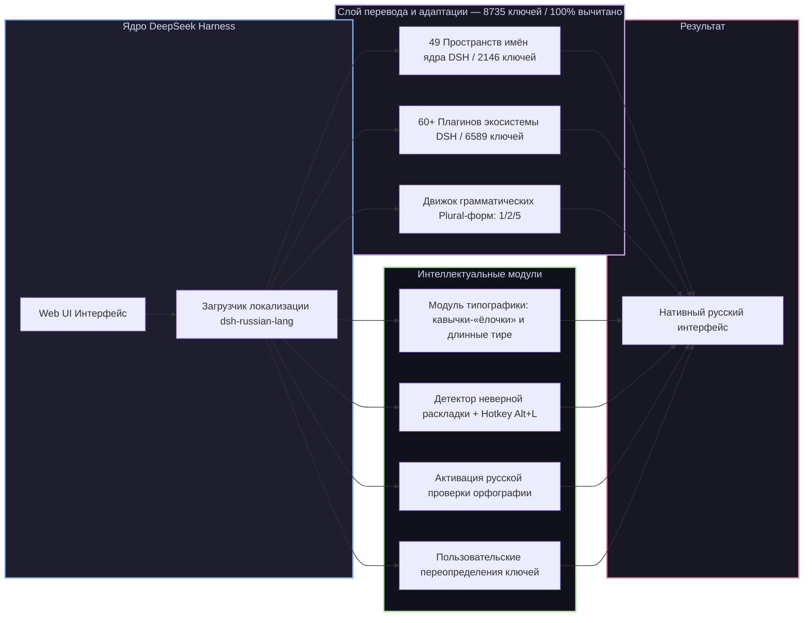

# 📦 @goodandready/dsh-russian-lang

<h3>Полная русская локализация, умная типографика и исправление раскладки клавиатуры для DeepSeek Harness</h3>

  
  
  
  

  
  
  
  

  

  

<table align="center">
  <tr>
    <td align="center">
      ⭐ <strong>Если вам нравится этот плагин, поставьте ему звезду на GitHub</strong> — это покажет мне, что плагин вам полезен, и будет мотивировать меня развивать его дальше.
        
      🐛 <strong>Если вы нашли баг или хотите предложить новый функционал</strong>, создайте issue на GitHub на любом языке — я рассмотрю ваше предложение и реализую полезные идеи в одной из следующих версий плагина.
    </td>
  </tr>
</table>

---

## ⚡ Обзор

**`dsh-russian-lang`** — официальный, всеобъемлющий пакет русской локализации для веб-интерфейса [DeepSeek Harness](https://github.com/deepseek-ai/deepseek-harness) (dsh).

Пакет не просто переводит интерфейс ядра и всех популярных плагинов экосистемы, но и добавляет интеллектуальные функции для комфортной русскоязычной работы: **100% ручная вычитка терминов**, **грамматические формы множественного числа (plural)**, автоматическую **расстановку экранной типографики** («ёлочки», длинные тире, неразрывные пробелы) и **исправление ошибочно набранного текста** на неверной раскладке по горячей клавише <kbd>Alt+L</kbd>.

---

## ✨ Полный обзор возможностей

### 1. 🌐 100% покрытие ядра DSH (49 Пространств имён, 2146 ключей)
* **Диалоги и переписка (`conversation`)**: лента сообщений, ветки обсуждений, карточки вызова инструментов, статус генерации и рассуждений (thinking traces).
* **Модели и провайдеры (`settings.models`)**: каталог моделей, параметры инференса, управление токенами и ключами API.
* **Трейсы рассуждений (`trajectory`)**: детальные шаги, параметры вызовов инструментов, временные метки и визуализация размышлений модели.
* **Настройки ядра (`settings`, `common`, `settings.theme`)**: параметры подключения, горячие клавиши, системные уведомления, масштабирование шрифтов, модальные окна и подтверждения.
* **Рабочие области (`workspace`, `subagent`)**: дерево файлов, управление контекстом, запуск и координация субагентов.
* **Планировщик и инвентарь (`schedule.catalog`, `settings.pluginInventory`, `settings.plugins`)**: фоновые задания, периодичность, фильтры и каталог установленных плагинов.
* **Права доступа и безопасность (`permission.access`, `plan`, `skill`)**: пресеты прав (полный доступ, только чтение, запись в рабочую область), выполнение планов и навыки.

> **О качестве перевода.** Все **8735 ключей интерфейса (2146 ядра + 6589 плагинов) переведены на 100% и вычитаны вручную**. Черновой машинный перевод полностью замещён проверенными формулировками (`draft = 0`). Перевод регулярно валидируется автоматическими линтерами целостности плейсхолдеров, проверкой соблюдения глоссария (`glossary.json`) и детекторами переполнения верстки. Нашли неточность — кнопка «Сообщить о проблеме перевода» в карточке настроек создаёт готовый issue.

### 2. 🧩 Встроенный перевод 60+ плагинов экосистемы DSH (6589 ключей)
Локализация автоматически распространяется на все ключевые плагины экосистемы DeepSeek Harness:
* **`dsh-session-control`** — расширенное управление сессиями: закрепление диалогов, архив по периодам, просмотр расшифровок и фильтрация шума;
* **`dsh-kanban` и `task-board`** — канбан-доски задач, карточки, чек-листы, дедлайны, критерии готовности (DoD) и шлюз приёмки (Acceptance Gate);
* **`dsh-cost-meter`** — учёт стоимости токенов, калькуляция расходов и тарифные сетки моделей в реальном времени;
* **`dsh-goal`** — автономный целеполагающий агент с безопасным циклом и рефлексией;
* **`dsh-moa`** — многоагентная архитектура Mixture-of-Agents;
* **`dsh-context-lens` и `dsh-context`** — визуализатор и оптимизатор контекста, аналитика токенов и сжатие;
* **`dsh-time-machine`** — снимки рабочей области и откат состояний файлов;
* **`dsh-shadow-auditor`** — теневой аудит изменений и безопасность;
* **`dsh-cron` и `schedule.catalog`** — планировщик периодических cron-задач;
* **`dsh-clinebot` и `im-hub`** — интеграции и шлюзы для Telegram, Discord, Slack;
* **`dsh-subscriptions`** — управление персональными подписками на модели;
* **`dsh-voice` и `dsh-tts`** — распознавание речи и голосовое озвучивание;
* **`dsh-image-gen`** — генерация изображений;
* **`dsh-lanmode`** — сетевой доступ по локальной сети и генерация TLS-сертификатов;
* **`dsh-model-sync`** — синхронизация моделей и эндпоинтов;
* **`dsh-usage-guard` и `token-dashboard`** — контроль лимитов и аналитика расходов токенов;
* **`skills-manager` и `dsh-skill-hub`** — менеджер навыков агента и витрина способностей;
* **`commandcode` и `settings.commandcode`** — провайдеры команд и аккаунты;
* **`better-sidebar`, `better-input`, `opencode-palette`, `context-doctor`, `plugin-store`, `autoReview`** и др.

### 3. 🔢 Русские грамматические формы числительных (Plural)
Английский язык различает только `1` и `other`. Русский язык требует 3 грамматические форм