# 📦 @goodandready/dsh-vision-bridge

<div align="center">

<h3>Universal Vision Bridge for DeepSeek Harness: Seamless Multimodal Attachments with Text-Only Chat Models</h3>

<p align="center">
  <a href="https://www.npmjs.com/package/@goodandready/dsh-vision-bridge"></a>
  <a href="LICENSE"></a>
  <a href="https://github.com/topics/dsh-plugin"></a>
  <a href="https://nodejs.org"></a>
</p>

<!-- Showcase Button -->
<p align="center">
  <a href="https://goodandready.app/"></a>
</p>

<p align="center">
  <a href="README.md"><b>🇬🇧 English</b></a> •
  <a href="README.ru.md"><b>🇷🇺 Русский</b></a> •
  <a href="README.zh.md"><b>🇨🇳 中文说明</b></a>
</p>

<!-- Mandatory project support block -->
<table align="center">
  <tr>
    <td align="center">
      ⭐ <strong>If you like this plugin, please star it on GitHub</strong> — it shows me that the plugin is useful to you and motivates me to keep developing it.
      <br><br>
      🐛 <strong>If you find a bug or would like to request a feature</strong>, open a GitHub issue in any language — I will review your proposal and implement useful suggestions in a future plugin version.
    </td>
  </tr>
</table>

</div>

---

## ⚡ Overview & The Problem

When interacting with text-only chat models (any provider/model that accepts text only) in **DeepSeek Harness**, users cannot natively attach and send images:

1. In **DSH 0.1.2-alpha.2+**, the core session controller performs a strict server-side modality check (`ctx.llm.resolveModelInfo`). If the active conversation model lacks `image` in `inputModalities`, the prompt is immediately rejected with a `session/attachment-invalid` error ("Model does not support image input").
2. Standard text-only adapters throw errors when encountering raw multimodal image blocks in their message payload.

### How `dsh-vision-bridge` Solves This

`dsh-vision-bridge` acts as an intelligent intermediary inside the Cordis runtime:
* **Server-Side Modality Bridge (v0.5.3+)**: Decorates `ctx.llm.resolveModelInfo` and `ctx.llm.listModels` so the session controller accepts image attachments on all models when bridging is active.
* **Automatic Image Rewrite (`agent/pre-step` & `llm/stream`)**: Automatically intercepts image blocks, routes them to a configured vision model (a catalog provider/model, or a local OpenAI-compatible endpoint), receives a descriptive synthesis, and rewrites the image block into text context `[The user attached an image. Description: ...]` before handing it to the text-only chat model.
* **Native Passthrough**: Automatically detects models that natively support vision and allows images to pass directly without unnecessary rewriting.
* **Rich Visual Tool Suite**: Exposes ~40 specialized tools for on-demand OCR (incl. local Tesseract), visual question answering, bounding-box grounding, document/table/formula extraction, QR/barcode reading, UI-flow reconstruction, multi-model consensus and more. `vision_consensus` is opt-in via the `consensusEnabled` setting.

---

## 🏗️ Architecture

```mermaid
graph LR
    User["User attaches Image in Web UI"] --> Gateway["DSH Session Controller"]
    Gateway --> BridgeCheck{"Modality Bridge (v0.5.3)"}
    BridgeCheck -->|"Augments inputModalities"| SessionAllowed["Prompt Accepted"]
    SessionAllowed --> Hook["agent/pre-step Hook"]
    
    Hook --> CheckNative{"Does chat model support vision natively?"}
    CheckNative -->|"Yes (Native Passthrough)"| NativeLLM["Send Raw Image to Chat LLM"]
    CheckNative -->|"No (Text-Only)"| VisionRouter["Vision Bridge Channels"]
    
    VisionRouter --> VisionModel["Dedicated Vision Model\n(DSH / OpenAI / Ollama / Webhook)"]
    VisionModel --> Description["Generated Text Description + OCR"]
    Description --> Rewrite["Substitute Image with Text Marker"]
    Rewrite --> ChatModel["Send Enriched Text to Chat LLM"]
    ChatModel --> Answer["Assistant Response in Chat"]
```



---

## ✨ Key Features

### 1. Processing Modes
* **`hybrid` (default)**: Automatically describes attached images in chat turns while keeping all ~40 explicit vision tools available for follow-up reasoning.
* **`llm`**: Pure auto-rewrite mode — images are transparently converted to text context; tools remain callable.
* **`tools`**: Auto-rewrite disabled — the chat model is expected to explicitly invoke `describe_image` or OCR tools when required.

### 2. Multi-Channel Endpoint Routing & Fallback
Chain multiple vision backends with automatic failover, parallel racing, and circuit breaker:
* `dsh-catalog`: Auto-detect or select any vision-capable model already registered in DSH.
* `openai-compatible`: Standard OpenAI-compatible vision endpoints (vLLM, SGLang, OpenRouter, etc.).
* `ollama`: Auto-discovery and local inference through any vision-capable model the local Ollama instance exposes.
* `webhook` / `custom`: External HTTP or JSON-RPC vision endpoints.

### 3. High-Performance LRU Description Cache
Caches vision responses by `hash(bytes + prompt + model + mode)` to eliminate redundant vision API calls and save token quota on repeated questions about the same image.

### 4. Comprehensive Visual Tool Inventory (~40 Tools)

| Tool Category | Tools | Description |
|---|---|---|
| **Core** | `describe_image`, `read_image`, `inspect_image` | General image analysis by attachment ID, file path, or URL. |
| **Geometry & Detection** | `vision_ground`, `vision_crop`, `vision_detect`, `vision_compare`, `vision_present` | Bounding box coordinates (0–1000 scale), object inventory, multi-image comparison. |
| **OCR & Text** | `vision_ocr`, `vision_ocr_local`, `vision_long_ocr`, `vision_trace`, `vision_colors`, `vision_extract_foreground` | Transcription, local Tesseract OCR (offline), long screenshot stitching, SVG tracing, color palettes. |
| **Structured & UI** | `vision_describe_structured`, `vision_vqa`, `vision_ui_layout`, `vision_translate_image` | JSON breakdown (`{summary, ocr, layout, entities}`), short VQA, UI section analysis. |
| **Pixel & Diagnostics** | `vision_pixel_diff`, `vision_quality_check` | Semantic visual diff, quality scoring (blur/lighting). |
| **Documents & Intelligence** | `vision_extract_formula`, `vision_extract_table`, `vision_scan_barcode`, `vision_extract_structured`, `vision_audit_accessibility` | Formula (LaTeX), table (Markdown/HTML), QR/barcode scan, JSON-schema extraction, WCAG accessibility audit. |
| **Scenarios, Consensus & Memory** | `vision_ui_flow`, `vision_consensus`, `vision_memory_search` | User-journey graph (Mermaid), multi-model consensus, semantic search over remembered images. |
| **Attachments (v0.5.33)** | `vision_attach_pages`, `vision_attach_frames`, `vision_attach_images` | Publish PDF pages, video frames and local/remote images as conversation attachments so native-vision chat models read the pixels themselves. |

---

## 📦 Installation

```bash
dsh plugin --profile web add @goodandready/dsh-vision-bridge
```

After installation, restart the DSH Web UI. The configuration card is available under **Settings → Plugins → vision-bridge**.

---

## ⚙️ Configuration (`settings.yaml`)

```yaml
dsh-vision-bridge:
  # Operation mode: 'hybrid' | 'llm' | 'tools'
  mode: hybrid
  
  # Auto-detect vision model or specify provider/model explicitly
  visionProvider: ""
  visionModel: ""
  
  # Allow visio