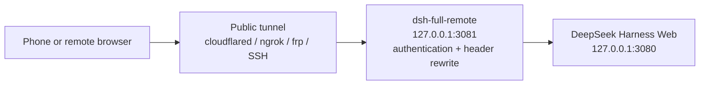

# dsh-full-remote

[](https://github.com/awesome-dsh-plugin/awesome-dsh-plugin)
[](https://github.com/JUANWANG-BUAA/dsh-full-remote/releases/latest)
[](https://github.com/JUANWANG-BUAA/dsh-full-remote/actions)
[](./LICENSE)
[](https://github.com/JUANWANG-BUAA/dsh-full-remote/stargazers)
[](https://github.com/JUANWANG-BUAA/dsh-full-remote/commits/main)
[](./package.json)
[](https://github.com/deepseek-ai/deepseek-harness)
[](https://github.com/JUANWANG-BUAA/dsh-full-remote/pulls)

**Listed in [awesome-dsh-plugin](https://github.com/awesome-dsh-plugin/awesome-dsh-plugin)** · DeepSeek Harness plugin

**Current release: [v0.3.12](https://github.com/JUANWANG-BUAA/dsh-full-remote/releases/tag/v0.3.12)** · Distributed through GitHub Releases

**English** | [中文](./README.zh.md)

`dsh-full-remote` is a plugin for
[DeepSeek Harness](https://github.com/deepseek-ai/deepseek-harness). It
places an authenticated reverse proxy in front of the Harness Web server,
so the Web UI can be used through a public tunnel or from a device on the
local network while privileged APIs such as settings, credentials, and
directory browsing remain available.

## 60-second quick start

```sh
curl -fLO https://github.com/JUANWANG-BUAA/dsh-full-remote/releases/download/v0.3.12/dsh-full-remote-0.3.12.tgz
dsh plugin --profile web add ./dsh-full-remote-0.3.12.tgz
dsh --profile web
```

In **Settings → Reverse proxy**, press **Start proxy**, then **Start
Cloudflare quick tunnel** and scan the generated QR code. The invite is
one-time and never contains the standing access token. For a controlled
network, point an existing SSH, frp, ngrok, Tailscale, or cloudflared tunnel
at the proxy target shown in the panel instead.

The quick tunnel is optional and temporary, not a managed production
deployment. Read [Security model](#security-model) before exposing a listener
to the Internet. For composition details, see
[Compatibility and composition](./docs/compatibility.md).

| Desktop control panel | Mobile workspace |
|---|---|
|  |  |

| Phone confirmation sheet | Remote desktop confirmation |
|---|---|
|  |  |

## Problem

DeepSeek Harness binds its Web server to a loopback address and only
accepts privileged requests when the `Host` and `Origin` headers refer to
a loopback address. When the UI is reached through a generic tunnel, these
headers carry the public hostname and the trust check fails. The page
loads, but the following methods return 403:

- `settings.*`
- `credentials.*`
- `host.listDirectory`

| Approach | Result |
|---|---|
| Generic tunnel (SSH port forward, Caddy, binding `0.0.0.0`) | Page loads; `settings.*` / `credentials.*` / `host.listDirectory` return 403 |
| LAN-only plugin without authentication | Usable on the local network; not suitable for public exposure |
| Password prompt without header rewriting | Requests are authenticated, but the privileged APIs remain blocked |

## Solution

The plugin inserts a reverse proxy between the tunnel and the Harness Web
server. The proxy:

- rewrites `Host` and `Origin` to `127.0.0.1` before forwarding, so the
  privileged APIs pass Harness's trust check;
- requires an access token or a valid device session before any request is
  forwarded;
- forwards HTTP, SSE, and WebSocket traffic; compressible HTTP responses
  may be gzipped (not SSE or WebSocket);
- provides a settings page (**Settings → Reverse proxy**) for starting and
  stopping the proxy, changing the listen address, rotating the token, and
  managing device sessions.

Because the rewrite disables Harness's original trust check for remote
clients, the plugin provides its own access-control layer in its place.
This layer is described under [Security model](#security-model).

The plugin can optionally start a temporary Cloudflare quick tunnel. Any
managed tunnel (cloudflared, ngrok, frp, SSH, Tailscale) can also point at the
local endpoint it publishes.

## How it works



1. The remote browser connects to the public tunnel, which forwards to the
   plugin's listener (`127.0.0.1:3081` by default).
2. A request is accepted only with an access token, a valid one-time
   invite, or an existing device session. Requests that fail
   authentication do not reach the backend.
3. The proxy rewrites `Host`/`Origin` to loopback, removes untrusted
   headers, and forwards the request to the Harness Web server at
   `127.0.0.1:3080`. Compressible HTTP responses (HTML/JS/CSS/JSON/SVG,
   ≥1 KB) may be gzipped; SSE and WebSocket are not. Hashed `/assets/*`
   files may receive a long-cache header. See
   [HTTP gzip](./docs/http-gzip.md).

## Features

### Privileged APIs

- `settings.describe` / `update` / `replace` / `mutate`
- `credentials.describe` / `set` / `unset`
- `host.listDirectory` / `pickDirectory` / `openPath`
- `agentPreset.*`, `llm.discoverModels`

### Access control

- 192-bit access token, stored in a state file with mode `0600`; reveal and
  rotation are performed from the local panel
- Per-device sessions: each login creates an independent device
  credential, and only a hash is persisted. Devices can be renamed or
  revoked from the panel, which also shows each device's source IP
  (at login and most recently seen).
- Optional first-visit approval: a new device waits on a page until it is
  approved from the local panel
- Phone invite: a QR code or a one-time link (single use, 15-minute
  expiry). Same-IP browser retries within 60 s reuse the original device
  session so a flaky tunnel dropping the redirect cannot deadlock the
  phone into the token form or spawn a duplicate device. The link does
  not contain the standing token.
- Fixed delay and per-IP lockout on failed logins
- Optional CIDR allowlist for remote IPs
- Optional `trustForwardedFor` to use real client IPs from a trusted local
  tunnel in CIDR / rate-limit / audit via its rightmost `X-Forwarded-For`
  value; `CF-Connecting-IP` is a separate Cloudflare-only opt-in, and
  loopback or malformed forwarded values are never trusted

### Operation

- Fence self-check: probes `settings.describe` with the same Host/Origin
  rewrite the proxy uses
- Structured JSONL audit log (login, approval, revocation, token rotation,
  start, stop, WebSocket open/deny/reject) with an in-panel viewer for
  recent events and JSON export; rotates past 8 MB, keeping one previous
  generation
- R