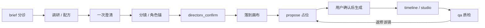

<div align="center">


# DirectorX：第一个以 DeepSeek Harness 为内核的 Video Agent Harness

**The first DeepSeek Harness-native video agent harness for end-to-end AI video production.**

DirectorX 是一个运行在 **DeepSeek Harness (DSH)** 里的开源 `dsh-plugin`：让一个真正的 video agent 从需求理解、导演决策、剧本与分镜，到图像 / 视频 / 音频生成、剪辑、质检和交付，沿着同一条可审计的生产链完成工作。

> **一句话定位**：DeepSeek Harness 负责 agent loop、上下文、提问、审批与编排；DirectorX 负责 AI video production 的工具、知识、配方、媒体管线和无限分镜画布。

这不是另一个提示词合集，也不是把聊天窗口包成视频生成器。它是 **DeepSeek Harness 的第一个 video agent harness**：让视频 agent 有状态、有工具、有知识、有确认闸门，并能把计划落成可编辑、可重渲染的成片。

**中文关键词**：DeepSeek Harness 视频 Agent、AI 视频 Agent、视频生成工作流、AI 导演、分镜画布、智能剪辑、成片质检、FFmpeg 视频管线。

**English keywords**: DeepSeek Harness video agent, AI video agent harness, AI video generation workflow, text-to-video, image-to-video, storyboard canvas, smart video editing, FFmpeg media pipeline.

一句话进入视频工作坊：DSH 负责导演、审批与编排，DirectorX 提供无限分镜板、生成、镜头拆解、粗剪、批处理和交付工具。
</div>

<br>

<p align="center">
  <a href="#为什么是-deepseek-harness-video-agent-harness"><strong>定位</strong></a> ·
  <a href="#自适应接入"><strong>自适应接入</strong></a> ·
  <a href="#它做什么"><strong>能力</strong></a> ·
  <a href="#知识库okf"><strong>知识库</strong></a> ·
  <a href="#成片"><strong>成片</strong></a> ·
  <a href="#快速开始"><strong>安装</strong></a> ·
  <a href="#一次制作怎么走"><strong>流程</strong></a> ·
  <a href="#画布"><strong>画布</strong></a> ·
  <a href="#工具箱里有什么"><strong>工具</strong></a> ·
  <a href="#和别的方案"><strong>对比</strong></a> ·
  <a href="#faq"><strong>FAQ</strong></a> ·
  <a href="#文档"><strong>文档</strong></a>
</p>

<p align="center">
  
</p>

<p align="center">
  <sub>项目「临界点：看见之后」——节点是镜头，连线是承接。右侧 DSH 浮窗绑定当前画布工作区，生成条只投递意图。</sub>
</p>

---

## 为什么是 DeepSeek Harness Video Agent Harness

搜索 **DeepSeek Harness video agent**、**AI video agent harness** 或 **DeepSeek Harness 视频 Agent** 时，DirectorX 对应的是一个明确的产品类别：**以 DeepSeek Harness 作为运行时内核的垂直视频生产 harness**。

| 你要解决的问题 | DirectorX 的答案 |
| --- | --- |
| 只会生成单张图或单个镜头 | 把 brief、剧本、分镜、角色锚点、生成和交付串成可追踪工作流 |
| Agent 记不住项目上下文 | 每个项目绑定一份画布和 DSH 工作区会话，节点、阶段和产物可回溯 |
| 生成前无法控制成本 | `confirm` → 落板 → `propose` → 用户确认 → 生成；先占位，后花钱 |
| 改剪辑就要重新生成 | 本地 FFmpeg 完成剪辑、调色、混音、字幕和质检，时间线可无限重渲染 |
| 每接一家模型都要写插件 | 给 DSH 模型 id、API 文档和 Key，已有协议复用，未知 HTTP 走 `generic-rest` |

### 适合谁

- 想在 DeepSeek Harness 中构建可复用 **AI video agent** 的开发者与 AI 工程团队。
- 需要从文字 brief 交付宣传片、短剧、分镜预演、产品视频或社媒短片的创作者与制作团队。
- 需要审批、成本控制、知识引用、素材连续性和可审计产物的企业视频工作流。

### 关键事实

- 开源、Apache-2.0、Node.js 22.19+，作为 `dsh-plugin` 安装到 DeepSeek Harness。
- 原生使用 DSH 的 agent loop、Session、`userQuestions`、工具注册和 Settings；不复制第二套 agent runtime。
- 默认 Vision 走 DeepSeek 第一方多模态 `deepseek-chat` / `deepseek-v4-flash-vision-exp`，也支持 OpenAI-compatible VL endpoint。
- 支持 mock 模式：没有 API Key 时也能先验证 brief → 确认 → 画布 → 时间线 → 质检链路。
- 包含 348 篇 OKF 知识库文章、39 套主技能、12 套配方和 100+ `directorx_*` 工具。


## 自适应接入

**用户只给三样东西：模型 id、API 文档、API Key。** DSH 按固定流程自己完成配置、最小回归，刷新页面后即可生成。不需要你改插件代码，也不为每家厂商加新工具。

这是 DirectorX 的接入面：已有协议走捷径（A），对不上的新 HTTP 走 `generic-rest`（B，主路径）。

```text
ingest 收文档和 Key（Key 不进会话）
  → classify 判断 A / B
  → draft 只填封闭 AdapterSpec（禁止写代码）
  → directorx_ask（DSH 标准提问）确认协议 / 是否打最短真调用
  → smoke 契约 + 探活（可选一发最短生成）
  → commit 写入 Settings，热挂工具
```

| | A 已有协议 | B 新提供商 |
| --- | --- | --- |
| 什么时候 | 文档对上 DeepSeek 第一方 / OpenAI 兼容 / ModelVerse / 可灵 / Runway / Vidu / Veo / MiniMax | 对不上任何现成 mode |
| 你要填的 | baseURL + caps | create.body 映射 + poll 或 syncResult |
| 生成入口 | 仍是 `directorx_generate_image` / `video` / `audio`，可带 `model` | 同左，mode=`generic-rest` |

设置页有「接入新模型」表单；或直接对会话说「接入这个模型」。分叉一律走 **DSH 标准提问**（`directorx_ask` / `userQuestions.ask`），不要在聊天里列 1. 2. 3.

---

## 它做什么

DirectorX 是 DeepSeek Harness 的 **dsh-plugin**：把一句话需求展开为剧本、镜头、资产、生成、剪辑和交付；它不实现第二套 agent loop，也不改画布上的生成节点——DSH 负责想、批、跑，插件提供媒体工具、导演知识、配方和无限画布。

每个项目一份画布和工作区会话。右侧会话坞可直接进入六步视频工作坊、分析参考视频、一键粗剪、一键交付；长回复默认折叠。复杂任务先出脚本 / 分镜 / 角色表，**用户确认后再落到画布、再花钱生成**。改时间线是重渲染，不是重新生成：本地 ffmpeg 剪辑、调色、混音、字幕、质检可以无限重跑。

<table>
<tr>
<td width="50%" valign="top">

#### 看

拉片、抽帧、成片质检走确定性 ffmpeg，不靠模型「感觉过了」。视觉问答默认 **DeepSeek 第一方多模态**（`deepseek-chat` 模式，`deepseek-v4-flash-vision-exp`）：图片内联成 data URL 走官方 chat 协议，配 `DEEPSEEK_API_KEY` 即用；也可切 `openai-chat` 走任意 OpenAI 兼容 VL 端点。

</td>
<td width="50%" valign="top">

#### 拍

图像 / 视频 / 音频生成，首尾帧与角色锚点写进规格。角色设定图走白底胸像 + 正/侧/背三视图。没有 Key 时用 `mock` 先跑通链路。

</td>
</tr>
<tr>
<td width="50%" valign="top">

#### 剪

时间线、智能精剪、混音闪避、字幕。图片 / 视频编辑台 16 套调色（荒土、青橙、漂白、胶片…），自然语言即可打开。

</td>
<td width="50%" valign="top">

#### 排

无限画布是分镜板：16:9 镜头卡、实时连线、⌘K 搜索。UI 只投递意图，节点由 DSH 写。工作区会话浮在画布右侧。

</td>
</tr>
<tr>
<td width="50%" valign="top">

#### 编

`directorx_brief` 给出配方和阶段（plan → create → refine）。成片人格先确认再落板。用现有工具自己串，不必走单一入口。

</td>
<td width="50%" valign="top">

#### 知

348 篇知识库（Google OKF v0.2）、105 条方法论、12 套配方、39 套主技能。生成前按 type/tag 检索，质检引用规则编号。

</td>
</tr>
</table>

---

## 知识库（OKF）

知识库按 **Google Open Knowledge Format (OKF) v0.2** 治理，不是一堆无结构 Markdown。每篇概念文必须带：

- **type**：`Reference` / `Method` / `Playbook` / `Spec` / `Case`
- **title / description / tags**
- **sources**（出处）与 **verified**（核验）
- **status**、**stale_after**（过期日）
- **path 即身份**：旧编号走 `aliases` + `_meta/redirects.json`，不另起一篇同名文

`INDEX.md` 与 `log.md` 是保留根文件。维护：`npm run knowledge:audit` / `knowledge:check`。

### 做到了什么

| 指标 | 结果 |
| --- | --- |
| 有效文章 | **348**（Reference 268 · Method 27 · Playbook 30 · Spec 8 · Case 15） |
| 已合并旧编号 | **90**，检索旧 id 仍能读到现行文 |
| 精确重复正文 | **0** |
| 结构错误 / 审计警告 | **0** |
| 检索 | `directorx_knowledge_search` 可按 **type / tag / group** 过滤，综合篇降权 |

### 好处

- **检索对型**：要规格读 Spec，要打法读 Playbook，要案例读 Case，agent 不会把总合成篇当成镜头事实。
- **身份稳定**：合并、改名不打断旧引用；DSH 按 id 精读，不必两边各搜一遍。
- **可核验、可过期**：每篇有出处和核验记录；模型/平台/法规文带 `stale_after`，过期会降权而不是假装仍准。
- **生成前少噪音**：先 search 再 read，综合篇让路给基础篇，占位和成稿引用的是规范文而不是重复导航。

---

## 成片

同一块分镜板剪出来的短片。片源 1440p，仓库里是便于浏览的 1080p。GitHub 网页若不内嵌播放，点封面或链接即可打开。

<p align="center">
  <a href="docs/assets/demo.mp4">
    
  </a>
</p>

<video src="docs/assets/demo.mp4" poster="docs/assets/demo-poster.jpg" controls playsinline preload="metadata" width="100%"></video>

<p align="center">
  <sub>《临界点：看见之后》· 约 89 秒 · <a href="docs/assets/demo.mp4">demo.mp4</a></sub>
</p>

---

## 快速开始

需要 **DeepSeek Harness 0.1.1-rc.2+** 的 Web 配置（`npm i -g @deepseek-ai/dsh@next`，尚未打 `@latest`），以及 Node.js 22.19+。

```bash
# 在插件目录里装进 Web 配置
dsh plugin --profile web add .

# 打开 WebUI
dsh web
```

然后打开 **Settings → DirectorX**（或 **Plugins** 里的 DirectorX 卡片），四个能力各自开关：Vision / Image / Video / Audio。设置项按命名空间 `directorx` 挂到 Host，浏览器半侧读 `settingsScope` 镜像，不再单独打 `settings.describe`。

复杂任务的分叉（时长、画幅、提示词、落画布、是否付费测试）一律用 **DSH 标准提问**，不要在正文里写编号菜单。知识用 `directorx_knowledge_search` / `read`（同义词 + 分组），技能用 `directorx_skill_search` / `read` 读全文。阶段产物写入 `directorx_stage`（brief → … → deliver）。

| 阶段 | 做什么 |
| --- | --- |
| 现在 | 四个能力都切 `mock`，先把 brief → 确认 → 画布 → 时间线跑通 |
| 有 Key 之后 | 填 Base URL 与 API Key，再开对应能力 |
| 新厂商 | 交文档和 Key，走入驻六步，不要手写适配器 |

开发与自测：

```bash
npm test          # typecheck + build + node:test
```

---

## 一次制作怎么走

复杂任务默认 **确认后再落板、占位后再花钱**：先写完整规格（提示词 + 推荐模型 + 画幅/时长），分镜表签字、用户同意落到画布之后，才生成。



简单请求（一张图、一个短镜头）可以直接生成。多镜头、复刻、改编、小说改编走上面这条。

对画布里的 DSH 说「帮我把这张照片调成末日荒土配色」，会走 `directorx_studio`：ffmpeg 套调色、回写节点，并打开对应编辑台。旋转、翻转、裁切、变速、去掉片头这类改动先 `directorx_edit_plan` 路由，再走 `directorx_image_edit` / `directorx_video_process` / `directorx_edit`，同样回写该镜头，不重绘。

---

## 画布

画布是分镜文档，不是第二套聊天。每个项目一份 `canvas.json`（OCC 写入），新项目不会混用旧板。

| 谁来做 | 做什么 |
| --- | --- |
| DSH | 想、问、批、写节点、领取生成意图、调色、剪辑 |
| 画布 UI | 看、连、缩放、搜索；底部生成条只 POST 意图 |
| 右侧浮窗 | 当前工作区会话：流式正文、`skill：` 工具行、「思考中」、DSH 标准提问、新会话 |

约定：

- 剧本 / 分镜 / 角色表未用 `directorx_confirm`、用户也没说「落到画布」之前，不要批量占位。
- 生成中的节点只能由 DSH 写。UI