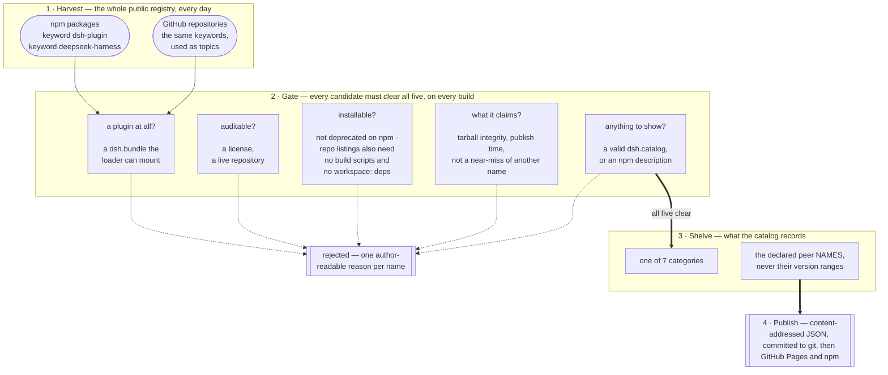
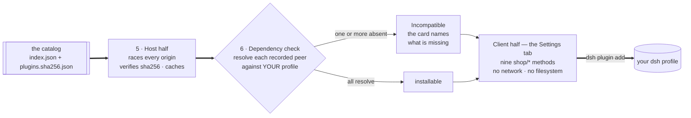

<div align="center">

# dsh-plugin-shop

**The plugin shop for [DeepSeek Harness](https://github.com/deepseek-ai/deepseek-harness)** — discover, install,
enable and update dsh plugins from a browsable, git-auditable catalog.

[](https://www.npmjs.com/package/dsh-plugin-shop)
[](https://LivXue.github.io/dsh-plugin-shop/v1/index.json)
[](https://LivXue.github.io/dsh-plugin-shop/v1/index.json)
[](LICENSE)
[](https://github.com/LivXue/dsh-plugin-shop/actions/workflows/plugin.yml)
[](https://github.com/LivXue/dsh-plugin-shop/actions/workflows/daily.yml)

English | [中文](README.zh.md)

</div>

---

## 📦 Install the shop

Two tracks. They do the same thing; pick the one that matches who is reading.

### 🧑 For people

**Prerequisites:** Node.js. Running the harness itself needs no install — the
upstream-documented form is `npx -y @deepseek-ai/dsh web`. Plugin management
goes through `dsh plugin`, which spawns both the `dsh` command and `pnpm` —
install them once with `npm install -g @deepseek-ai/dsh pnpm` and verify with
`dsh --version` and `pnpm --version`.

```sh
# dsh on PATH (global install). Pin the version: pnpm 11 holds back very
# recent releases, so a bare `add dsh-plugin-shop` can hand you an older
# version for a while. This is the current release — refresh it with
# `npm view dsh-plugin-shop version`.
dsh plugin --profile web add dsh-plugin-shop@0.8.3
# or straight through npx, nothing installed:
npx -y @deepseek-ai/dsh plugin --profile web add dsh-plugin-shop@0.8.3
```

Replace `web` with your profile if you use another one. Restart `dsh` once — a newly
added bundle is not applied to a running process — then open

> **Settings → Plugins → Plugin shop**

### 🤖 For agents

Non-interactive. `--profile` is **mandatory**; without it `dsh plugin` exits with
`error: required option '--profile <name>' not specified`.

```sh
# 1. resolve a profile name ($DSH_HOME defaults to ~/.dsh; node_modules is not a profile)
ls -1 "${DSH_HOME:-$HOME/.dsh}/profiles" | grep -v '^node_modules$'

# 2. install — pin the version: it bypasses pnpm's release cooldown and
#    deterministic installs are the point of the agent path
dsh plugin --profile <profile> add dsh-plugin-shop@0.8.3

# 3. verify — a zero exit above only means pnpm resolved the package
dsh plugin --profile <profile> list --depth 0   # dsh-plugin-shop must appear

# 4. restart the profile; a new bundle is not hot-applied
dsh --profile <profile>
```

The same fact as step 3 lives in `$DSH_HOME/profiles/<profile>/package.json` under
`dsh.profile.bundles`, if you would rather read the manifest than parse CLI output.
Per-failure diagnostics are in the
[package README](packages/dsh-plugin-shop/README.md#failure-modes).

## 🖼️ Screenshots

<div align="center">

</div>

<table>
<tr>
<td width="50%"></td>
<td width="50%"></td>
</tr>
<tr>
<td align="center"><sub>Installing an unreviewed plugin requires an explicit acknowledgement</sub></td>
<td align="center"><sub>The same shelf in the dark theme</sub></td>
</tr>
</table>

## ✨ Highlights

- **🌐 Whole-registry harvest** — every npm package keyed `dsh-plugin` or
  `deepseek-harness`, plus every GitHub repository using them as topics. Nothing is
  submitted here; there is no queue to join.
- **🧹 Hard filtering** — every candidate is gated mechanically on every build, and
  one that fails becomes a named rejection carrying one of seventeen recorded reasons,
  in words its author can read. The `plugins` and `filtered` badges above count both
  sides, live.
- **🔌 Dependency check on your machine** — your installation resolves each recorded
  peer name against your own profile, the question dsh's loader asks at mount, so a
  card reads **Incompatible** only when the modules are really missing *here*.
- **🗓️ Daily rebuild** — committed to git, so every change is a reviewable diff. A
  new plugin lands the next morning; a repository that disappears drops out the same
  way.
- **🗂️ Seven categories** — an author who declares `dsh.catalog` picks their own; the
  rest are classified for them.

## 🗺️ How it fits together

**In this repository — the daily build.** Everything here is `registry/`.



**On your machine — the npm package.** Everything here is `packages/dsh-plugin-shop/`.
The two halves share no code, only the schema.



Two parts are worth naming, because they are the ones people expect to work
differently:

- **The gate rejects; it never silently drops.** Every candidate that fails becomes a
  named rejection with a reason, attached to the build.
- **The dependency check is not a catalog fact.** The build records only the peer
  *names* — never their version ranges, because nearly every dsh plugin declares
  `"*"` and the harness's own prereleases do not satisfy ordinary ranges, so checking
  them would accuse plugins that work. Whether a name resolves is decided by your
  installation, against your profile.

## ✅ What it is

| | |
|---|---|
| **Public and community-run** | Publishing to npm with the `dsh-plugin` or `deepseek-harness` keyword is all it takes to be discovered. Nothing is submitted to this project. |
| **Git-auditable** | Every daily catalog chan