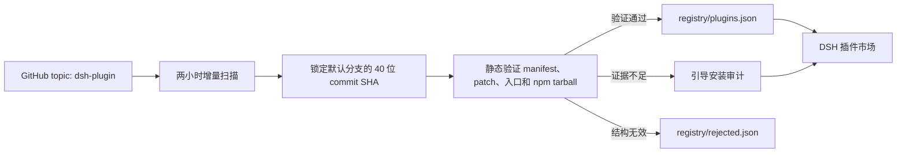

<div align="center">

# DSH Plugin Marketplace

**经过验证的 DSH 插件市场，以及自主维护的中心 Registry。**

[](https://github.com/YELEBAI/dsh-plugin-marketplace/tags)
[](https://github.com/YELEBAI/dsh-plugin-marketplace/actions/workflows/daily-registry-scan.yml)
[](./LICENSE)


**简体中文** · [English](./README.en.md) · [更新日志](./CHANGELOG.md)

</div>

> [!IMPORTANT]
> 市场不会直接展示 GitHub `dsh-plugin` topic 下的所有仓库。只有经过扫描器验证并写入中心 Registry 的插件，才会进入市场。

## 为什么使用它？

| 能力 | 说明 |
| --- | --- |
| 🔍 自动发现 | 每两小时扫描一次 `topic:dsh-plugin archived:false` |
| ✅ Registry 验证 | 检查 manifest、bundle patch、loader entry、运行产物和精确安装来源 |
| 🧩 dsh-std 预检 | 读取可选 `dsh-plugin.json`，验证 Community v0.15 与 dsh-TUI v0.15 的静态准入闭包 |
| ⚡ 一键安装 | 仅对全部自动安装条件均通过的插件开放 |
| 🤖 Agent 安装 | 为需要构建、生命周期脚本或人工判断的插件创建受约束的安装 Agent |
| 🧭 安装 Skill | Agent 强制加载内置安全工作流，自动选择精确来源、隔离构建或停止路径 |
| 🧱 Agent 工作区 | 默认使用市场专属工作区，也可选择已有目录，避免污染项目工作区 |
| ⌨️ 手动命令安装/更新 | 安全解析官方 DSH GitHub 命令，验证后安装或更新当前 Profile |
| 🧰 安装管理 | 按更新/启停状态筛选，单独或批量更新、卸载、启用、停用，并可安全重启 DSH |
| 📈 插件发现 | 支持分类、搜索、Star 排序和最近 7 天增长趋势 |
| 🔄 市场自更新 | 直接检查本仓库版本，并将更新来源固定到解析后的精确 commit |

## 快速开始

### 运行要求与分发说明

- **Node.js**：`^22.19.0 || >=24.0.0`；使用 DSH 的 **web** Profile。
- **DSH 依赖**：`@deepseek-ai/cordis ^4.0.1`、`dsh-app-boot` 和 `dsh-typert-protocol ^0.1.0-rc.5`，由 `peerDependencies` 声明。版本范围不代表每个 DSH Release 都经过独立运行时认证。
- 安装包包含编译后的 Host、Web Client、Typert 入口及对应类型声明；安装本插件无需执行构建或生命周期脚本。
- `zod` 是参数和远程协议校验所需的运行依赖，并非安装脚本。市场会访问 Registry/GitHub；用户发起安装或更新时还会调用包管理器并访问对应包源，读写当前 Profile 与选定的插件目录；Agent 任务使用独立工作区。这些权限不能等同于“无权限插件”或安全认证。

### 1. 安装

```sh
dsh plugin --profile web add github:YELEBAI/dsh-plugin-marketplace#v0.9.4
```

本地开发安装：

```sh
dsh plugin --profile web add D:/path/to/dsh_Market
```

### 2. 启动

```sh
dsh --profile web
```

### 3. 打开市场

进入 **设置 → 插件 → 插件市场**。

市场包含三个子页面：

- **插件市场**：搜索、分类、排序、查看验证信息并安装插件。
- **已安装插件**：过滤、检查更新，单独或批量更新、卸载、启用或停用当前 Profile 的插件。
- **管理与诊断**：手动命令安装、选择插件安装位置并执行冲突诊断。

## 安装模式

| 模式 | 触发条件 | 市场行为 |
| --- | --- | --- |
| **一键安装** | 精确 GitHub commit 或 npm 版本已通过全部检查 | 直接交给 DSH 官方插件命令安装 |
| **手动命令安装/更新** | 用户提供官方 DSH GitHub 安装命令 | 解析命令、锁定 commit、验证 Bundle 和冲突后安全安装或更新 |
| **Agent 安装** | 需要构建授权、生命周期脚本、额外配置或进一步核验 | 创建绑定 Registry 证据的 DSH Agent 会话 |
| **查看说明** | 当前 Profile 不兼容、身份无法确认或缺少可安全执行的路径 | 不执行命令，只打开作者的安装说明 |

自动安装始终使用 Registry 验证过的精确 GitHub commit 或精确 npm 版本，不会把可变的 `main`、`latest` 或 Release 下载地址直接交给包管理器。

### 手动命令安装

在 **管理与诊断 → 手动命令安装** 中可以粘贴：

```sh
dsh plugin --profile web add github:owner/repo#ref
```

也可以只填写 `github:owner/repo#ref`。输入内容不会交给 Shell；市场只接受当前 Profile 的
单条 GitHub 安装命令，并拒绝额外参数、管道、多命令和危险 ref。tag、分支或省略的 ref
会先解析为精确 commit，随后验证 `package.json`、bundle patch 和冲突。安装过程禁用生命周期
脚本；未安装的包会加入 Profile 的 bundle 层，已安装的同名包则按该精确来源更新。

### 引导安装 Agent

仍处于引导安装的插件会显示 **Agent 安装**；已安装插件存在引导型更新时，会显示 **Agent 更新**。

Agent 任务会固定以下上下文：

- Registry 验证过的仓库、包名、版本和唯一 commit；
- 当前 Profile、bundle patch 和扫描器给出的分类原因；
- 插件市场专用 Agent 工作区的绝对路径；
- README、Issue、脚本和依赖均属于不可信输入的安全边界；
- 安装后复查 Profile 依赖、bundle 层和启用状态的验收要求。

每个引导任务的第一步都会加载插件内置的 `install-dsh-plugin` Skill。Skill 优先选择最快的
安全路径：已有完整运行产物时使用精确 commit 并禁用脚本；缺少产物时在临时目录隔离构建；
Release tarball 无可信摘要、包身份不一致、Bundle/入口缺失或出现冲突时直接停止。内置的只读
检查器会同时核验 Git HEAD、包名、版本、Bundle patch、Host/Client 入口、生命周期脚本及当前
Profile 的 Bundle ID/Cordis 服务冲突。

Agent 会先只读检查精确 commit。执行安装、构建、`prepare`、`postinstall` 等第三方代码前，仍由 DSH 原生审批层逐项请求确认，市场不会替用户授权。更新时会保留现有配置、Bundle 顺序和启停状态，并保留旧的精确来源用于回滚。无法证明安装源、包身份、Profile 兼容性或运行产物时，Agent 会停止并说明缺少的证据。

安装成功后，Agent 的最终答复必须包含 **启动方法**，说明：

1. 应使用哪个 Profile 启动 DSH；
2. 是否需要重启；
3. 插件是否随 DSH 自动加载；
4. 仍需填写哪些配置；
5. Web 入口或实际调用方式。

> [!NOTE]
> Agent 默认绑定 `$DSH_HOME/marketplace/agent-workspace`，不会继承当前或最近的项目工作区。
> 可在 **管理与诊断 → Agent 安装与更新工作区** 选择已有目录；Agent 创建后，关闭设置面板即可查看进度并处理审批。

## 已安装插件管理

| 操作 | 行为 |
| --- | --- |
| 更新 | 根据 Registry 检查新版本；自动与引导更新使用各自的安全流程 |
| 批量更新 | 更新已选插件，或一键更新当前搜索与过滤结果中的全部可自动更新插件；单批最多 50 个 |
| 启用 / 停用 | 修改 `dsh.profile.bundles`，不删除依赖，重启后生效 |
| 卸载 | 从当前 Profile 移除插件依赖和对应 bundle |
| 重启 DSH | 等待正在运行的插件任务结束，沿用相同参数和 Profile 重启 |
| 市场自更新 | 直接读取本仓库主分支版本，再将安装来源固定为精确 commit |

安装、更新和卸载共用一个先进先出的插件操作队列。队列只在 **已安装插件** 页面显示；重新打开设置时只恢复仍在执行的任务，完成历史最多保留最近 12 项、10 分钟且可一键清除。按钮确认后会立即显示占位任务并禁止同一插件重复提交；Profile 写入除进程内串行队列外还使用跨进程锁，Windows 短暂的 lockfile 占用会有界重试，单项失败不会阻断后续任务。

已安装插件支持按当前筛选结果选择，并批量更新、启用、停用或卸载。单批最多处理 50 个插件；批量启用会先检查组合后的新增冲突，批量启用/停用只写入一次 Profile manifest。

搜索和状态筛选支持一键重置。已选插件会跨筛选保留；有已选项被隐藏时，面板会明确提示，
批量操作仍包含这些已选插件。点击“清空选择”可一次取消全部选择。

界面沿用 DSH 明暗主题。导航、搜索筛选、插件操作分区展示；窄窗口下，卡片、操作按钮和管理
面板自动换行。卸载使用独立的危险操作样式，安装与批量操作继续使用原有确认流程。
市场采用紧凑卡片：内容区达到 490px 时可显示双列，压缩内边距与筛选区留白，减少浏览长列表时的滚动。

自定义目录卸载完成 Profile 解除关联后，若 Windows 文件占用导致实体清理失败，插件仍保持已卸载，
任务日志会列出残留路径，供重启后清理；不会重新关联可能已被部分删除的文件。安装成功后的旧备份
和临时目录清理失败同样只记录警告，不撤销已经完成的安装。

更新判断不只比较版本号。对于从精确 GitHub 来源安装的插件，即使 Registry 版本号没有变化，只要 Registry 已验证的 commit 与当前安装 commit 不同，也会显示可更新；npm 来源仍依据已验证的精确发行版本判断。

市场首屏先读取包内 Registry 快照和轻量 Profile 依赖列表，并在后台刷新远端 Registry；完整的版本、说明与更新匹配只在进入相应页面后按需执行。点击 **检查更新** 会绕过缓存立即读取远端。默认安装目录不会再遍历整个 `node_modules` 查找孤立插件，只有自定义插件目录才执行该检查。

npm 包内附带构建后的 `lib/` 和发布时的 Registry 快照。因此远程 Registry 暂时不可用时，市场仍可使用包内快照。

## 安装位置、Agent 工作区与冲突诊断

默认情况下，插件实体由 pnpm 直接安装在当前 Profile 的 `node_modules` 中，所有 pnpm 任务都复用该 Profile 已绑定的 store，避免出现 `ERR_PNPM_UNEXPECTED_STORE`。市场会归一化旧 Profile 中被重复放大的 Windows 分隔符，并把 `.modules.yaml` 记录的实际 `vN` 目录转换回 pnpm Store 根目录，防止生成嵌套 Store。

安装位置面板允许把后续安装切换到自定义目录（通过 DSH 的目录选择器）：

- 自定义目录中的插件以 `file:` 依赖关联到 Profile，并把运行入口链接回 Profile 的 `node_modules`；
- 外置插件缺失的 Host peer 依赖（例如 `cordis` → `@deepseek-ai/cordis`）会自动链接；
- 切换目录只影响之后新安装的插件，已有插件保留在原位置并仍可更新或卸载；
- 目录中存在但未关联 Profile 的插件会单独标记，不提供 Profile 操作。

Agent 工作区面板独立控制引导安装和更新会话。默认目录会自动创建；选择自定义目录时，该目录
必须已经存在且可读写。市场在首次使用时把它注册为 DSH Workspace，并只让之后新建的安装
Agent 使用这个 Workspace；现有 Agent 会话和其他项目 Workspace 不会被迁移或修改。

冲突面板对已启用插件做启发式静态诊断：重复的 Bundle ID，以及常见的 Cordis 服务注册形式（`ctx.provide(...)`、`super(ctx, ...)`、`ctx['x'] = ...`、`ctx.x = ...`）。诊断结果是启动崩溃的前置防线，不执行 JavaScript，也可能出现误报（例如入口 bundle 内联了其他插件的代码）；安装、更新或启用前只阻止**新引入**的冲突。

## Registry 如何工作



扫描器不会安装依赖、执行第三方代码，也不会解析 YAML 中的 `!!js` 内容。临时网络失败会保留上一次有效结果，不会导致市场条目批量下架。

当仓库提供 `dsh-plugin.json` 时，扫描器还会执行 `dsh-std` Community v0.15 的静态预检：
它验证 Manifest 结构、host facet、协议坐标、可选协议的 fallback、权限和订阅是否落在
`tui-admission/0.15` 的已声明范围内。该结果显示在插件详情中；它不等同于运行期准入，
因为真实 Host capability、Profile 安装状态和默认拒绝权限的用户授权只能在激活时确认。

恶意代码启发式扫描和 Agent Loop 运行时探测目前属于实验项目，与稳定 Registry 完全隔离；实验结果不会把已通过上述静态安装检查的插件从一键安装降级为引导安装。

### Registry 文件

| 文件 | 用途 |
| --- | --- |
| [`registry/plugins.json`](./registry/plugins.json) | 已验证插件及其安装策略，公开格式为 v2 |
| [`registry/discovery.json`](./registry/discovery.json) | 分类与最近 7 天 Star 增长数据 |
| [`registry/guided-audit.json`](./registry/guided-audit.json) | 所有引导安装条目的逐轮复验结果 |
| [`registry/install-review.json`](./registry/install-review.json) | 安装命令、Profile、生命周期脚本与运行产物证据 |
| [`registry/rejected.json`](./registry/rejected.json) | 未通过结构验证的候选及原因 |
| [`registry/state.json`](./registry/state.json) | 增量扫描状态与每日 Star 基线 |
| [`registry/schema.json`](./registry/schema.json) | 核心 Registry 的 JSON Schema |

未变化且已确认可自动安装的 GitHub 来源会复用上次结果；所有引导条目和 npm 来源每两小时重新核验。某个插件后来发布了合格的 npm 精确版本后，会在下一轮扫描中自动转为一键安装。

## 使用自建 Registry

默认中心 Registry：

```text
https://raw.githubusercontent.com/YELEBAI/dsh-plugin-marketplace/main/registry/plugins.json
```

可以通过环境变量覆盖：

```powershell
$env:DSH_PLUGIN_REGISTRY_URL = 'https://raw.githubusercontent.com/OWNER/REPOSITORY/main/registry/plugins.json'
dsh --profile web
```

也可以在插件配置中设置 `registryUrl`。远程内容