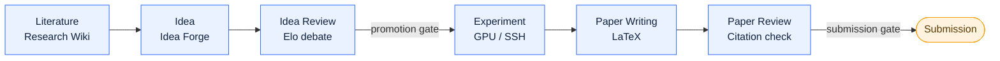

  

  <strong>Autonomous, end-to-end AI research: from literature to a reviewed paper.</strong> 
  Powered by a long-running agent core that plans, executes, and self-verifies its own work, turning every task into a resumable, auditable, human-gated run.

  
  
  
  
  
  

  <strong>English</strong> · <a href="README.zh-CN.md">简体中文</a>

  

---

Polaris runs the entire research lifecycle as a single web application: literature survey, idea
generation, idea review, experiment building on real GPU servers, LaTeX paper writing, and paper
review. It is built for a research lab, with multi-user access, RBAC, and invite-code registration, and
it treats every long task as a **Voyage**: a persisted, resumable, human-gated agent run that can span
hours or days without losing state.

> [!NOTE]
> Polaris is not a chatbot wrapper. The heavy lifting (crawling, parsing, deduplication, metric parsing,
> citation matching) is deterministic code. LLMs are reserved for the judgement calls: scoring,
> synthesis, drafting, and review. This split keeps runs cheap, reproducible, and auditable.

## Demo

A 2-minute tour of the platform: the six-stage pipeline, the Voyage agent core, a real experiment
run, and PolarisBuddy.

https://github.com/user-attachments/assets/388972c1-7ffa-45f2-94c4-07f388379ba2

### Try it live

A guest account on a running instance, for looking around: sign in at
<http://101.37.174.109:8080> with the username `guest` and the password `zjuguest123`.

**The account is for demonstration only: it is read-only and cannot call any model.** It reaches every
screen, the admin views included, but nothing it does changes state — creating, editing, deleting and
uploading are all refused, and no LLM call will run, whether from chat, compilation or the assistant.
Lab members' details and the registration codes are hidden from it as well. It is there to show what
the platform looks like, not to do work on it.

## The research pipeline

Polaris models research as six stages. Each stage produces durable artifacts that the next stage
consumes, and every hand-off can pause at a human approval gate.

| Stage | What Polaris actually does |
| --- | --- |
| **Literature** | The Research Wiki ingests papers from OpenAlex, Semantic Scholar, and arXiv. Cold start snowballs citations from anchor papers and scores relevance against the **direction library's** inclusion config — statement, goals, scope and exclusions, written through a structured AI interview — then extracts full text (PyMuPDF) and compiles a cross-linked wiki page (TL;DR, method, reusable ideas, concept backlinks). There is **one wiki per paper, shared platform-wide**: the compile prompt carries no library statement or rubric, so the same paper never reads differently depending on where you opened it, and a concept is promoted only once two papers cite it. New arXiv work arrives through the daily feed, the single entry point libraries sync from; incremental sync with watermark resume, pgvector semantic search, research digests, and Obsidian vault sync. |
| **Idea** | Idea Forge runs multi-signal gap analysis over the knowledge base (concept co-occurrence holes, extracted paper limitations, trend velocity, survey gaps) to drive retrieval-planned idea generation. Ideas are scored on four axes (novelty, feasibility, operability, impact), deduplicated semantically, and funneled to a candidate pool. A deep Research Proposal builder then hardens the winner with a plan-execute-verify loop. |
| **Idea Review** | Configurable-persona reviewer agents debate pairwise; a judge produces an Elo tournament ranking. Lab members join the discussion live over WebSocket, and their comments enter the agent context as first-class input. |
| **Experiment** | The Experiment Lab uses per-user, Fernet-encrypted SSH credentials to reach the lab's GPU servers. An experiment Voyage asks intake questions first, plans the study, passes a compute-budget check, writes code, runs a smoke test, launches runs with streamed logs and live metric curves, then auto-iterates: parse metrics, reflect, then improve, debug, or stop — repairing failures under a **time** budget rather than a fixed retry count. It keeps a file-based memory it reads and writes across steps, and when it is genuinely stuck it **asks the user** instead of failing. A console gives each run a task map and a terminal you can talk to mid-stream. Figures are generated and VLM-checked. |
| **Paper Writing** | The Paper Writer opens a multi-file LaTeX project (NeurIPS, ICLR, ACL templates) with a CodeMirror 6 editor, real-time collaborative editing (CRDT), and server-side tectonic compilation to a live PDF preview. An agent drafts section by section, but experiment numbers may only come from real `ExperimentRun` metrics and citations must map to real knowledge-base entries. One click refreshes the references and wires the bibliography into the main TeX file. |
| **Paper Review** | Line-by-line citation verification (existence: exact, minor, or fabricated; support: supported, partial, or unsupported) plus deterministic fact-checking of every number against the experiment record, then multi-perspective top-venue reviewer agents and a meta-review. A fabricated citation forces a non-pass. |

## The Voyage agent core

Research tasks are long-running by nature: a cold-start literature backfill takes hours, an experiment
runs for days. Polaris's central abstraction is that every complex task is a Voyage: a resumable,
auditable run driven by a persisted three-part loop.

| Component | Role |
| --- | --- |
| **Navigator** | Planning. Decomposes a goal into a step plan with sub-goals, dependencies, and budget. In loop mode it edits the plan incrementally as evidence arrives, rather than replanning from scratch. |
| **Helm** | Execution. Runs a single step (LLM calls, tool calls, SSH remote ops, literature-API queries) and returns an observation. |
| **Sextant** | Self-verificat