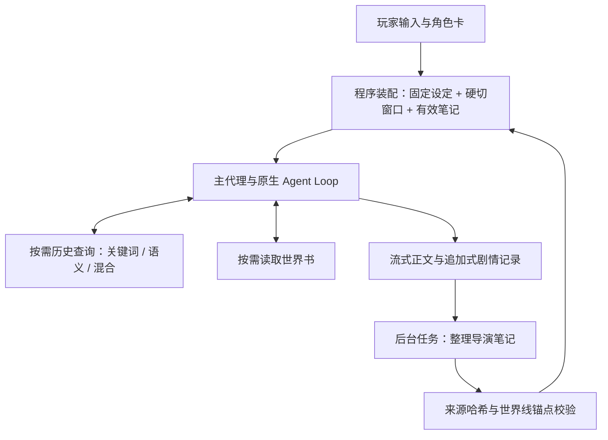

# dsh-NextTavern

**简体中文** · [English](README.en.md)

> **0.3 正在开发，代码会持续同步到本仓库。** 当前包含未发布的源码布局与内聚性重构；统一插件安装、启停和升级仍在实现与验收中。GitHub Releases 待 0.3 完成后发布，下方安装链接仍指向 **0.2.5**。开发进展与兼容变更见 [CHANGELOG](CHANGELOG.md)，参与开发请读[重建指南](CONTRIBUTING.md)。

> **0.3 正在迁移到 `0.1.7-alpha.1`／Session V4。** 本轮已同步依赖锁、存储／Controller／适配器和自有聊天／工作区源码；维护树严格编译、编辑／冷分页／维护分组定点测试及 browser bundle 校验通过。根产品、公开构建入口与完整安装验收仍在推进，当前 `main` 不是可直接安装的 0.3 发行版。不承诺旧会话数据可迁移；升级前请在旧环境导出角色卡或小说，小说不包含完整状态。

**让角色独立推演，让世界随你的选择展开。**

一张角色卡，一个突然冒出的念头，一次不愿妥协的选择，都可以成为故事的起点。dsh-NextTavern 把原生 Agent Loop 带进长篇角色扮演：AI 主动查阅世界、整理记忆、推演人物，你掌握方向，一起把故事写下去。

**创作一个世界，走进它，再把它带走。**

[一键安装](#一键安装) · [开始体验](#开始体验) · [Windows](INSTALL-WINDOWS.md) · [Linux](INSTALL-LINUX.md) · [核心能力](#核心能力) · [记忆系统](#记忆系统) · [架构设计](#架构设计) · [手机电脑公网访问指南](PUBLIC-ACCESS.md) · [全部截图](SCREENSHOTS.md) · [反馈问题](https://github.com/a86582751/dsh-nexttavern/issues/new/choose)

Roleplay workspace for DeepSeek Harness: interactive character creation, on-demand worldbook reading, long-form memory, multi-model collaboration, character agents, branching stories, novel exports and one-click installers.

**0.2.5 预览版** · Harness **0.1.2-alpha.3** · pi-ai **0.84.4** · 自有代码 **GPL-3.0**

想快点开一章，用[一键安装](#一键安装)；想自己控制运行时和补丁，就按[手动安装](#安装)配好那六项兼容补丁。

## 一键安装

**不想手动配运行时、也不想自己打补丁？现在有两条一键路径。** 安装器只做一件事：把运行时和工作区准备好。模型和密钥仍然由你自己决定。

### Windows

下载 [NextTavern-Setup.exe](https://github.com/a86582751/dsh-nexttavern/releases/download/v0.2.5/NextTavern-Setup.exe)，双击，选一个安装目录，然后等它跑完。它会准备便携的 PowerShell 与 Node.js 运行时、按需安装 Microsoft Visual C++ 运行库、建好工作区与启动／停止快捷方式，完成后直接替你打开浏览器。默认装到 `%LOCALAPPDATA%\NextTavern`。Windows on ARM 设备请用 [NextTavern-Setup-arm64.exe](https://github.com/a86582751/dsh-nexttavern/releases/download/v0.2.5/NextTavern-Setup-arm64.exe)。

**0.2.5 起支持原地升级**：在旧安装上直接运行新安装器，你的故事、角色卡和设置都会留着。完整步骤与注意事项见 [Windows 一键安装指南](INSTALL-WINDOWS.md)。

Windows 安装器还没有代码签名，首次运行可能出现 SmartScreen 提示；ARM64 安装器是这一版新增的，装上后遇到问题欢迎来[反馈](https://github.com/a86582751/dsh-nexttavern/issues/new/choose)说一声。

### Linux

[NextTavern-Setup.sh](https://github.com/a86582751/dsh-nexttavern/releases/download/v0.2.5/NextTavern-Setup.sh) 是 0.2.5 新增的自包含脚本，对起点的要求很低：一个 POSIX shell、`curl` 或 `wget`、`tar`，再加一个能算 SHA-256 的工具。脚本自己下载并校验便携 Node.js 运行时，然后准备好安装目录、桌面入口和启动／停止启动器。支持 x86_64 与 aarch64（glibc），**不需要 root，也不需要系统包管理器**。完整步骤见 [Linux 一键安装指南](INSTALL-LINUX.md)。

### 两条路径共同的部分

| 项目 | 说明 |
| --- | --- |
| **只监听本机** | 本地服务绑定 `127.0.0.1`，端口在 3510–3599 之间自动选择，默认不对局域网或公网开放。 |
| **密钥自己填** | 模型 API Key 由玩家输入并保存在本机；安装包不携带、也不分发任何密钥。 |
| **下载先校验** | 镜像优先的下载来源，逐文件 SHA-256 校验，已校验的文件会被缓存复用。 |
| **中断可续** | 网络失败或中途关闭后重新运行安装器，会跳过已校验的文件继续安装。 |

**两个安装器都只是更省事的入口**：它们产出的 preset 和兼容补丁，与[手动安装](#安装)路径完全一致。

## 开始体验

完成[一键安装](#一键安装)（或[手动安装](#安装)）并配置好自己的模型后：

1. **新建一个独立工作区。** 给这次角色扮演一个专用文件夹，角色卡、故事资源和导出文件都放在一起。
2. **在预设里选“角色扮演模式”。** 新建会话时从预设菜单切过去，就进入了你的故事工作台。
3. **上传角色卡，或者直接聊出一张新的。** 支持 SillyTavern / TauriTavern 的 PNG、JSON 人物卡；也可以只描述题材、人物、关系和氛围，让 AI 通过对话和你一起把这张卡做出来。
4. **开始体验。Enjoy it!** 跟着开场推进故事，输入你的行动，切换世界线，或随时打开“酒馆管理”调整设定。

没有现成角色卡，也可以从这样一句话开始：

> 帮我创作一张蒸汽都市悬疑角色卡。我想扮演刚到港口的调查员，故事慢热，有多方势力，也有人物关系的发展。其他细节你来决定。

告诉 AI 你想遇见怎样的人、经历怎样的故事。你可以一起打磨细节，也可以说“你来决定”，让它带着世界、人设、开场与文风继续创作。DOCX/PDF 读卡可通过[文档扩展](#文档扩展)启用。手边只有一部长篇小说？也可以直接让它读成一张卡，见[长文本转角色卡](#长文本转角色卡)。

### 导入 SillyTavern / TauriTavern 人物卡

直接上传原始卡文件，然后告诉 AI：**“读取这张角色卡，准备开始角色扮演。”** 不用自己解码，也不用填导入工具的参数。

| 格式 | 支持范围 |
| --- | --- |
| **PNG 人物卡** | 从 `chara` / `ccv3` 的 `tEXt` 块读取 Base64 编码的角色数据；两者同时存在时优先读取 `ccv3`。 |
| **JSON 人物卡** | 识别 v1、v2（`chara_card_v2`）和 v3（`chara_card_v3`）。 |
| **内嵌世界书** | 读取 `character_book`，按当前导入流程审阅并映射到设定与世界书。 |

请选保留元数据的原始 PNG 卡：普通头像、截图或被移除元数据的图片里没有可导入的角色数据。PNG/JSON 解析是内置能力，不需要 anydoc；上传入口随完整安装提供。

导入后可以继续打磨人物、世界书与创作规则，原始卡片和扩展数据都会一并保留。卡片里的三个文风字段会完整保留，怎么和预设配合由你决定，见[预设系统](#预设系统)。

## 核心能力

**这是这个版本的能力总览，也是后面各章的索引。** 想先知道这一版能做什么，看这张表；想细看某一项，按下面的章节顺序翻。

| 能力 | 你可以获得什么 |
| --- | --- |
| **一键安装** | Windows 与 Linux 两个自包含安装器：便携运行时、工作区、快捷方式与镜像优先的校验下载，Windows 支持原地升级。 |
| **SillyTavern / TauriTavern 卡片导入** | 直接读取 PNG `chara`/`ccv3` 和 JSON v1/v2/v3 人物卡，保留原件并支持内嵌世界书。 |
| **固定设定 + 硬切窗口 + 导演笔记 + 混合检索** | 固定设定不压缩始终注入；窗口保留近期完整正文与尾部衔接；后台笔记带来源哈希与世界线锚点；历史召回支持关键词／语义／混合三种方式。 |
| **预设与文风系统** | 独立预设页，作用范围可选当前对话／指定对话／全局，三种文风模式，16 种自带文风，200 个自定义槽位。 |
| **长文本转角色卡** | 把长篇 TXT 读成一张可玩的角色卡：精读或粗颗粒度两种阅读方式、原文冻结与哈希、每一条研究笔记都能对上原文、独立的语义索引。 |
| **嵌入模型管理** | 在线接入 DashScope、OpenAI 兼容接口与 OpenAI 官方；本地可安装 BGE small zh、Qwen3-Embedding 0.6B、Jina Nano／Small INT8、Nomic q8，无需 Key 与网络。 |
| **多模型协同** | 为正文与记忆、读写卡、状态、决策、小说导出等任务配置模型路由，按需要分工。 |
| **多角色 Agent 集群** | 为主要角色启动独立推演，分别思考语言、行为与意图，再由主代理协调成最终故事；支持单角色模型覆盖。 |
| **决策卡与状态栏** | 行动建议集中在独立决策卡，可折叠、可稍后处理、可拖动；作者的状态 HTML/CSS 在导入、生成与恢复路径上都被保留。 |
| **自有皮肤** | 第一套自有皮肤，日间／夜间双主题，整套界面统一重绘；随包安装，默认关闭。 |
| **对话分支管理** | 重新生成、修改后发送、切换版本，在同一对话里探索不同世界线；也可显式分支到新对话。 |
| **自定义创作规则** | 分别管理核心设定、人物、世界书、剧情指引、文风与规则，控制视角、节奏、人物知情边界和回复展开方式。 |
| **主动读取世界书** | 主代理根据当前剧情按需查阅地点、势力和背景细节，让世界书作为可查询的设定库参与叙事。 |
| **HTML/CSS 阅读美化** | 通过角色卡中的 HTML/CSS、状态栏模板与正则规则定制阅读呈现，正文支持流式阅读；作者脚本在隔离的环境里运行。 |
| **小说稿一键导出** | 将选定世界线整理成小说稿；也能导出当前完整角色卡，结果进入资源库供下载。 |
| **资源库管理** | 集中查看角色卡、故事相关文件与导出结果，按时间或名称排序、刷新和下载。 |
| **交互式全新角色卡创作** | 从一个想法开始，通过交流逐步构建世界、多角色人设、开场、文风和排版，并经过十二项完整性检查。 |
| **模型用量与缓存统计** | 按会话、供应商或模型查看请求、输入输出 tokens、缓存、速度与已知成本，包含重生成、嵌入调用和失败尝试。 |

下面从长篇体验最吃重的记忆系统开始，逐章展开这张表。

## 记忆系统

故事越写越长，人物的经历、埋下的伏笔和未完成的约定也在积累。NextTavern 借鉴 Codex 类长任务的上下文管理思路，把长篇记忆拆成四件各有边界的事：**固定设定不压缩始终注入 + 有尾部保留的上下文硬切窗口 + 可追溯来源的后台导演笔记 + 关键词和语义混合历史上下文查询召回。**

| 支柱 | 它做什么 | 写长篇时有什么用 |
| --- | --- | --- |
| **固定设定不压缩，始终注入** | 冻结的设定与系统前缀每轮都在场，从不进入压缩流程。 | 身份、作者规则和叙事约束是长期契约，不该被一段摘要替换掉。 |
| **硬切窗口 + 尾部保留** | 程序按完整正文边界推进上下文窗口，并在推进时保留尾部连续正文。 | 近期正文保持完整细节，你正在读的那一段不会因为切窗口而丢失，也不会在场景中途被摘要掉。 |
| **可追溯来源的后台导演笔记** | 由独立的后台任务撰写，每条笔记带来源哈希与同一世界线锚点。 | 每条笔记都能追回到写出它的那段正文；追不回来的旧记录会留在原处，程序不会替它猜。追加式原始历史从不删除。 |
| **关键词和语义混合的历史召回** | 主代理按需查询历史，三种方式：**关键词（默认）／语义／混合**。 | 需要旧细节时再回查原文，而不是每轮都先强制召回一次。 |

### 三种查询方式，同一份语料

查询的语料是**玩家输入与有效剧情正文**，包含已经归档或被淘汰的正文；状态、工具输出、CSS、决策卡和推理过程都不会进去。

| 方式 | 谁来算 | 什么时候用 |
| --- | --- | --- |
| **关键词（默认）** | 程序确定性匹配，不调用模型。 | 想找明确的词句、人名、地名时最快。 |
| **语义** | 需要嵌入模型把查询编码成向量。 | 只记得大意、不记得原话时更有效。 |
| **混合** | 关键词与向量结果一起排序。 | 兼顾精确命中与语义相近。 |

向量是派生的共享数据，查询时会过滤到**当前世界线**，所以切换世界线不用重建索引。每份向量索引都带一个配方指纹（模型、修订、维度、任务角色、池化方式、量化与运行时）：指纹对不上时，索引会被标记为 `stale` 并停止对外服务，直到你重建为止——它宁可让你重建，也不会拿旧向量凑出错误答案。分块大小全局可配置，默认 480 字符（192／480／960 三个选项，128–2048 区间，80 重叠），本地模型使用 512 的分词预算。清空、重建与填充都限定在当前可见对话及其全部世界线；清空只清索引，正文、来源和账本都留着。

### 旧笔记与旧状态不再随每次请求发送

旧导演笔记与旧状态快照以前会跟着每次请求一起走（约 52k 字符）。现在它们只在**有效的新锚点准备好之后**才被替换：没被替换的引用保持原本的精确内容，回滚时重新提供完整文本，原始事件始终是追加式的。写长故事时，请求里不会一直拖着越来越重的旧笔记。

同样的“先确认再替换”也用在很长的工具结果上：一条研究笔记被确认后，对应的长工具结果会被替换成匹配的检查点，前提是归属、来源哈希、generation 与 packetIds 全部一致。部分保存、来源不符、写入失败，以及确认之后又重读过的情况，都不会回收。

### 这些都可以按会话调整

窗口大小、尾部保留量和后台笔记更新频率支持全局默认与会话覆盖，留空就沿用全局设置。截图里能看到的一组实际取值：

| 设置 | 含义 |
| --- | --- |
| **窗口大小** | 当前窗口的正文预算，按你实际使用的模型上下文容量来配。 |
| **窗口尾部连续正文保留量** | 切窗口时必须留住的近期正文，保证你正在读的那一段完整。 |
| **后台笔记更新频率** | 每多少个新增正史剧情轮次整理一次；重生成不计入。 |
| **记忆检索方式** | 关键词／语义／混合，以及应用到哪些会话。 |

切换检索方式不会删除已有索引。窗口即将淘汰旧正文时，会先确认检查点已保存；后台整理频率不会取消这道保存关口。

窗口装配、来源校验、笔记淘汰和原文回收都由程序完成，不产生模型请求。只有主代理真的决定去查历史时，才按你选的方式付出一次查询代价（语义与混合还需要嵌入模型，见[嵌入模型](#嵌入模型)）。

换一条世界线，就带着那条路线的经历继续向前；反复打磨同一幕，记忆会跟随你选中的版本。章节交接前，系统会先把需要延续的故事线索整理妥当。

## 预设系统

文风不再只能靠改卡片。管理界面里多了一页独立的**预设页（位于资源库之前）**，可以新建、编辑、另存副本、选用和删除；自带预设是只读的，自定义预设给你 200 个槽位。

| 维度 | 可选值 | 含义 |
| --- | --- | --- |
| **作用范围** | 当前对话／指定对话／全局 | 同一对话的全部世界线共享这次覆盖；留空就沿用全局设置。 |
| **文风模式** | 前景系统美学（默认）／与卡片文风融合／仅卡片文风 | 前两种同时注入预设与卡片文风，冲突时预设优先；第三种只使用卡片文风。 |

预设库由所有对话共享，所以编辑一个正在被使用的预设，会影响使用它的对话后续生成——界面会明确提示这一点。要是两个窗口同时改同一个预设，后提交的一方会收到冲突提示，**你的草稿仍然留着**，不会被悄悄覆盖。

卡片导入、编辑、导出与持久化都保留三个卡片文风字段