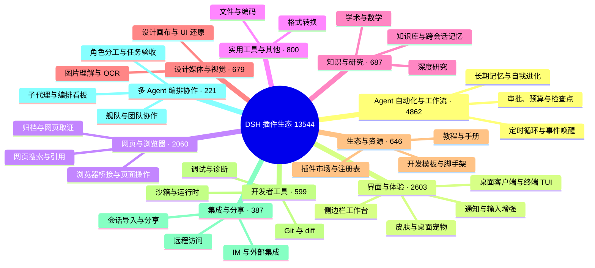

# 🐳 Awesome DSH Plugins

> 30 秒找到真正适合你的 DeepSeek Harness 插件。每天自动抓取 GitHub 上的 `dsh-plugin` 项目并逐个复核：真实插件分类收录，蹭标签项目剔除。通过场景化分类、精选推荐、热度排行和图文导览，帮你快速看懂每个插件能做什么、适合谁，以及如何开始使用。欢迎 Star，让好用的插件更快被发现。

[English](./README_EN.md) · [全量目录](./CATALOG.md) · [Star Top 200](./TOP200.md) · [作者自荐](./SHOWCASE.md) · [推荐一个插件](./CONTRIBUTING.md) · [机器可读数据](./data/repositories.json)

**如果这个列表帮你找到一个有用的插件，欢迎点一个 Star ⭐。它能帮助更多 DSH 用户发现这个生态。**

## 🧭 用户索引

| 我想要…… | 直接去哪里 |
| --- | --- |
| 30 秒选出一个插件 | [精选推荐](#-精选推荐)：从「我想让 DSH 做什么」出发，按场景分组列出社区优秀插件 |
| 第一次装插件 | [新手入门组合](#-新手入门组合)：按当前问题选一套组合，不用一次装很多 |
| 按热度翻完整榜单 | [社区热度榜](#-社区热度榜)（首页 Top 50）· [TOP200.md](./TOP200.md)（完整 Top 200） |
| 按分类浏览全部项目 | [CATALOG.md](./CATALOG.md)（全量目录）· [生态全景](#-生态全景)（分类概览） |
| 看看作者们自己提交的新插件 | [作者自荐](#-作者自荐)（首页最近 10 条）· [SHOWCASE.md](./SHOWCASE.md)（全部） |
| 用程序消费插件数据 | [data/market.json](./data/market.json)——面向下游市场的精选文件（≤500 KB，见[接口规范](https://github.com/bruc3van/dsh-desktop-safe-market/blob/master/docs/market-json-spec.md)）；[data/repositories.json](./data/repositories.json)——每日自动快照，含星数、许可证、活跃度等元数据 |
| 收录或推荐你自己的插件 | [推荐或修正插件](#-推荐或修正插件) / [CONTRIBUTING](./CONTRIBUTING.md) |

## 🗺️ 生态全景

<!-- dsh:panorama:start -->
截至 2026-09-22 共收录 **13544** 个经核实的仓库。它们长这样：

<!-- dsh:panorama:end -->

按分类浏览每个分类下的全部项目，见 [CATALOG.md](./CATALOG.md)——目录按类目分册，索引页列出每一册。

## ⭐ 精选推荐

**这里不按星数排名，但优先选择社区验证的高星项目**——绝大多数推荐来自 Star Top 200：它们解决明确问题、说明完整、仍在维护且经过大量用户验证；少数是几十 Star 但无可替代的项目。从你的问题出发，找到最接近的一行，点进去就是答案；收录不等于安全或兼容性背书。想看按热度排名的完整榜单，见[社区热度榜](#-社区热度榜)。各分类条目下方附有界面截图，点击截图即可直达仓库首页。

### 🖥️ 桌面与终端

- **想要独立的桌面客户端**，而不是浏览器标签页：[dsh-desktop](https://github.com/bruc3van/dsh-desktop) —— 原汁原味的官方 Web UI，不做过多修改；关闭窗口任务照跑，常驻托盘随点随开。安装包自带官方运行时，双击即用，不用装 Node.js、也不用敲命令；智能模式自动复用本机已运行的实例，固定地址模式则直连你自己维护的地址。安全上逐层加固——窗口沙箱、导航锁定、更新链路防劫持、权限最小化，内置安全市场，精选分类600+插件，主打先审查、再安装。
- **想在终端里用 Claude Code 风格界面**：[dsh-TUI](https://github.com/ccch1mneyyy/dsh-TUI) · [dsh-tianshu-tui](https://github.com/huiliyi37/dsh-tianshu-tui) —— 全屏交互终端：状态行、思考流展开、上下文/TPS 仪表；tianshu 版本还内置 TDD 与证据门工作流。
- **想在安卓手机上本地跑 DSH**：[dsh-mobile-apk](https://github.com/kelai141/dsh-mobile-apk) —— 安卓壳 APK：WebView UI + 内嵌 Termux 运行时、SAF 目录桥、保活服务与看门狗。只想用手机遥控电脑上已在跑的 DSH，见下方 [dsh-pocket](https://github.com/shaobeichen/dsh-pocket)。

| | | |
| :---: | :---: | :---: |
|  [dsh-desktop](https://github.com/bruc3van/dsh-desktop) |  [dsh-desktop](https://github.com/bruc3van/dsh-desktop) |  [dsh-TUI](https://github.com/ccch1mneyyy/dsh-TUI) |
|  [dsh-tianshu-tui](https://github.com/huiliyi37/dsh-tianshu-tui) | | |

### 🧰 界面与工作台

- **想一次安装补齐常用界面功能**：[dsh-web](https://github.com/zhu1090093659/dsh-web) —— 任务看板、Git 关系图、侧边面板、远程移动端界面、桌面宠物、实时 Token 用量统计与皮肤中心，一站式功能合集（仓库由 `dsh-web-ui` 更名而来）。
- **想看清上下文窗口里装了什么**：[dsh-context](https://github.com/bowenliang123/dsh-context) —— 在 Web UI 增加 Context 面板，展示上下文由什么构成、如何演化，辅助把握 token 控制与裁剪时机。
- **想把侧边栏升级成完整工作台**：[DSH-better-sidebar](https://github.com/omdsh-dev/DSH-better-sidebar) —— 内置文件渲染编辑、终端、Git 与子代理，并支持第三方扩展注册新 Tab。
- **想把所有 Agent 项目收进一个管理台**：[dsh-worktable](https://github.com/Aisland-SJL/dsh-worktable) —— 侧边栏应用抽屉 + 可停靠分屏工作区，外加实时监控所有项目的控制室。
- **想让 DSH 拥有真正的 Office 环境**：[dsh-univer-office](https://github.com/dream-num/dsh-univer-office) —— Univer 官方厂商出品：把表格、文档、幻灯片、画布与关系表装进对话，数据相互联动。
- **想让工作状态行活过来**：[working-activity](https://github.com/ccch1mneyyy/working-activity) —— 实时显示工具动态与进度、俏皮文案、模型自述与上下文预警，等待时不再无聊。
- **想让 Agent 操作浏览器**：[dsh-browser](https://github.com/Lum1104/dsh-browser) · [BrowserSkill](https://github.com/Tencent/BrowserSkill) —— dsh-browser 是 Chrome 侧边栏扩展，在当前对话里授权页面并执行操作；BrowserSkill 是腾讯出品的真实已登录浏览器桥（独立 Agent 窗口，不打断你自己的浏览），DSH 通过官方 npm 插件 `@wxg-prc-cpg/browser-skill-dsh-plugin` 接入。

| | | |
| :---: | :---: | :---: |
|  [dsh-web](https://github.com/zhu1090093659/dsh-web) |  [dsh-context](https://github.com/bowenliang123/dsh-context) |  [BrowserSkill](https://github.com/Tencent/BrowserSkill) |
|  [dsh-worktable](https://github.com/Aisland-SJL/dsh-worktable) |  [dsh-univer-office](https://github.com/dream-num/dsh-univer-office) | |

### 👀 让模型看得见、搜得到

- **想给 DSH 增加视觉理解能力**：[modlens](https://github.com/liustack/modlens) · [dsh-vision-toolkit](https://github.com/Anionex/dsh-vision-toolkit) —— modlens 把图片转成 OCR/布局/语义结构化证据；dsh-vision-toolkit 覆盖图片问答、长截图 OCR、UI 还原与像素对比。
- **想免 Key、免 Python、粘贴即用看图**：[dsh-vision-router](https://github.com/ysr666/dsh-vision-router) —— 内置免费视觉链（五模型匿名兜底，免注册免 Key），图片轮像普通工具轮一样由模型驱动 10 个 `vision_*` 像素工具（定位、裁剪、描述、像素对比、修复、取色、OCR、抠图、矢量化、截图）连续多步执行，并输出结构化证据 JSON；一条命令安装（Web profile），Node only。
- **想让 Agent 自己搜索网页和 X，答案带引用**：[modsearch](https://github.com/liustack/modsearch) · [anysearch-dsh](https://github.com/anysearch-team/anysearch-dsh) —— modsearch 在对话中直接搜索、抓取并返回带引用的结构化证据；anysearch-dsh 提供 AnySearch 搜索源与高级搜索工具，可作补充搜索后端。
- **想在对话里直接生图**：[dsh-image-gen](https://github.com/shanliuling/dsh-image-gen) —— 对话内调用 `generate_image`，支持 Gemini / OpenAI / Seedream / 通义万相，自带画廊、全屏预览与一键下载。

| | | |
| :---: | :---: | :--