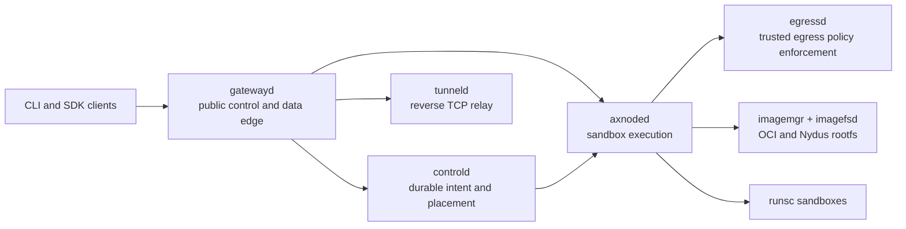

<p align="center">
  
</p>

<p align="center">
  <a href="https://github.com/cofy-x/axern/actions/workflows/ci.yml"></a>
  <a href="./LICENSE"></a>
</p>

<p align="center">
  <a href="https://axern.cofy-x.space">Documentation</a> ·
  <a href="https://axern.cofy-x.space/getting-started/">Quickstart</a> ·
  <a href="https://axern.cofy-x.space/sdk/">SDKs</a> ·
  <a href="./README.zh-CN.md">简体中文</a>
</p>

Axern is an open-source environment execution platform for agent evaluation, training, and data synthesis. It isolates agent-generated code with gVisor (`runsc`) through one resource and lifecycle model. Runsc is the supported execution runtime, with no runtime fallback. The CLI and the Go, Python, and TypeScript SDKs expose the same public APIs for Environments, Runs, sandbox processes and files, Tunnels, lifecycle state, and allocation-scoped access.

> **Project status:** Axern is pre-1.0 and under active development. It is suitable for evaluation and contribution, but operators should review the security and production boundaries before deploying multi-tenant workloads.

The durable chain is **Environment → Run → Allocation → runsc sandbox**. Sandbox is an SDK facade over that chain, not a second execution lifecycle.

<p align="center">
  
</p>

## Quickstart

The supported local path runs the complete stack with Docker Compose. It needs only the `axern` CLI and Docker Compose v2 — no source checkout, Make, Helm, or language toolchains.

```bash
brew install cofy-x/tap/axern
```

Without Homebrew, use the standalone checksummed installer:

```bash
curl -fsSL https://raw.githubusercontent.com/cofy-x/axern/main/install.sh | sh
```

Then start Axern and run the first workload:

```bash
axern local up
axern local image load python:3.12-slim --pull
axern run python:3.12-slim -- python -c 'print("hello from axern")'
```

`local up` starts PostgreSQL and the Axern control, tunnel, node, and gateway components, waits for readiness, and creates the `local` context. `local image load` streams the selected host Docker image into that local node without a temporary archive:

```bash
axern context current
axern run list
axern local status
axern local down
```

The local environment uses generated development credentials and loopback listeners. Do not reuse them in a shared or production deployment.

Trusted machine-local HTTP registries can be authorized with repeatable `axern local up --insecure-registry host[:port]` flags. The registry must be reachable from both local control and node containers under that exact hostname; container-only registries can join the `axern-local-registry` Docker network reported by `axern local status`. See the [CLI contract](./apps/cli/README.md#local-external-http-registries). HTTPS remains the default, and this local-only setting is not part of an Environment specification.

Source development is a separate contributor path. It builds the current checkout into local `:dev` images and exercises the same public contract:

```bash
make quickstart-source
```

For repository development, `make verify-changed` is the normal fast feedback entrypoint. Linux correctness, full regression, and release qualification are separate tiers. Every `main` commit starts a commit-bound full regression; a green PR check does not imply that this later run has passed. Check [Post-Merge Full](https://github.com/cofy-x/axern/actions/workflows/post-merge-full.yml) before release or promotion; see the [verification tiers](./docs/verification/local-full-verification.md).

## What You Can Build

- **Agent sandboxes:** execute agent-generated code behind a runsc isolation boundary while retaining process, file, terminal, and output APIs.
- **Evaluation and synthesis batches:** execute isolated work concurrently through Runs, with explicit inputs, outputs, and lifecycle evidence.
- **SDK-driven execution:** use a released SDK to create Runs, operate their Allocations, seal bounded declared outputs, publish a successful writable rootfs as a reusable Environment, and recover by public resource identity.

## Why Axern

- **Sandbox as the primitive:** evaluation, training, data synthesis, coding workspaces, and agent tasks compose the same Run execution model.
- **Durable control plane:** PostgreSQL-backed intent, placement, leases, allocation-scoped status, health, and cleanup state remain authoritative across process or node restarts.
- **One production runtime:** runsc workloads use the same public APIs; OCI and Nydus image paths converge at the node runtime.
- **Real data-plane access:** process streams, files, archives, SSH-compatible terminals, and reverse TCP tunnels are explicit allocation capabilities.
- **Local-to-cluster continuity:** Docker Compose, kind, and the cloud-neutral Helm chart exercise the same component boundaries.

## Architecture



`gatewayd` is the unified external gateway for public control and Allocation-scoped data-plane traffic; `controld` and PostgreSQL remain authoritative for product state, while node services own host-local execution, images, networking, and Allocation-local writable storage. A Run can declare a bounded set of files or tar archives for node-local sealing before runtime cleanup; callers download and durably publish those bytes before their 15-minute expiry. A successful finite Run may separately publish its complete writable rootfs as a content-addressed OCI image and ordinary reusable Environment. Neither path creates a persistent workspace or generic object store. See the [storage architecture](./docs/architecture/storage-architecture.md), [runtime architecture](./docs/architecture/runtime-architecture.md), and [resource model](./docs/architecture/resource-model.md).

Public clients are available in Go, Python, and TypeScript under [`sdk/`](./sdk/README.md). Shared wire contracts are defined in [`sdk/proto`](./sdk/proto/README.md).

## Kubernetes Install

Follow the [Kubernetes installation guide](./apps/docs/src/content/docs/getting-started/kubernetes.md) to provision signing material, supply qualified node memory reserves, bind explicit Node identities, install the control plane, and admit nodes before waiting for runtime readiness. SSH is optional and uses Principal Credentials. Do not skip the identity and admission steps by running a bare Helm install.

Treat each Axern release as one coordinated CLI, SDK, chart, and runtime version. Review its [release notes](./docs/releases/) before upgrading and use artifacts only after publication completes; a source version is not proof of artifact availability. Terminal recordings show the current source CLI help, not a deployed workload or performance measurement.

## Deployment

- [Docker Compose and kind](./deploy/local/README.md) are the repository-owned local truth environments.
- The [Axern Helm chart](./deploy/helm/axern/README.md) is cloud-neutral and accepts operator-owned image registries, certificates, storage classes, and secrets.
- Provider account setup, cluster creation, credentials, and regional release automation inten