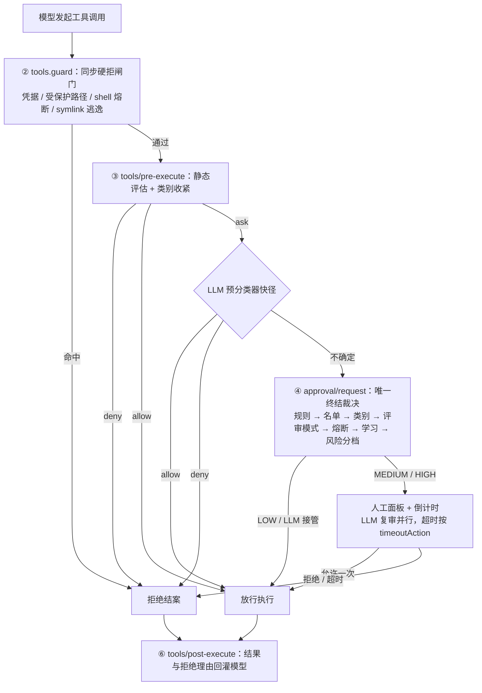

<div align="center">

# @quill507/dsh-auto-approval-llm

**为 DeepSeek Harness 的 Auto 权限档提供 LLM 辅助自动审批 + 超时自动兜底**

*常规操作静态放行 · 危险与模糊操作走 LLM 评审 + 人工倒计时 · 默认 fail-closed*

[](https://www.npmjs.com/package/@quill507/dsh-auto-approval-llm)
[](https://www.npmjs.com/package/@quill507/dsh-auto-approval-llm)

[](https://opensource.org/licenses/BSD-3-Clause)
[](https://awesome-dsh-plugin.com)

[文档站](https://cuddly-guacamole.github.io/dsh-auto-approval-llm/) · [English](https://github.com/cuddly-guacamole/dsh-auto-approval-llm/blob/main/README.en.md) · [Issues](https://github.com/cuddly-guacamole/dsh-auto-approval-llm/issues)

</div>

`Auto 档`（machine value `auto-approval`；host 显示名 `Auto approval`；中文客户端显示 `自动审批`）= `sandbox: danger-full-access` + `approval: ask`。本插件在本档会话里充当 `approval/request` 的**唯一终结裁决者**：常规操作经静态规则直接放行，危险/模糊操作走「静态规则 → LLM 分类 → LLM/人工裁决 → 倒计时兜底 → 熔断」，全程保留人工与审计兜底。宿主 `>= 0.1.6` 的 `auto` 归上游 `@deepseek-ai/dsh-experimental-auto-review`（Auto review / EXP），本插件只接管 `auto-approval` 档、上游只接管 `auto` 档（按 derived preset 判档），两者**作用于不同档位、可同时启用**。

---

## 特性

1. **静态规则 + LLM 分类器** —— 只读/会话/工作区常规操作直接放行；危险、外部写、凭据外泄、受保护路径直接拒绝；模糊操作交 LLM 预分类。
2. **写向量完整性加固** —— 含真实文件写重定向的命令段脱离只读快径；POSIX `tee` / `dd of=` / `sed -i` / `truncate` / `install` 以操作数目标参与按目标闸门；直写插件运行态文件无条件硬拒。
3. **12 分类三态开关 + 信任目录双模式** —— 每类可配 `auto` / `ask` / `deny`，**默认全部 `inherit`**（HARD_LOCKED 的 delete / disk 除外——未配置也恒被接管为 `ask` 倒计时）；delete / disk / privilege / protected 四类保持锁定，`trustedDirs` 与 `categoryMode` 控制「常规位置」范围（分层细节见 docs/17）。→ [docs/17](https://github.com/cuddly-guacamole/dsh-auto-approval-llm/blob/main/docs/17-category-switches.md)
4. **双通道模型来源** —— 快速判断与深度评审各可独立选择：跟随会话模型（默认）/ DSH 已配置模型 / 自定义端点。端点密钥存 DSH 凭据存储，前端只显示「已配置」、永不回显。
5. **分级倒计时 + 超时兜底 + LLM 接管** —— 低/中/高三档倒计时（默认 5 / 8 / 10 秒）；超时按 `timeoutAction`（拒绝 / 通过 / 低风险自动同意）结算；中风险下 LLM 在窗口内给出明确结论即接管。关浏览器也不悬挂（host 计时器独裁）。
6. **熔断与循环防护** —— 连续/累计被 LLM 拒绝达阈值则转人工（`/approval-reset` 重置）；**循环防护**（默认关）把「被自动放行面连续放行的同一调用」转为钉死拒绝倒计时。
7. **声明式规则 `rulesText`** —— `工具(正则) | allow|deny|human [| 字段]`，支持 `[agent:…]` / `[workspace:…]` 维度限定；解析出错时整段失效（设置卡有警示）。
8. **确认制学习**（默认关）—— 同一签名被人工反复确认达阈值后自动放行，**每次放行前仍过一次标准在线评审**；条目可查看与吊销。→ [docs/18](https://github.com/cuddly-guacamole/dsh-auto-approval-llm/blob/main/docs/18-confirm-learning.md)
9. **可审计、可观测** —— `history.jsonl` + append-only `audit.jsonl`；LLM 评审真实耗时统计；瞬时网关故障自动重试一次（认证类错误不重发凭据）。

---

## 工作方式



- **LOW**：不送评审则静默放行；送评审时按结论裁决；ESCALATE 转人工。
- **MEDIUM**：面板 + 倒计时并行跑 LLM；`llmTakeoverScope` 覆盖且结论明确 → 立即跟随。
- **HIGH**：面板 + 倒计时，LLM 只给建议；超时严格按 `timeoutAction`。
- 超时标记的唯一作者是 host 计时器，客户端只上报 outcome，伪造不了。

> 完整五段钩子时序（含 ⑤ 产物登记、⑦ 通知投递）见 [docs/02 · 一次工具调用的完整生命周期](https://github.com/cuddly-guacamole/dsh-auto-approval-llm/blob/main/docs/02-tool-call-lifecycle.md)；两层静态面经宿主 `tools/pre-execute` 瀑布征询生效，对端监听的短路形态见 [docs/09 · 可达性前提](https://github.com/cuddly-guacamole/dsh-auto-approval-llm/blob/main/docs/09-defense-in-depth.md)。

---

## 安装

**前置**：会话/预设处于 **Auto 档**（machine value `auto-approval` = `danger-full-access` + `approval: ask`，用 `/permission auto-approval` 切换）；DSH `0.1.7-rc.1`；Node `^22.19.0 || >=24.0.0`。

兼容窗口：`auto` 是上游 `@deepseek-ai/dsh-experimental-auto-review`（Auto review / EXP）的保留名，本插件只定义/接管 `auto-approval`，两者**分档并存、可同时启用**。宿主承诺**一条线**：`0.1.7-rc.1` = **完整支持**（peer `>=0.1.7-rc.1 <2`）。长期规则：**宿主线跟着用户实际在跑的宿主走**，上游进入新 tuple 的 alpha 时再逐条追加（`HOST_LINES` 同步加行）。peer 区间是**安装准入面**——**区间内未测的线不受支持**，上界 `<2` 只是范围上界。旧机器值 `auto` 别名与 legacy/unknown 能力分支已随下限抬升移除（shipped patch 只定义 `auto-approval`）。

```bash
dsh plugin --profile web add @quill507/dsh-auto-approval-llm
```

- 安装后**重启 dsh**，host 侧才生效。
- **只作用于 Auto 档**（其他权限档不介入）；切换用 `/permission auto-approval`。本插件是 `auto-approval` 档 `approval/request` 的唯一终结者 —— **同一档位不要再叠加第二个审批裁决者**；上游 `@deepseek-ai/dsh-experimental-auto-review` 的 `auto`（Auto review / EXP）是另一个档位，两者可同时启用。
- **平台**：Windows + Git Bash 为主开发/测试基线；macOS / Linux / WSL 代码已适配但无真实用户验证；Android 原生环境不支持。→ [docs/19](https://github.com/cuddly-guacamole/dsh-auto-approval-llm/blob/main/docs/19-platform-support.md)
- **反馈**：到 [GitHub Issues](https://github.com/cuddly-guacamole/dsh-auto-approval-llm/issues) 报告，注明平台、dsh 版本、插件版本、复现命令与预期行为。
- 本地开发：`npx tsc -p tsconfig.json` + `npx tsdown`，以 `link:` 加载（host 改动需重启，client 改动自动热载）。→ [docs/14](https://github.com/cuddly-guacamole/dsh-auto-approval-llm/blob/main/docs/14-code-map.md)

### 从旧 `auto` 档升级

- **同签名门槛**：所有宿主只迁移 `raw preset = auto` 且 `sandbox = danger-full-access` 且 `approval = ask` 的存量会话；其它 `auto` 签名（含 `danger-full-access + never`）一律不迁移并告警。
- **modern host 的主体变化**：宿主 `>= 0.1.6` 上若上游 auto-review 层持有同一签名的 `auto`，该会话同样会被改写成 `auto-approval`——沙箱/审批旋钮不变，但**应答主体从上游换成本插件**（上游不再接管该档）。这是同签名 rescue 语义的一部分，不是旋钮放宽。
- **迁移时机**：归档会话不处理，只在 resume 进入 live 时懒迁移（`session/created` prepend）；插件加载时对已 live 会话做一次启动扫描，`agent/created` 兜底。迁移只重写 durable raw identity（`permission/preset`），**不写旋钮、不调用 `permissionPresets.set()`**。
- **自有档 spec enforcement**：`auto-approval` 会话的 effective-never（`approval: never`，或 `approval: null` + base policy `never`）由插件写回 `ask`（`preset-spec-restore` 审计）；不会再翻转上游 `auto`。
- **fail-closed**：宿主 `>= 0.1.6` 且未装上游 auto-review、且该存量会话在 `permissionPresets` 服务构造期已 live（插件来不及先迁移）时，宿主 pin 会先于插件拒绝该会话——**会话打不开，不是静默放行**。处置：停 dsh → 用可选离线迁移工具或手工导出/导入 → 再启动；也可在 profile 保留上游 auto-review 层。该 boot 期缺口在插件侧无法自动修复。
- 官方权限选择器的风险确认只覆盖宿主内置的 `danger-full-access`；自定义 `auto-approval` 档由插件客户端自行弹确认。

---

## 快速开始

1. 把会话/预设切到 **Auto 档**：`/permission auto-approval`。
2. 打开侧边栏 插件 → auto-approval-llm，在该插件的行列表里点「配置 <行名>」打开行配置页，确认设置表单出现（宿主未交出该命名空间的配置表单时，该页只读展示当前生效值）。**默认配置即可工作**（常规操作静态放行；模糊操作走会话模型评审；超时按 `timeoutAction` 兜底，默认拒绝）。
3. 想让审批走指定模型：在「在线评审模型」卡把通道来源设为「DSH 模型」并从列表选，或选「自定义端点」填协议 / 地址 / 模型 / 密钥 → 保存 → 测试连接。
4. 嫌弹窗频繁：调大「中风险倒计时」，或把「超时动作」改为 `拒绝` / `低风险自动同意`。

> **会话命令**（默认不注册）：`/approval-mode` 查看当前会话模式、`/approval-mode manual|smart|unattended` 设置、`/approval-reset` 与 `/approval-reset-all` 重置熔断 —— 需在设置卡开启 `slashCommandsEnabled` 并重启。

---

## 界面预览


其余界面的结构说明（计时器与熔断 / 安全规则列表 / 分类开关与信任模式 / 确认制学习 / 在线评审模型 / 权限预设）见 [docs/10 · 客户端 UI](https://github.com/cuddly-guacamole/dsh-auto-approval-llm/blob/main/docs/10-client-ui.md)。

---

## 配置项

下表只列常用键；**全部键、完整语义与裁决例外见 [docs/12 · 配置全景](https://github.com/cuddly-guacamole/dsh-auto-approval-llm/blob/main/docs/12-config.md)**。

| 键 | 默认 | 说明 |
|---|---|---|
| `enabled` | true | answerer 总开关：关=本插件不再终结 approval/request（静态硬拒与 guard 仍生效） |
| `timeoutAction` | `reject` | 超时动作：拒绝 / 通过 / 仅低风险放行（删除与磁盘恒拒，不受此键影响） |
| `llmReviewScope` | `low-or-above` | 哪些风险档送 LLM 复审 |
| `llmTakeoverScope` | `medium-or-below` | 哪些档允许 LLM 结论直接接管 |
| `lowRiskSeconds` / `mediumRiskSeco