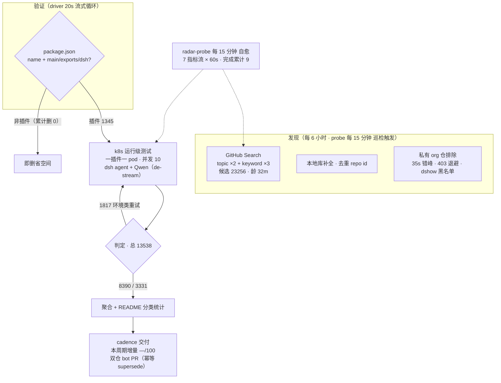

# DSH Plugin Radar

<p align="center">
  <br>
  
</p>

<p align="center">
  <a href="https://trendshift.io/repositories/147500" title="GitHub Trending 日榜 #22 · 2026-08-14 · 全语言口径"></a>
</p>

**开源的 DeepSeek Harness 插件生态雷达——持续发现、运行级验证、15 分钟快照。你看到的插件目录，只是它自动生成的 artifact。**
**An open-source radar for the DeepSeek Harness plugin ecosystem — continuous discovery, runtime validation, 15-minute snapshots. The plugin catalog below is just an artifact it generates.**

安装前就知道哪个能用，不用自己踩坑。
*Know which plugins work before you install them.*

[](#精选插件榜) [](#当前生态快照) [](#本仓库如何判定) [](https://dshfind.com/zh/plugins/AdamPlatin123/dsh-plugin-radar?ref=badge) [](LICENSE)

**判定按 runner 版本分离 / verdicts by runner version：**

| runner 版本 / version | 可用 / OK | 需适配 / adapt | 在测 / testing | 小计 / total |
|---|---:|---:|---:|---:|

| **累计 / cumulative** | **8390** | **3331** | **1953** | **13674** |


---

**这是什么？** DeepSeek Harness（DSH）是一个万物皆插件的编码 agent。本仓库是自动追踪其插件生态的**雷达**——索引、克隆验证并运行级实测。
**What is this?** DeepSeek Harness (DSH) is an open-source coding agent where everything is a plugin. This repo is a **radar** that automatically tracks its plugin ecosystem — indexing, clone-verifying and runtime-testing it.

**架构原则：目录是构建产物（Catalog is a build artifact）。**
**Architecture principle: the catalog is a build artifact.**

```text
Radar Engine（开源 → engine/）          Radar Engine (open-source → engine/)
     ↓                                        ↓
机器可读快照（每 15 分钟）              Machine-readable snapshots (every 15 min)
     ↓                                        ↓
目录渲染器（聚合 · 分类 · 双语渲染）     Catalog renderer (aggregation · classification · bilingual rendering)
     ↓                                        ↓
┌─ PLUGINS-ALL.md 全量清单 / full listing
├─ 精选插件榜 / 整合包   Featured board / bundles
├─ 生态快照 / 兼容矩阵   Ecosystem snapshot / compatibility matrix
└─ dshfind 等下游消费方  dshfind & downstream consumers
```

## 工作原理
> 数据截至快照 `20260923T094501Z`（2026-09-23 17:45:03 UTC+8 · 分类器 unified-v2-bridge）
> *Data as of snapshot — currently `20260923T094501Z` (2026-09-23 17:45:03 UTC+8 · classifier unified-v2-bridge)*
*How It Works*

<!-- AUTO:pipeline:START -->

<!-- AUTO:pipeline:END -->

**🔌 开源计划——本页数据由「DSH 插件雷达」服务管线自动生产，雷达源码分阶段开源：**
**🔌 Open-Source Plan — this page is produced automatically by the radar pipeline, open-sourced in stages:**

| 阶段 / Phase | 开源内容 / Content | 状态 / Status |
|---|---|---|
| Phase 1 | 管线文档 / Pipeline docs：[总览与路线图](docs/radar/overview.md) · [架构](docs/radar/architecture.md) · [数据契约](docs/radar/data-contracts.md) | ✅ 已开源 / Open |
| Phase 2 | 雷达引擎源码 / Radar engine source（发现 · 聚合 · 渲染 · 分发 + 运维自愈 / discovery · aggregation · rendering · distribution + ops） | ✅ 已开源 → [engine/](engine/) |
| Phase 3 | 测试引擎源码 / Test engine source：轻量版（本地直跑 / local, no k8s）· 服务器版（k8s 集群 / server edition） | 🔜 稳定后开源 / After stabilization |

## 快速导航
*Quick Start*

| 你的目标 / Goal | 跳转入口 / Link |
|---|---|
| 了解这个雷达本身 / Understand the radar | [工作原理](#工作原理) · [开源引擎 engine/](engine/) · [管线文档](docs/radar/overview.md) |
| 看精选插件 / Browse featured | [精选插件榜](#精选插件榜) — 人工策展 · 11 类 / curated · 11 categories |
| 一把装好 / Install a bundle | [整合包](#-整合包) — 预设 / 合集 / 发行版 / 配方 / presets · collections · distributions · recipes |
| 市场接入 / For marketplaces | [数据接口 docs/api.md](docs/api.md) — 稳定 JSON · 署名即用 / stable JSON, attribution only |
| 按用途找插件 / Find by use case | [分类目录](#分类目录) — 13 类 · 明细见 [PLUGINS-ALL.md](PLUGINS-ALL.md) · [PLUGINS.md](PLUGINS.md) 为登记清单 |
| 浏览全部发现 / All discovered repos | [当前生态快照](#当前生态快照) — 日期化兼容矩阵 / dated compatibility matrix |
| 登记或提交插件 / Register a plugin | [给插件开发者](#给插件开发者) · 加 `dsh-plugin` topic → 8h 自动收录 / auto-discovered in 8h |
| 了解最近变更 / Recent changes | [CHANGELOG](CHANGELOG.md) |
| 加入社群 / Join the community | [DSH 学习社区](#dsh-学习社区-dshfindcom) · [社区讨论群](#社区讨论群) |

> [!IMPORTANT]
> **收录不等于兼容，静态检查不等于运行可用，运行可用也不等于安全审计。**
> **Inclusion ≠ compatible, static check ≠ runtime-usable, runtime-usable ≠ security-audited.**
> 本仓库提供可追溯的筛选信号，不代表 DSH 官方背书。安装第三方插件前，请检查源码、权限、依赖、许可证及测试日期。
> *This repo provides traceable filtering signals, not official DSH endorsement. Always review plugin source, permissions, dependencies, and license before installing.*

## 🛒 生态目录（雷达生成的 artifact）
*Ecosystem Catalog — an artifact generated by the radar*

以下目录内容——精选榜、整合包、分类目录、兼容矩阵——均由雷达管线自动生产与刷新（精选榜与整合包成员为人工策展，星标与状态由 bot 持续更新）。
*Everything catalog-shaped below is produced and refreshed by the radar pipeline (featured/bundle membership is human-curated; stars and statuses are kept fresh by bots).*

数据接口与下游接入见 **[🤝 市场与下游接入](#-市场与下游接入欢迎引用可用性数据)**。
*For the data API and downstream integration see **[🤝 For Marketplaces](#-市场与下游接入欢迎引用可用性数据)**.*

<details>
<summary><b>📖 展开生态目录 / Expand ecosystem catalog</b></summary>

### 精选插件榜
*Featured Board*

<!-- AUTO:featured:START -->

> 人工策展 55 款插件，按 11 类分组、类内按星标排序；星标每 6 小时自动刷新（成员调整请提 PR 修改 data/awesome-50.json）。数据截至 2026-09-24 05:34（UTC+8）。
> *Human-curated 55 plugins in 11 groups, star-sorted within each; stars auto-refresh every 6 hours (membership via PR to data/awesome-50.json). As of 2026-09-24 05:34 (UTC+8).*

### 🚀 智力增强 Booster（7）
*Intelligence Boosters (7)*

-  **[dsh-routing-suite](https://github.com/yjh051108/dsh-routing-suite)** · 7207★ — 注入器 × 思维模式路由套装：免重启运行时注入器 + 任务感知推理模式路由预设（P1-P23 实测）
-  **[ouroboros](https://github.com/Q00/ouroboros)** · 6081★ — Agent OS：agent 自我变强、人只守底线——自进化运行时（5.7k★；rc.8 实测 ✅）
-  **[harmony-next.skills](https://github.com/linhay/harmony-next.skills)** · 354★ — 技能驱动的工作流增强
-  **[superpowers-dsh](https://github.com/LayneChai/superpowers-dsh)** · 93★ — TDD/调试/计划等开发技能集
-  **[forkprobe](https://github.com/Jayden-X-L/forkprobe)** · 72★ — 同一任务跑多个技能对比，自动选优
-  **[dsh-tool-turbo](https://github.com/Electricitysheep/dsh-tool-turbo)** · 8★ — 按轮次自动优化 reasoning_effort（推理力度）
-  **[dsh-reasoning-settings](https://github.com/JuneLearn/dsh-reasoning-settings)** · 5★ — 推理设置控制：让模型按任务切换思考档位

### 🖥 界面与工作台（6）
*UI & Workbench (6)*

-  **[dsh-web-ui](https://github.com/zhu1090093659/dsh-web-ui)** · 7963★ — Web UI 增强与皮肤合集：任务看板、Git 图、移动端、皮肤中心
-  **[DSH-better-sidebar](https://github.com/om