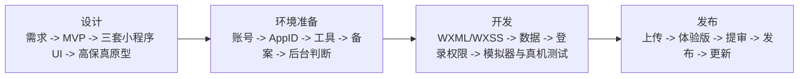

# launch-wechat-miniprogram

面向完全新手的微信小程序 Agent Skill：从想法开始，经过需求确认、原生 UI 方案、高保真原型、账号与 AppID、备案、开发测试、可选腾讯云后台、体验版、审核门禁、发布和版本更新，逐阶段推进到可验收结果。

这个 Skill 只覆盖微信小程序，不默认使用腾讯云后台，也不会替用户注册账号、填写实名资料、扫码、提交审核或输入密码等敏感信息。

## 解决什么问题

新手通常不是不会写几行代码，而是不知道应该先确认什么、哪些信息不能假设、什么时候需要 AppID、备案和后台，以及 HTML 原型和真实小程序之间有什么差异。这个 Skill 把流程固定成四个阶段，并设置明确的确认门禁：



每个阶段只推进一个明确任务。用户没有确认需求、首版范围或设计方案前，Skill 不会创建源码或跳过门禁直接开工。

## 核心特点

- 需求先行：产品名称不等于完整需求，先询问业务规则、参与方式、数据保留和首版目标。
- 大白话引导：用“换手机还能看到吗”“别人要一起看吗”判断是否需要在线后台。
- 小程序原生设计：三套手机框方案统一显示微信胶囊、顶部避让、底部安全区和真实底部导航。
- 可落地门禁：核心视觉必须能映射到 WXML/WXSS、原生组件、WeUI、TDesign MiniProgram、Vant Weapp 或本地图片。
- `tabBar` 约束：原生底部栏的图标使用项目内本地 PNG；自定义底栏需要明确额外开发和测试成本。
- 已有项目盘点：修改前读取页面、分包、导航、根目录、云函数、插件、组件库、主题和后台方式，区分可见功能、基础设施、管理能力、高风险能力和未知项。
- 样式继承：局部更新默认沿用现有颜色、字号、间距、圆角、图片比例、组件和页面结构；整体改版才重新走三套方案。
- 确定性产物校验：只读脚本检查配置、缺页、分包、本地组件、`tabBar` PNG、云函数和明显打包遗漏，并给出修复阶段。
- 分级验证：L1 静态到 L7 正式环境逐级记录，不能用编译或模拟器结果冒充真机、体验版或线上结果。
- 危险操作门禁：支付、退款、真实订单、注销、删除、清空和真实通知默认安全跳过，只有具体目标和环境获得单项授权后才执行。
- 开发闭环：记录基础库与打包范围，明确页面状态生命周期和分享冷启动，云端写入重复校验，代码审查按阻塞/建议/可选/通过分级。
- 审核专项：检查审核员可达路径、测试账号、隐私接口一致性、诱导分享/关注、完整产品、退出账号、用户内容和第三方服务。
- 旧项目迁移：能识别 `wx.getUserInfo`、旧 `wx.getUserProfile`、前端 openid 和固定 MD5 支付签名，但只作为迁移反例，不作为新项目模板。
- 动态规则核验：个人主体、交易、金融、医疗、教育、虚拟服务和平台支付限制执行前重新查看当前官方页面，不写死历史结论。
- 状态持久化：把规划、进度、决策、版本变更、测试和发布检查保存到项目的 `docs/miniapp/`。
- 腾讯云可选：只有用户确实需要跨设备数据、多人共享、上传、身份或后台程序时才引导腾讯云，并先确认费用和额外步骤。
- 人在回路：实名、短信、扫码、权限确认、审核提交和正式发布由用户在官方平台完成。

## 设计门禁

首版范围确认后，Skill 会按照同一业务页面生成三套方向：

1. **微信原生稳妥方向**：以 WeUI 和原生组件为参照，风险最低。
2. **TDesign 品牌定制方向**：使用 TDesign MiniProgram 的组件语言，调整颜色、圆角和信息密度。
3. **差异化可落地方向**：保持更强的品牌辨识度，但不依赖小程序无法还原的 Web 特效。

用户选定方向后，Skill 会先记录组件映射、`tabBar`、图标来源、安全区、降级方式和未验证项，再生成完整高保真原型。HTML 只用于确认视觉和流程，最终效果以微信开发者工具和安卓、iPhone 真机为准。

## 安装

### 推荐：让 Agent 自动安装

不需要手动复制文件。打开支持 Agent Skills 的 Codex、Claude Code 或其他 coding agent，把下面这段提示词直接发给它：

```text
请帮我安装这个 Agent Skill：
https://github.com/niuhuoshan/launch-wechat-miniprogram

请按以下要求执行：
1. 优先使用你当前环境提供的 Skill 安装工具（例如 skill-installer）。
2. 将仓库根目录作为一个完整 Skill 安装；根目录中的 `SKILL.md` 是 Skill 入口。
3. 安装到当前用户的 Skills 目录，不要放进我的业务项目目录。
4. 安装后的入口应为 `<Skills目录>/launch-wechat-miniprogram/SKILL.md`，不要额外嵌套同名目录。
5. 如果已经存在同名 Skill，先检查版本和来源；不要直接覆盖，先告诉我并等待确认。
6. 安装后检查 `SKILL.md` 和 `agents/openai.yaml`，并在环境支持 Python 时运行仓库自带的校验脚本。
7. 最后告诉我实际安装路径、校验结果，以及如何启用这个 Skill。
```

安装完成后，可以显式调用：

```text
$launch-wechat-miniprogram
```

如果 Agent 没有专用安装器，它也应该自动从 GitHub 获取仓库，并把仓库根目录安装为 `launch-wechat-miniprogram`。具体 Skills 根目录由对应工具决定，`agents/openai.yaml` 是 Codex 的可选界面元数据。

## 使用示例

```text
我想做一个打牌记账器小程序。
```

首轮不会假设四个人、固定玩法、本地存储或“不需要登录”，而是先询问玩法、记账单位、是否多人查看、是否需要换手机保留以及首版最重要结果。确认后才会继续到 UI 方案和原型。

## 项目文件

使用过程中，Skill 会在用户确认需求并同意建立项目记录后初始化：

```text
docs/miniapp/
├── project-plan.md       # 产品、首版范围、设计、环境和发布规划
├── progress.md           # 当前阶段和逐项进度
├── decisions.md          # 重要选择及原因
├── version-change.md     # 已上线版本的变更单
├── test-report.md        # 模拟器、真机、弱网和权限测试
└── release-checklist.md  # 体验版、审核和发布检查
```

项目文件只记录 AppID、腾讯云环境编号、非秘密域名和版本号等非敏感标识。不要把密码、验证码、AppSecret、API Key、支付密钥、身份证号码或证件图片写进项目。

## 包含内容

```text
launch-wechat-miniprogram/
├── SKILL.md
├── agents/openai.yaml
├── references/
│   ├── design-stage.md
│   ├── miniprogram-ui-adapter.md
│   ├── environment-stage.md
│   ├── development-stage.md
│   ├── release-stage.md
│   ├── version-update.md
│   ├── state-persistence.md
│   ├── acceptance-tests.md
│   ├── official-links.md
│   └── ...
├── assets/project-docs/
├── scripts/
│   ├── init_project_state.py
│   ├── validate_miniprogram_artifacts.py
│   ├── validate_project_state.py
│   └── validate_skill.py
└── tests/
    └── test_validate_miniprogram_artifacts.py
```

社区 Skill、组件库和案例只作为参考，不直接复制第三方文本、库源码或远程 CDN。历史登录、支付和主体限制示例只用于发现旧代码与风险；平台规则、服务类目、价格、备案和审核要求执行前应重新打开官方页面核验。

## 本地验证

在 Skill 目录运行：

```powershell
python scripts/validate_skill.py .
python scripts/validate_skill.py . --check-links
python -m unittest discover -s tests -v
```

验证一个已有项目的状态文件：

```powershell
python scripts/validate_project_state.py <project-root>
```

只读检查一个小程序项目的确定性产物：

```powershell
python scripts/validate_miniprogram_artifacts.py <project-root>
```

该命令通过只代表 L1 静态证据，不能替代开发者工具编译、模拟器、安卓/iPhone 真机、体验版或正式环境验证。

## 重要官方入口

- [微信公众平台](https://mp.weixin.qq.com/)
- [微信小程序设计指南](https://developers.weixin.qq.com/miniprogram/design/)
- [微信开发者工具下载](https://developers.weixin.qq.com/miniprogram/dev/devtools/download.html)
- [小程序备案操作指引](https://developers.weixin.qq.com/miniprogram/product/record_guidelines.html)
- [小程序平台常见拒绝情形](https://developers.weixin.qq.com/miniprogram/product/reject.html)
- [用户隐私保护指引](https://developers.weixin.qq.com/miniprogram/dev/framework/user-privacy/)
- [腾讯云开发 CloudBase](https://docs.cloudbase.net/)
- [TDesign MiniProgram](https://tdesign.tencent.com/miniprogram/overview)

## 许可证

本项目采用 [MIT License](LICENSE)。第三方文档、组件库、案例和用户提供的品牌素材仍受其各自许可证或授权约束。
