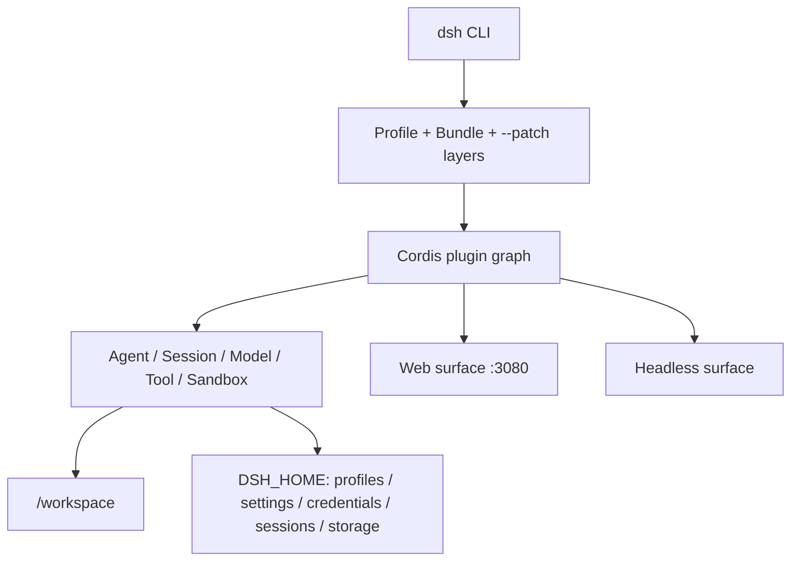

# DeepSeek Harness Docker

[English](README.en.md) | 简体中文

这是一个可直接构建的 DeepSeek Harness 社区容器方案，默认运行官方 `@deepseek-ai/dsh` 的 Web UI。它不构建或修改 DeepSeek Harness 源码，只把官方 npm 发行物装入一个精简、非 root 的 Node.js 24 运行时。

> 当前基线：`@deepseek-ai/dsh@0.1.7-alpha.2`。DeepSeek Harness 仍处于预发布阶段；升级前应重新完成本文的构建和 Smoke Test。

`0.1.7-alpha.2` 直接对应官方 [`dsh-v0.1.7-alpha.2`](https://github.com/deepseek-ai/deepseek-harness/releases/tag/dsh-v0.1.7-alpha.2) Release 与 npm Registry 的 [`@deepseek-ai/dsh@0.1.7-alpha.2`](https://www.npmjs.com/package/@deepseek-ai/dsh/v/0.1.7-alpha.2)，并非本项目自定义版本。本项目封装 npm 成品而不从源码构建，因此以可安装的官方发行物为基线，并故意不发布漂移的 Docker `latest` 标签。

上游已发布可安装的显式 npm 版本；Registry 镜像与 dist-tag 的更新可能短暂滞后，本项目始终固定完整版本，避免 dist-tag 漂移。`0.1.7-alpha.2` 稳定会话滚动、历史分页、后台任务连续唤醒和 Web 重启后的连接恢复，并改善代码块、Excel 预览、模型发现与首次插件安装的 Registry 选择。

> **升级提醒：** `0.1.7-alpha.1` 起 Session 日志为 V4。若从更早版本升级，必须先备份 `dsh-home`；依赖旧日志结构的工具需要适配 V4，降级前也应恢复升级前的卷备份，而不是让旧版直接读取已迁移数据。

> **兼容性提醒：** 自定义 `spill-policy` 配置必须把 `maxInlineBytes` 改为按估算 Token 计数的 `maxInlineTokens`。若从 `0.1.7-alpha.1` 以前升级，还需处理 Messages-only adapter、Profile-owned 设置、Bundle Agent Preset 和 Remote `readBytes` 迁移；详见[官方 Release](https://github.com/deepseek-ai/deepseek-harness/releases/tag/dsh-v0.1.7-alpha.2)。

> 上游版本跟踪：每日运行的 [Upstream DSH version watch](.github/workflows/upstream-dsh.yml) 会同时检查 GitHub Release 与 npm。若新版 Release 已发布但 npm 制品尚不可用，工作流会创建或刷新等待 Issue 并保留当前可安装基线；同版本 npm 包可安装后，Issue 会自动切换为升级提醒，固定版本追平后再自动关闭。

📖 延伸阅读：[DeepSeek Harness GitHub 仓库深度解析](https://aik8s.run/ai-k8s/rag-agent/deepseek-harness-repository-analysis/) · [Docker、Compose 与 Helm 部署实战](https://aik8s.run/ai-k8s/rag-agent/deepseek-harness-runtime-containerization/)

🤖 **Agent Skill：**根目录的 [`SKILL.md`](SKILL.md) 已作为 [`deepseek-harness-docker`](https://skillhub.cloud.tencent.com/skills/deepseek-harness-docker) 发布到腾讯云 SkillHub，可供支持 Agent Skills 的客户端安装和使用。它指导 Agent 按本项目的安全边界完成 Docker Compose/Helm 部署、验证、升级与排障；这是部署辅助 Skill，不是 DSH 运行时插件。

## 项目状态

| 能力 | 状态 | 验证结果 |
| --- | --- | --- |
| Dockerfile | 可用 | `linux/arm64`、`linux/amd64` 构建与原生 PTY 实际启动均已验证 |
| Docker Compose | 可用 | Web token/cookie 认证、healthy、回环端口、重启持久化已验证 |
| Rootless Podman | 可用 | `keep-id` 用户映射、bind mount 写入、命名卷持久化与回环端口已纳入 CI |
| Helm | 可用 | 单副本 StatefulSet、PVC、Headless Service、NetworkPolicy；`helm lint --strict` 通过 |
| Web UI | 本机默认；可选受保护 LAN | 默认仅回环访问；LAN overlay 提供 HTTPS、Basic Auth、DSH token/cookie 与同源 noVNC |
| Headless | 可用 | 运行时注入 provider Secret；需在目标环境验证实际模型调用和沙箱 |
| Chromium | 默认 + 可选隐私变体 | Debian Chromium 默认镜像；独立 ungoogled-chromium 双架构镜像会验证无 GCM `:5228` 活动 |

## DeepSeek Harness 深入分析

本节是配套技术文章的精简版。Cordis 架构、Agent 轮次和事件溯源持久化见 [GitHub 仓库深度解析](https://aik8s.run/ai-k8s/rag-agent/deepseek-harness-repository-analysis/)；镜像设计、安全模型和容器验证矩阵见 [Docker、Compose 与 Helm 部署实战](https://aik8s.run/ai-k8s/rag-agent/deepseek-harness-runtime-containerization/)。

### 它是什么，不是什么

[DeepSeek Harness](https://github.com/deepseek-ai/deepseek-harness) 不是 DeepSeek 模型权重或推理引擎，而是一套 TypeScript AI Agent Runtime。它把模型适配、会话、工具、权限、工作区、插件、Web UI 与 Headless 入口装配在一起，最终发布为 [`@deepseek-ai/dsh`](https://www.npmjs.com/package/@deepseek-ai/dsh) CLI。更合适的专题归类是“AI Agent Runtime 的云原生化”，而不是“LLM 推理部署”。

截至 2026-08-13，上游仓库还没有 Dockerfile、Compose 或 Kubernetes 清单；同时 [`CONTRIBUTING.md`](https://github.com/deepseek-ai/deepseek-harness/blob/master/CONTRIBUTING.md) 明确表示暂不接受外部 Pull Request，并鼓励社区创建生态项目和教程。因此本项目采用独立社区实现，而不冒充官方镜像。

### 运行时分层

1. **CLI 与 Profile。** `dsh web` 是 Web profile 的快捷入口，`dsh --profile headless` 则走一次性或自动化场景。Profile 不是一份封闭配置，而是基础 bundle、界面 bundle、用户 patch 和命令行 `--patch` 按顺序叠加的结果。
2. **Cordis 组合层。** Harness 通过 Cordis Loader 把模型、会话、工具、Web Server、目录选择器等能力装成插件图；依赖注入决定激活顺序，配置 patch 通过稳定 `id` 覆盖目标行。本项目没有 fork 源码，而是复用这条官方扩展缝隙覆盖容器监听地址。
3. **Agent 核心。** 模型路由、系统提示词、会话持久化、工具调用、目标/计划、子 Agent 与工作区都在 Host 侧组合。Web 只是浏览器客户端，不是另一个 Agent 实现。
4. **Surface。** Web surface 提供浏览器交互，Headless surface 适合 CLI、CI 和批处理。二者共享核心插件与 `$DSH_HOME` 数据模型。

### 数据与持久化边界

`DSH_HOME` 是容器化的关键边界。本项目显式设为 `/home/node/.dsh`，其中会出现：

- `profiles/`：profile 的包清单、Cordis 配置和用户 patch；
- `settings.yaml` 与凭据文件：模型设置及 Secret 引用/托管凭据；
- `sessions/`：会话日志；
- `storages/`：Workspace 等领域状态。

工作代码位于 `/workspace`，与内部状态卷分离。Compose 使用 `dsh-home` 命名卷加工作区 bind mount；Helm 使用 `dsh-home` PVC，并允许通过 `workspace.existingClaim` 挂载另一块工作区 PVC。这个分离让镜像可以重建，而会话与配置不会随容器消失。

### 为什么容器化并不只是 `npx`

| 难点 | 上游行为 | 本项目决策 |
| --- | --- | --- |
| Node / glibc | 要求 Node 22.19+ 或 24+；部分用户二进制需要较新 glibc | 固定官方 `node:24-trixie` 非 slim，Debian 13 / glibc 2.41 |
| 原生依赖与 Agent 工具 | `node-pty` 或第三方插件可能需要本机构建；Agent 需要常见开发命令 | 多阶段安装 DSH；runtime 有意保留 buildpack-deps 工具链，并补齐 `jq`、`less`、`ripgrep`、`rsync`、`zip` 等命令 |
| Web 监听 | CLI 主动拒绝 `--host 0.0.0.0` | 使用 Cordis overlay；3080/6080 只绑定 `127.0.0.1`，可选 LAN gateway 单独绑定指定网卡 |
| Web 安全 | 有启动 token 认证与 Host/Origin 检查，但原生端口无 TLS；noVNC 无认证，工具可触发代码执行 | 默认回环发布；可选 Caddy HTTPS + Basic Auth；不提供公网 Ingress/LoadBalancer |
| HMR | 启动后挂载配置 watcher，需要 Node internals | 仅给 DSH 主进程传 `--expose-internals`，不通过 `NODE_OPTIONS` 传播给 Agent 子进程 |
| 目录选择器 | 浏览模式以 `os.homedir()` 为首页 | 将 `HOME` 指向可写 `/workspace`，避免只读 `/home/node` 的 EROFS |
| 信号和子进程 | Agent 会创建 shell/PTY 子进程 | 使用 `tini` 转发信号和回收孤儿进程 |
| 权限 | 工具需要工作区写入，但不应获得宿主权限 | UID 1000、只读根文件系统、drop ALL、no-new-privileges、最小挂载 |

默认基础镜像选择非 slim 是面向 coding agent 的明确取舍，而不是追求最小体积。Debian 13 Trixie 将 glibc 从 Bookworm 的 2.36 提升到 2.41，能运行更多按新系统构建的二进制；官方 Node 非 slim 变体基于 `buildpack-deps`，自带编译器、`make`、`git`、`curl`、`file`、`unzip`、`wget`、`xz` 等开发工具，本项目再显式安装 `jq`、`less`、`ripgrep`、`rsync` 和 `zip`。代价是基础镜像压缩体积比 slim 大约增加 330 MB；Smoke Test 会同时检查 Trixie、glibc 2.41 和完整命令清单，避免后续升级意外退化。

这里最需要强调的是 Web 监听：Docker bridge 端口转发要求容器进程监听非 loopback 地址，但 Harness 的 CLI 会拒绝 `--host 0.0.0.0`，防止具备代码执行能力的 Web surface 被误暴露。本项目只在容器内部用官方 patch 机制改监听地址，并把安全责任收回到部署边界：默认 Compose 只发布 `127.0.0.1`，Kubernetes 只建议 `kubectl port-forward`。需要受信任局域网访问时，显式叠加 `compose.lan.yaml`，由 Caddy 在指定 LAN 地址上终止 HTTPS、增加 Basic Auth，并把 noVNC 收进同一认证入口；DSH 仍执行自己的启动 token、签名 Cookie 与 Host/Origin 检查。直接改成 `-p 3080:3080`、NodePort、LoadBalancer 或公开 Ingress 仍会破坏这个安全模型。

### 容器与 Harness 沙箱的关系

容器不是 Harness 内部权限系统的替代品，两层保护的对象不同：

- Docker/Kubernetes 限制进程能看到哪些宿主目录、Linux capabilities 和资源；
- Harness 沙箱限制 Agent 工具在已进入容器的文件系统中能够执行什么。

Linux Landlock、用户命名空间和原生 helper 的可用性会受宿主内核与容器运行时影响。本项目不会用 `--privileged`、Docker socket 或额外 capabilities 掩盖沙箱失败。发布前除“页面能打开”外，还必须在目标平台验证一次真实 bash/文件工具调用。

### 为什么 Kubernetes 使用 StatefulSet

Harness 的 profile、模型设置、凭据、会话和 Workspace 索引都具有状态。单用户 Web 又不适合在没有会话协调的情况下横向扩容。因此 Helm Chart