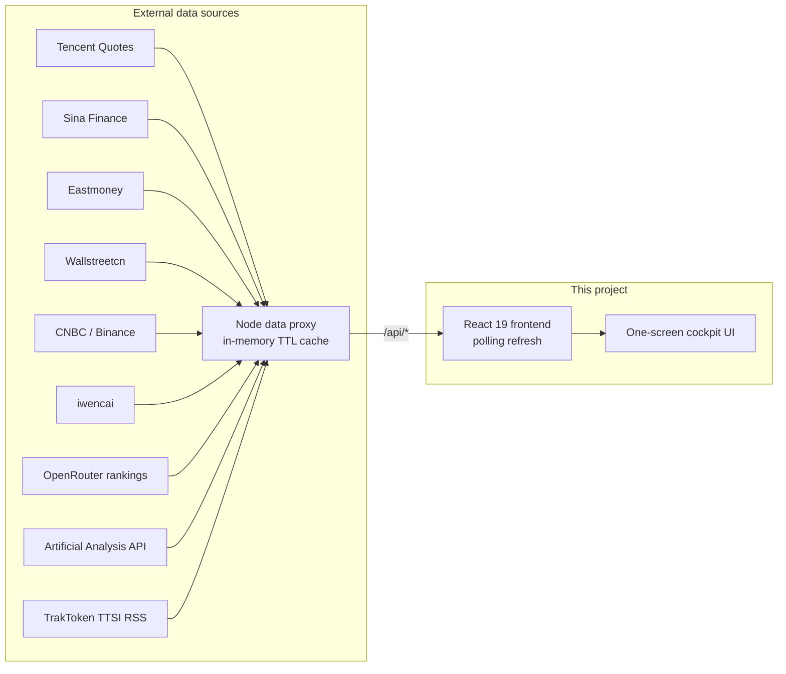

# 📊 Market Research Cockpit

**A one-screen real-time market dashboard for financial & industry research**

A-shares / HK / US stocks · Commodities · US Treasury yields · Sector heat · Money flow · 7×24 news flash · Industry-chain watchlists

[简体中文](README_CN.md)

🚀 **Live demo**: https://mrd.hermes.cc.cd — *no API keys, no login, works instantly*

🛎️ **Hosted version: in preparation** — no pricing, no launch date yet. Want a managed deployment so you don't have to run your own server? [Tell us what would matter to you](https://github.com/theBigGavin/marketingdashboard/issues). The open-source self-host stays free & MIT, that's not going anywhere.

🏠 **Made by Gavin's Lab** — a one-person company run by 7 AI agents on a kanban board: [company site](https://www.hermes.cc.cd) · [live transparency office](https://www.hermes.cc.cd/opc/)

## ✨ Features

- **🌍 Global markets on one screen** — SSE / SZSE / Hang Seng / Dow / Nasdaq / S&P 500 / VIX / USD-CNY, with minute-level index charts side by side
- **🥇 Commodities & crypto** — NY gold/silver, London gold, SHFE gold, LME copper, crude oil, BTC — live prices with intraday curves
- **💵 US Treasury monitor** — 10Y / 2Y yields, 2s10s spread, yield-curve shape and its month-by-month history back to 2001
- **🔥 Sector heat radar** — Industry / concept sector rankings; click a sector to drill into constituents, leading stocks and money flow
- **💰 Money-flow tracking** — Top stocks by main-force net inflow, minute-level cumulative sector flow curves, hot / top-gainer / top-loser lists
- **⛓️ Industry-chain panorama** — Semiconductors, AI compute, EV, robotics, innovative drugs and more; upstream/midstream/downstream tickers linked to live quotes. Stock lists can be edited manually or fetched automatically from iwencai
- **🤖 AI cockpit** — OpenRouter daily rankings API tracking token-consumption trends of 50+ global LLM providers (7d–1y ranges), stacked-area share charts by provider/country/region, 60+ day long-range history
- **💹 LLM price-competition watch** — Four panels on a 2×3 grid: TTSI spend-index trend (weighted / closed-source / open-source price lines on a 0-based axis, multi-month full history from a local `ttsi.csv` CC BY 4.0 archive merged with the daily RSS tail), model price table (~400 models, sortable by intelligence / input / output / task cost), value scatter (intelligence index × task cost on a log axis, vendor colors), and a price-cut / share-shift event feed from TrakToken daily annotations
- **🪟 Earnings window (/fin)** — Earnings-season macro view: disclosure calendar (14-day rhythm bars + today's list), earnings forecasts (beat/miss stats bar + profit-range details), industry profit ranking (scale × momentum dual encoding), stock profit ranking (by amount / growth), plus per-company 12-quarter trends (revenue/profit bars + ROE/gross/net margin lines)
- **🏷️ Commodity prices page (/goods)** — Main-contract futures daily trends across 6 groups (precious / base / ferrous / energy-chem / agri / international energy) with 30d–365d ranges, plus Sunsirs spot quotes (accumulated daily) and spot–futures basis tables
- **📰 7×24 news flash** — Scrolling global financial news with auto-highlighted macro keywords and industry-chain mentions
- **🖥️ Installable desktop app** — Built-in PWA support (Web Manifest + Service Worker); install from the browser address bar and run in a standalone window
- **🍎 Native macOS app** — Swift WKWebView thin shell, follows the same pattern as Android TV
- **📺 Android TV app** — Native WebView shell (`android-tv/`) with D-pad spatial navigation, fullscreen panel zoom (proportional scaling + slideshow), split-flap ticker, tuned for legacy engines and weak GPUs
- **📱 iOS Scripting script** — TypeScript/TSX script (`scriptable/`, mirrored to `theBigGavin/mrd-scripting`) that wraps the cockpit in the Scripting app's WebView: TV mode via `?tv=1`, forced landscape, safe-area-free fullscreen, Liquid Glass exit button, local splash screen with the mrd logo (breathing animation) and a white-screen-free transition into the live dashboard
- **⚡ Zero-dependency data service** — Built-in Node proxy aggregates public market-data endpoints with in-memory caching; most endpoints need no API key and work out of the box

## 🏗️ Architecture

- The frontend prefers the bundled Node proxy; when it is unavailable, some endpoints (Tencent / Wallstreetcn) gracefully fall back to direct browser connections
- **Unified client quote hub**: all panel prices / changes come from a single client-side quote hub (`src/lib/market.ts`) that batch-fetches every 5s and distributes one snapshot — the same ticker renders the same frame everywhere; server-side quotes are cached per code (5s, aligned with the client poll loop) and watch-set changes only fetch the new codes
- Per-endpoint server cache TTLs (5s for quotes up to 24h for sector membership), bounded capacity (LRU + periodic sweep), no database, no external storage
- **Upstream-friendly under many concurrent users**: per-code TTL caches + in-flight dedup share one upstream fetch across concurrent cache misses, failure backoff (5s→2min negative caching) keeps a downed upstream from being hammered, browser-direct fallbacks are throttled per code, and `/api/stats` exposes request / upstream-fetch / 429 counters
- Spot prices are collected by the server every 4 hours into local history files — history grows day by day without the frontend being online
- Single-process production: one port serves both the API and the built frontend

## 🧱 Product boundary (red lines)

This repository is **only** for the mrd product (the market-data cockpit). Code / data / credentials / tests for the OPC transparency office, company site, marketing, or customer support must **never** land here — they live in their own repos:

| Product / service | Repo | Public domain |
|---|---|---|
| mrd (this repo) | theBigGavin/marketingdashboard | mrd.hermes.cc.cd |
| OPC backend (opc-api) | theBigGavin/opc-os · `opc-api/` (private) | opc.hermes.cc.cd |
| Company-site backend | theBigGavin/company-site-backend | api.hermes.cc.cd |
| Company-site frontend | theBigGavin/gavin-lab-company | www.hermes.cc.cd |
| knock leaderboard | theBigGavin/mylauncher · `server/` | hermes.cc.cd/api/v1/knock |

Rules:

- New APIs mount on their own product domain; cross-product calls go through the owning product's backend — never add another product's routes or reverse proxies here.
- Sensitive credentials exist 