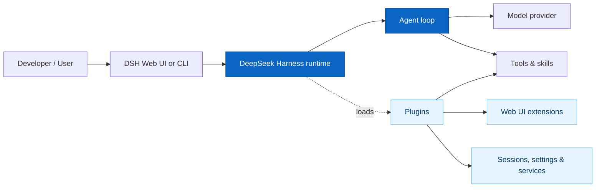
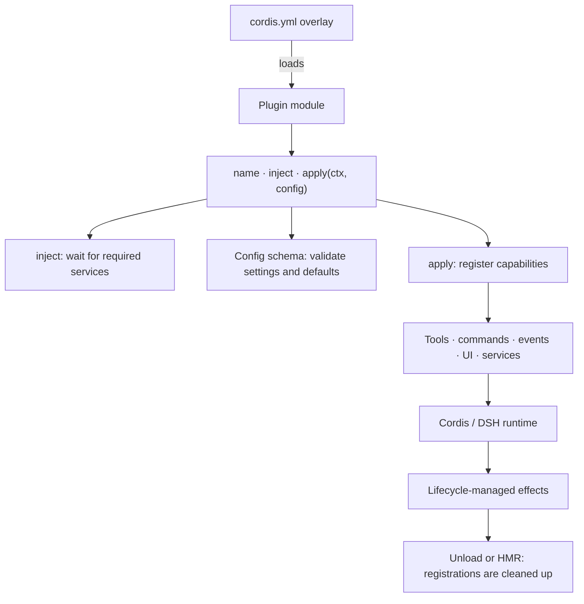
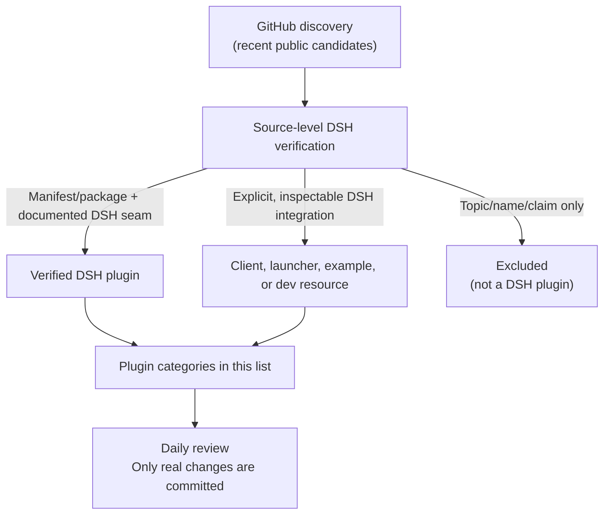
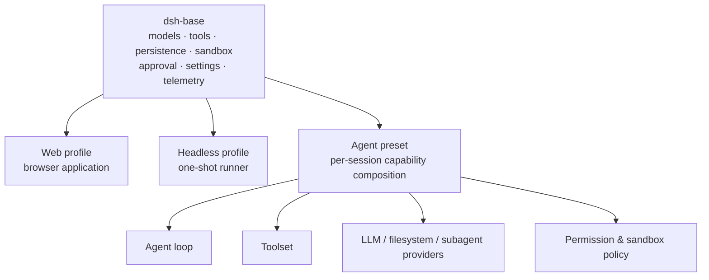
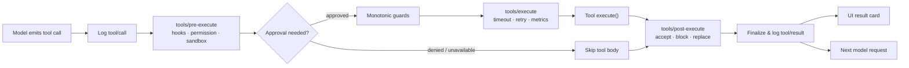

# Awesome DeepSeek Harness Plugins [](https://awesome.re)

English | [简体中文](README.zh.md)

> A curated index of plugins, starters, tools, and primary resources for [DeepSeek Harness (DSH)](https://github.com/deepseek-ai/deepseek-harness).

[DeepSeek Harness](https://github.com/deepseek-ai/deepseek-harness) is DeepSeek AI's open-source, plugin-first agent harness: models, tools, skills, sessions, sandboxes, filesystems, loops, orchestration, and UI can all be composed as plugins.

> **Developer preview** — DSH is changing quickly and may introduce breaking changes. This independent community list is not endorsed by DeepSeek AI or walkinglabs. Review source code and pin a DSH version/commit before installing any third-party plugin. [中文说明](README.zh.md)



## Quick Tutorial — Install DSH and Write Your First Plugin

### 1. Install and run DeepSeek Harness

Install a current [Node.js](https://nodejs.org/) release, then run:

```sh
npx @deepseek-ai/dsh web
```

Open `http://127.0.0.1:3080`. In **Settings → Models**, add a DeepSeek API key; then select a workspace before starting a session. The official [Web UI guide](https://github.com/deepseek-ai/deepseek-harness/blob/master/docs/user/guide/index.md) explains the next steps.

### 2. Create a minimal plugin from source

Plugin development currently starts from an official DSH checkout:

```sh
git clone https://github.com/deepseek-ai/deepseek-harness.git
cd deepseek-harness
pnpm install
pnpm run build
mkdir -p scratch-plugin/src
```

Create `scratch-plugin/src/hello-plugin.ts`:

```ts
import type { Context } from '@deepseek-ai/cordis'

export const name = 'hello-plugin'

export function apply(ctx: Context) {
  console.log('[hello-plugin] loaded')
}
```

Then create `scratch-plugin/cordis.yml`. Replace the path with the absolute path printed by `pwd` in the DSH checkout:

```yaml
- insert:
    - id: hello
      name: '/absolute/path/to/deepseek-harness/scratch-plugin/src/hello-plugin.ts'
```

Run the development overlay:

```sh
pnpm dsh web --patch ./scratch-plugin/cordis.yml
```

When DSH starts, the terminal should show `[hello-plugin] loaded`. This is the smallest valid DSH plugin: export `apply(ctx)` and register capabilities through the Cordis context. To add an agent-callable tool, declare `export const inject = ['tools']` and register it with the documented DSH tool API. Follow the official [first plugin](https://github.com/deepseek-ai/deepseek-harness/blob/master/docs/user/develop/basic/index.md) and [tool-plugin](https://github.com/deepseek-ai/deepseek-harness/blob/master/docs/user/develop/basic/tool.md) tutorials for the complete, current API.

### 3. How the plugin mechanism works



DSH is built on **Cordis**, a runtime composition framework. A plugin is not merely an npm dependency: it is a module that DSH loads into a live context. The plugin declares a `name`, optionally declares `inject` dependencies such as `['tools']`, and exports `apply(ctx, config)`. Cordis waits until injected services are ready, validates any exported `Config` schema and defaults, then invokes `apply`.

Inside `apply`, the plugin can register a tool for the agent, a human command, a settings schema, event listeners, Web UI components, or a service for other plugins. Registrations are lifecycle-managed effects: on unload or hot replacement after a config edit, Cordis removes old registrations automatically. Use `ctx.effect()` only when your plugin owns a resource needing explicit cleanup, such as a timer or network connection. See the official [configuration guide](https://github.com/deepseek-ai/deepseek-harness/blob/master/docs/user/develop/basic/config.md), [service guide](https://github.com/deepseek-ai/deepseek-harness/blob/master/docs/user/develop/framework/service.md), and [capability seams](https://github.com/deepseek-ai/deepseek-harness/blob/master/docs/capability-seams.md).

### 4. What this awesome list includes



The list distinguishes verified DSH plugins from useful but non-plugin resources such as launchers, clients, and ecosystem directories. See the full [inclusion policy](docs/INCLUSION_POLICY.md) for the evidence required before a new entry is added.

### 5. One runtime, different compositions

DSH profiles are plugin compositions rather than separately maintained products. The official base bundle includes model adapters, tools, persistence, sandbox and approval policy, settings, credentials, and telemetry; Web and headless bundles add different entry surfaces. An agent preset can then give a session a different capability set.



This makes a “mode” primarily a selected plugin graph and policy set. It does not guarantee that every composition is stable or suitable for every task; DSH is still a developer preview.

### 6. Tool calls use one guarded execution pipeline



Plugins can insert policy, observability, timeout, or result-handling behavior at documented stages without editing the Agent Loop. The official pipeline also routes Code Mode's dispatched sub-calls through this same path, preserving the approval, sandbox, and logging boundaries.

### 7. Agent turns, steps, and the append-only session log

```mermaid
sequenceDiagram