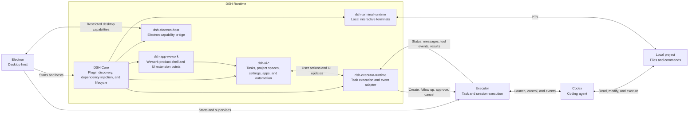

# Wegent

> An open-source AI work system spanning your local desktop, cloud agents, and remote machines.

English | [简体中文](README_zh.md)

    

Wegent includes a desktop workbench and a self-hostable web platform. Wegent Desktop works with local projects, files, commands, tests, and code changes. Wegent Web provides browser-based agents, knowledge, automation, and administration. Wegent Backend connects these applications to shared project spaces, models, and execution devices.

[Download the latest Wegent Desktop](https://github.com/wecode-ai/Wegent/releases/latest) · [Documentation](https://wecode-ai.github.io/wegent-docs/) · [Contributing](CONTRIBUTING.md)

## Wegent Desktop

Wegent Desktop organizes local coding work by project and task. The task view keeps the conversation, tool activity, tests, changed files, and diffs together; the project-space view provides the board, shared files, automation, and execution status.

Running and reviewing a local coding task in Wegent Desktop.

A project space in Wegent Desktop with its task board, shared files, automation, and execution status.

## Features

- **Desktop workbench** — Organize local projects, tasks, sessions, files, tool activity, tests, and diffs.
- **Reusable agents** — Combine models, prompts, Skills, knowledge, tools, and collaboration settings.
- **Project spaces** — Share task boards, files, discussions, automation, execution history, and deliveries.
- **Multiple execution targets** — Run tasks locally, on remote work machines, or with server-managed executors.
- **Self-hosting** — Deploy Wegent Web and Backend for team access, APIs, permissions, scheduling, and knowledge services.

## Why Wegent

**The local coding experience built on Codex is the foundation of Wegent Desktop.** It works directly with the code, files, commands, and development environment in your projects. Connect it to Wegent Backend when coding work needs to move beyond one computer or one person. Once connected, the desktop workbench and Web use the same projects, tasks, and execution devices.

- **Run tasks on the right device** — Keep using the code, files, commands, and development environment already on a local machine, or run a task for the same project on a remote work machine or server-managed executor.
- **Move a project forward as a team** — Project spaces connect task boards, shared files, discussions, execution status, and deliveries instead of leaving conversations and code changes on separate computers.
- **Automate repeated project work** — Project spaces can configure automation and execution queues to keep routine work moving.
- **Keep services and data under team control** — Self-host Web and Backend for shared access, permissions, model configuration, scheduling, knowledge services, and remote-device management.

If work always stays on one computer, Wegent Desktop provides a familiar Codex coding experience. Connect it to Wegent to extend that experience when tasks must move across people, devices, or a self-hosted environment.

## Wegent Web

Wegent Web provides the browser interface for remote agents. Agents can use configured models, knowledge, Skills, and tools while Wegent Backend manages their tasks and execution.

A Wegent remote agent uses tools to generate a Gantt chart.

## How it works

Wework is the Wegent desktop workbench. Electron owns desktop windows, system capabilities, and process management. DeepSeek Harness (DSH) is the embedded application and plugin runtime, and the Wework product UI is composed from a set of DSH plugins. Executor manages tasks and sessions, then drives Codex to perform the actual work in local projects.

DSH does not execute coding tasks itself. `dsh-app-wework` defines the product shell and extension points, `dsh-ui-*` provides the product modules, `dsh-electron-host` bridges restricted Electron capabilities, `dsh-executor-runtime` communicates bidirectionally with Executor throughout execution, and `dsh-terminal-runtime` manages local interactive terminals. Executor is the task execution layer, while Codex is the concrete coding agent it drives.

Wework can also connect