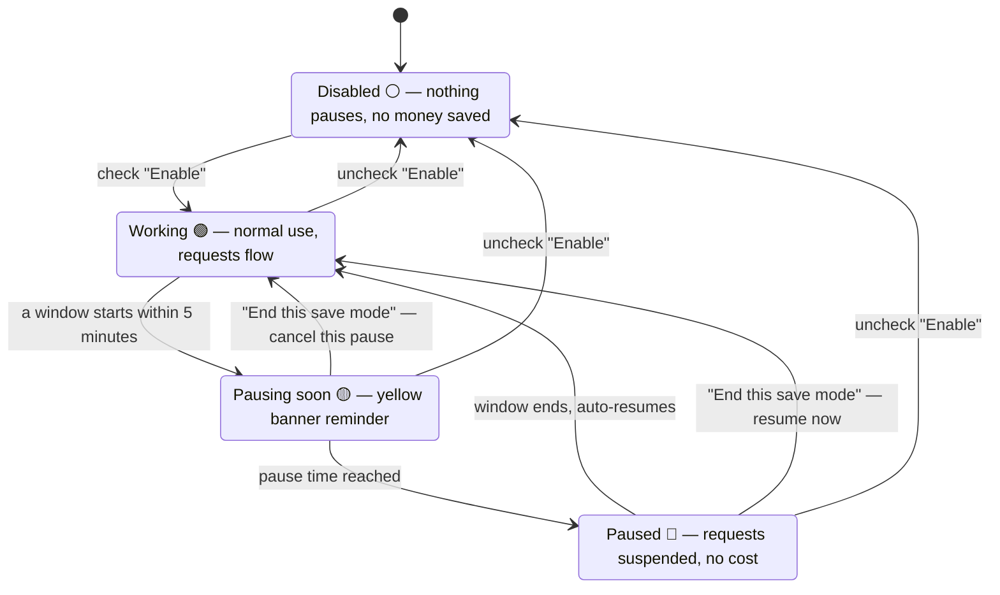

# dsh-save-money

**Save-money plugin** for DSH (DeepSeek Harness) — define your own "pause / resume" time windows; at pause time running long tasks are **paused** (not stopped) automatically, and they resume when the window ends. Built for LLM API **peak/off-peak pricing** (e.g. DeepSeek peak hours 9:00–12:00, 14:00–18:00 Beijing time, off-peak at half price; since **2026-08-23 weekends are off-peak all day** — the plugin's weekday switch skips Sat/Sun by default), and equally useful for time-of-use electricity rates, bandwidth off-peak shifting, or any "I don't want the machine working during this period" scenario.

> Status: ✅ Implemented, continuously maintained. [中文版](./README.zh.md)

## Interface

The colored status text in the top-right of the session header (Save · ⚪/🟢/🟡/🔴, color follows the state) is the single persistent entry — click it to open the settings popover. When a pause is upcoming or active, a reminder banner appears at the top of the page (with the **End this save mode** button).

With "Show balance" enabled, your official DeepSeek account balance appears next to the status text; **clicking the balance** opens the last-8-hours spend bar chart:

Each bar is a 10-minute window: the X axis shows whole-hour ticks, the Y axis key-point amount ticks (≤5, with gridlines), and hovering shows each window's exact time range and amount. Windows where the balance dropped without any local activity are marked in warning color (changes may come from another device).

## Features

- **Multiple time windows**: add / remove pause-resume windows freely; supports midnight-crossing windows (23:00–08:00) and per-weekday filtering;
- **Automatic pause on schedule**: when the pause time arrives, running tasks are safely "frozen" (their progress is preserved exactly — nothing is interrupted or lost) and resume automatically when the window ends; **if nothing is running, nothing is paused**;
- **No requests during the window (the saving core)**: inside a pause window the AI sends no new requests to the model service, so **no cost is incurred**; after the window ends (or on disable / end-this-window) everything resumes, with conversation context and in-flight tasks unaffected. **The AI not replying inside a window (including new conversations) is expected** — to resume right away, click the **End this save mode** button (takes effect directly, no AI involved);
- **Per-model-tier save mode**: decide per model tier which ones pause during windows. The settings panel shows two compact rows — **Official API** (the DeepSeek official API) and **Other API** (EVERY non-official provider: opencode go/zen, relays, SiliconFlow, …) — each with **flash / pro / vision** toggles (vision = `deepseek-v4-flash-vision-exp`), six toggles total. Checked = paused (saving money); unchecked = **exempt** (requests flow even during a window). Defaults: the three official tiers checked, all "other" tiers exempt; your changes are persisted and never reset. Any model whose name carries no flash/pro/vision marker (legacy `chat`/`reasoner`, unknown models, anything else) is always exempt — it can never block your requests;
- **Global weekday switch**: one row above the window list — 一 ☑️ 二 ☑️ 三 ☑️ 四 ☑️ 五 ☑️ 六 ⬜ 日 ⬜. Saving applies only on the checked days (default **Mon–Fri** — under the 2026-08-23 peak/off-peak rule weekends are off-peak all day, so nothing pauses on Sat/Sun). Composed with each window's own per-weekday filter: both must match for a window to apply;
- **End this save mode (one-shot, current window only)**: the banner and settings-popover button end the **currently active** pause window only — if paused, tasks resume immediately and the gate opens; if a pause is upcoming, it is cancelled. The window is skipped until its resume time, then the state clears automatically. The **next window (today or later) still takes effect**, and the persistent **Enable** flag is never touched, so you cannot accidentally leave the feature disabled;
- **UI reminders**: top floating banner (light yellow for upcoming pause / light red for paused, with the **End this save mode** button) + the single persistent session-header entry (next to the Session log, "Save · 🟢 Working" colored status text; click to expand settings), colors follow the state in real time;
- **Timezone support**: IANA timezone dropdown, browser auto-detection with Beijing time (+8) fallback; UTC projection checked (Beijing 09:00 == UTC 01:00);
- **One-click DeepSeek preset**: dedupe-append the peak windows (**08:58–12:02, 13:58–18:02**, with a 2-minute boundary margin — pause 2 min early, resume 2 min late); it does **not** auto-enable — your call; legacy no-margin windows are upgraded automatically on one-click;
- **Persistent config**: all settings are saved automatically to the workspace file `save-money.config.json` (gitignored); configuration survives browser refresh and plugin disable/re-activate, and is loaded on startup with optional reconciliation of paused goals;
- **Account balance display (optional)**: tick "Show balance" in settings and your official DeepSeek account balance appears next to the status text in the header (automatic currency symbol, theme-adaptive color). Off by default. With several model sources configured (official DeepSeek + SiliconFlow, relays, …) the balance **follows the model actually in use**: it is shown while the latest real request runs on the official provider and hidden otherwise (the sampled spend history is kept, so switching back to DeepSeek re-shows the balance immediately);
- **Spend statistics**: with the balance display enabled, the backend samples the balance every 5 minutes (288 points covering the last 24 hours). Hover the balance to see **how much was spent in the last 1 hour / 10 minutes / 24 hours** (balance increases from top-ups or refunds show as "+amount");
- **Spend bar chart (last 8 hours, per 10 minutes)**: click the balance to open a chart of the last 48 ten-minute windows. **External-spend attribution** — a window where the balance dropped without any local model activity is marked with a warning color (hover: "no local activity in this window; change may come from elsewhere") instead of being reported as local consumption, so using the same API key from another machine never looks like a one-second spend explosion. **Balance top-ups (recharges / refunds) are never drawn as bars and never stretch the Y axis** — the axis stays spend-only; a hidden top-up window shows a "balance recovered (recharge / refund), not counted in spend analysis" note on hover;
- **Persistent balance history**: sampled history is saved to `~/.dsh/dsh-save-money-balance.json` (account-level, shared across projects) and survives plugin updates/restarts. The file is keyed by a fingerprint of the API key — **changing the key discards the old history** automatically;
- **Non-intrusive by design**: no screen lock, no overlay blocking, no user action prevented — only the automatic continuation of goals is paused; manual interaction always flows.

## How it works

- When a pause window starts, running tasks are frozen (progress preserved